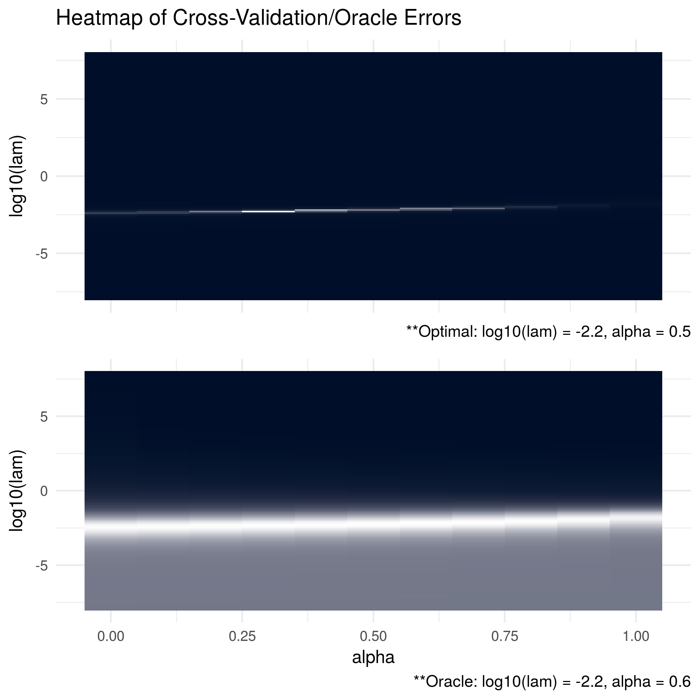

```{r setup, include=FALSE}
knitr::opts_chunk$set(echo = TRUE)
```

In the simulations below, we generate data from a number of different oracle precision matrices with various structures. For each data-generating procedure, the `ADMMsigma()` function was run using 5-fold cross validation. After 20 replications, the cross validation errors were totalled and the optimal tuning parameters were selected (results below the top figure). These results are compared with the Kullback Leibler (KL) losses between the estimates and the oracle precision matrix (bottom figure).

We can see below that our cross validation procedure consistently chooses tuning parameters that are close to the optimal parameters with respsect to the oracle.

<br>\newpage

### Compound Symmetric: P = 100, N = 50

```{r, message = FALSE, echo = TRUE, eval = FALSE}

# oracle precision matrix
Omega = matrix(0.9, ncol = 100, nrow = 100)
diag(Omega = 1)

# generate covariance matrix
S = qr.solve(Omega)

# generate data
Z = matrix(rnorm(100*50), nrow = 50, ncol = 100)
out = eigen(S, symmetric = TRUE)
S.sqrt = out$vectors %*% diag(out$values^0.5) %*% t(out$vectors)
X = Z %*% S.sqrt

```
<br>\vspace{0.5cm}


<br>\newpage

### Compound Symmetric: P = 10, N = 1000

```{r, message = FALSE, echo = TRUE, eval = FALSE}

# oracle precision matrix
Omega = matrix(0.9, ncol = 10, nrow = 10)
diag(Omega = 1)

# generate covariance matrix
S = qr.solve(Omega)

# generate data
Z = matrix(rnorm(10*1000), nrow = 1000, ncol = 10)
out = eigen(S, symmetric = TRUE)
S.sqrt = out$vectors %*% diag(out$values^0.5) %*% t(out$vectors)
X = Z %*% S.sqrt

```
<br>\vspace{0.5cm}


<br>\newpage

### Dense: P = 100, N = 50

```{r, message = FALSE, echo = TRUE, eval = FALSE, tidy = FALSE}

# generate eigen values
eigen = c(rep(1000, 5, rep(1, 100 - 5)))

# randomly generate orthogonal basis (via QR)
Q = matrix(rnorm(100*100), nrow = 100, ncol = 100) %>% qr %>% qr.Q

# generate covariance matrix
S = Q %*% diag(eigen) %*% t(Q)

# generate data
Z = matrix(rnorm(100*50), nrow = 50, ncol = 100)
out = eigen(S, symmetric = TRUE)
S.sqrt = out$vectors %*% diag(out$values^0.5) %*% t(out$vectors)
X = Z %*% S.sqrt

```
<br>\vspace{0.5cm}


<br>\newpage

### Dense: P = 10, N = 50

```{r, message = FALSE, echo = TRUE, eval = FALSE, tidy = FALSE}

# generate eigen values
eigen = c(rep(1000, 5, rep(1, 10 - 5)))

# randomly generate orthogonal basis (via QR)
Q = matrix(rnorm(10*10), nrow = 10, ncol = 10) %>% qr %>% qr.Q

# generate covariance matrix
S = Q %*% diag(eigen) %*% t(Q)

# generate data
Z = matrix(rnorm(10*50), nrow = 50, ncol = 10)
out = eigen(S, symmetric = TRUE)
S.sqrt = out$vectors %*% diag(out$values^0.5) %*% t(out$vectors)
X = Z %*% S.sqrt

```
<br>\vspace{0.5cm}



<br>\newpage

### Tridiagonal: P = 100, N = 50

```{r, message = FALSE, echo = TRUE, eval = FALSE, tidy = FALSE}

# generate covariance matrix
# (can confirm inverse is tri-diagonal)
S = matrix(0, nrow = 100, ncol = 100)
for (i in 1:100){
  for (j in 1:100){
    S[i, j] = 0.7^abs(i - j)
  }
}

# generate data
Z = matrix(rnorm(10*50), nrow = 50, ncol = 10)
out = eigen(S, symmetric = TRUE)
S.sqrt = out$vectors %*% diag(out$values^0.5) %*% t(out$vectors)
X = Z %*% S.sqrt

```
<br>\vspace{0.5cm}


