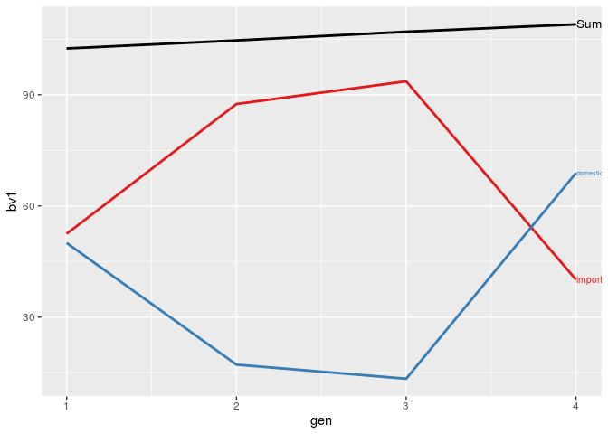

<!-- README.md is generated from README.Rmd. Please edit that file -->
AlphaPart
=========

<!-- badges: start -->
<!-- badges: end -->
AlphaPart implements the method for partitioning genetic trend. The method was originally described in García-Cortés et al. (2008). The method and the package are valuable for deciphering and quantifying the sources of genetic gain. The package streamlines such analysis into a few lines of R code, while enabling advanced handling of data and results, and plotting.

Installation
------------

You can install the released version of AlphaPart from [CRAN](https://CRAN.R-project.org) with:

``` r
install.packages("AlphaPart")
```

And the development version from [GitHub](https://github.com/) with:

``` r
# install.packages("devtools")
devtools::install_github("janaobsteter/alphaPart")
```

Example
-------

This is a basic example which shows you how to solve a common problem:

``` r
library(AlphaPart)
#> 
#> Attaching package: 'AlphaPart'
#> The following object is masked from 'package:utils':
#> 
#>     write.csv
## Partition breeding values of a demo dataset AlphaPart.ped
## Partition the breeding values for trait 1 by "country" variable into domestic and import contributions
part <- AlphaPart(x = AlphaPart.ped, colBV = "bv1", colPath = "country")
#> 
#> Size:
#>  - individuals: 8 
#>  - traits: 1 (bv1)
#>  - paths: 2 (domestic, import)
#>  - unknown (missing) values:
#> bv1 
#>   0

## Sumarize the partition by generation ("gen")
partSum <- summary(part, by = "gen")

## Visualize the summarized partitions
```


