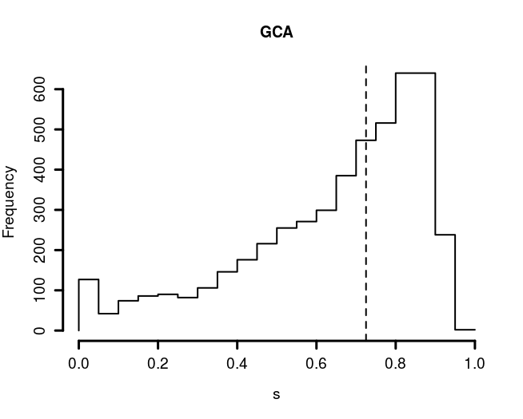
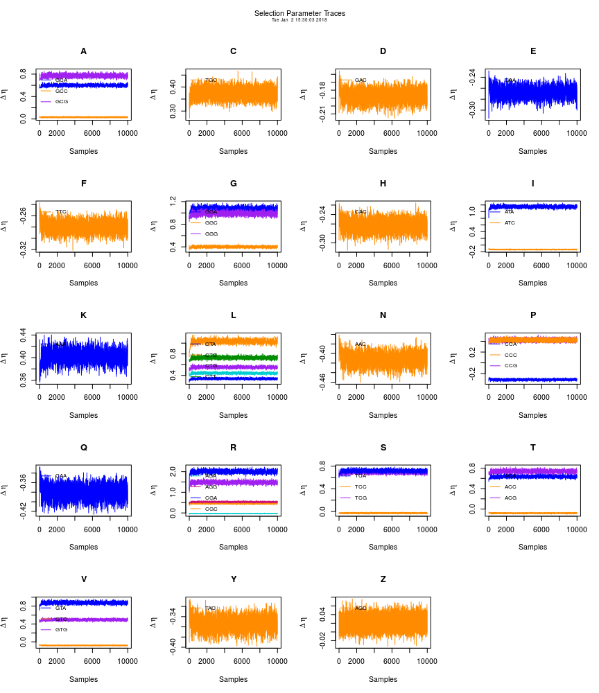
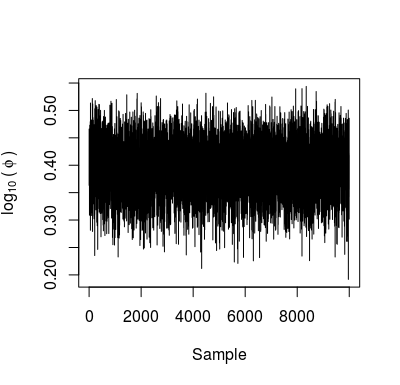
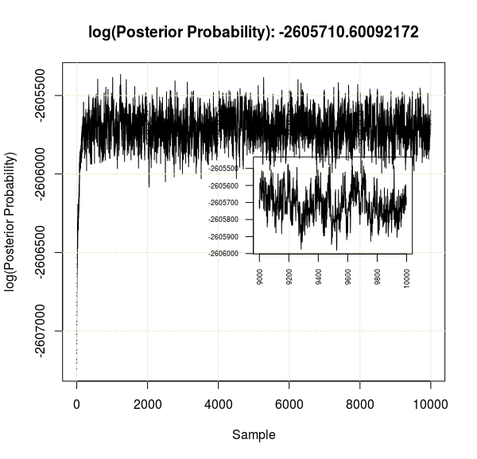
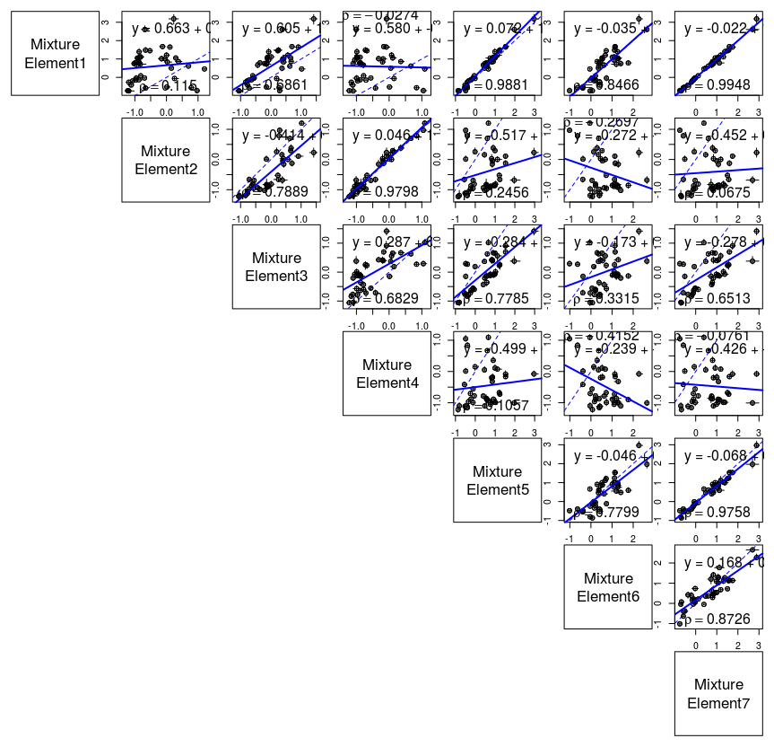

```{r setup, include = FALSE}
knitr::opts_chunk$set(
  collapse = TRUE,
  comment = "#>"
)
```

AnaCoDa allows for the estimation of biologically relevant parameters like mutation bias or ribosome pausing time, depending on the model employed.  Bayesian estimation of parameters is performed using an adaptive Metropolis-Hasting within Gibbs sampling approach. Models implemented in AnaCoDa are currently able to handle gene coding sequences and ribosome footprinting data.


## The AnaCoDa framework

The AnaCoDa framework works with gene specific data such as codon frequencies or position specific footprint counts.
Conceptually, AnaCoDa uses three different types of parameters.

* The first type of parameters are  **gene specific parameters** such as gene expression level or functionality.
Gene-specific parameters are estimated separately for each gene and can vary between potential gene categories or sets.

* The second type of parameters are **gene-set specific parameters**, such as mutation bias terms or translation error rates.
These parameters are shared across genes within a set and can be exclusive to a single set or shared with other sets.
While the number of gene sets must be pre-defined by the user, set assignment of genes can be pre-defined or estimated as part of the model fitting.
Estimation of the set assignment provides the probability of a gene being assigned to a set allowing the user to asses the uncertainty in each assignment.

* The third type of parameters are **hyperparameters**, such as parameters controlling the prior distribution for mutation bias or error rate.
Hyperparameters can be set specific or shared across multiple sets and allow for the construction and analysis of hierarchical models, by controlling prior distributions for gene or gene-set specific parameters.

## Analyzing protein coding gene sequences
AnaCoDa always requires the following four objects:

* **Genome** contains the codon data read from a fasta file as well as empirical protein synthesis rate in the form of a comma separated (.csv) ID/Value pairs.

* **Parameter** represents the parameter set (including parameter traces) for a given genome. The parameter object also hold the mapping of parameters to specified sets.

* **Model** allows you to specify which model should be applied to the genome and the parameter object.

* **MCMC** specifies how many samples from the posterior distribution of the specified model should be stored to obtain parameter estimates.

## Setup of AnaCoDa

### Application of codon model to single genome
In this example we are assuming a genome with only one set of gene-set specific parameters, hence `num.mixtures = 1`.
We assign all genes the same gene-set, and provide an initial value for the hyperparameter sphi ($s_\phi$).
$s_\phi$ controls the lognormal prior distribution on the gene specific parameters like the protein synthesis rate $\phi$.
To ensure identifiability the expected value of the prior distribution is assumed to be 1. 

\begin{align}
E[\phi] = \exp\left(m_\phi+\frac{s_\phi^2}{2}\right) = 1
\end{align}

Therefor the mean $m_\phi$ is set to be $-\frac{s_\phi^2}{2}$.
For more details see [@gilchrist2015]

After choosing the model and specifying the necessary arguments for the MCMC routine, the MCMC is run.

```{r, echo = TRUE, eval = FALSE}
genome <- initializeGenomeObject(file = "genome.fasta")
parameter <- initializeParameterObject(genome = genome, sphi = 1, num.mixtures = 1, geneAssignment = rep(1, length(genome)))
model <- initializeModelObject(parameter = parameter, model = "ROC")
mcmc <- initializeMCMCObject(samples = 5000, thinning = 10, adaptive.width=50)
runMCMC(mcmc = mcmc, genome = genome, model = model)
```
`runMCMC` does not return a value, the results of the MCMC are stored automatically in the `mcmc` and `parameter` objects created earlier.

> **Please note that AnaCoDa utilizes C++ obejct orientation and therefore employs pointer structures. 
> This means that no return value is necessary for such objects as they are modified within the the `runMCMC` 
> routine. 
> You will find that after a completed run, the `parameter` 
> object will contain all necessary information without being directly passed into the MCMC routine. This might be confusing at first as it is not default R behaviour.**

### Application of codon model to a mixture of genomes
This case applies if we assume that parts of the genome differ in their gene-set specific parameters. This could be due to introgression events or strand specific mutation difference or other stuff. We make the assumption that all sets of genes are independent of one another.
For two sets of gene-set specific parameter with a random gene assignment we can use:

```{r, echo = TRUE, eval = FALSE}
parameter <- initializeParameterObject(genome = genome, sphi = c(0.5, 2), num.mixtures = 2, geneAssignment = sample.int(2, length(genome), replace = T))
```

To accommodate for this mixing we only have to adjust `sphi`, which is now a vector of length 2,  `num.mixtures`, and `geneAssignment`, which is chosen at random here.

### Using empirical protein synthesis rate values
To use empirical values as prior information one can simply specify an `observed.expression.file` when initializing the genome object.

```{r, echo = TRUE, eval = FALSE}
genome <- initializeGenomeObject(file = "genome.fasta", observed.expression.file = "synthesis_values.csv")
```

These observed expression or synthesis  values ($\Phi$) are independent of the number of gene-sets.
The error in the observed $\Phi$ values is estimated and described by sepsilon ($s_\epsilon$).
The csv file can contain multiple observation sets separated by comma.
For each set of observations an initial $s_\epsilon$ has to  be specified.
```{r, echo = TRUE, eval = FALSE}
# One case of observed data
sepsilon <- 0.1
# Two cases of observed data
sepsilon <- c(0.1, 0.5)
# ...
# Five cases of observed data
sepsilon <- c(0.1, 0.5, 1, 0.8, 3)

parameter <- initializeParameterObject(genome = genome, sphi = 1, num.mixtures = 1, geneAssignment = rep(1, length(genome)), init.sepsilon = sepsilon)
```

In addition one can choose to keep the noise in the observations ($s_\epsilon$) constant by using the `fix.observation.noise` flag in the model object.
```{r, echo = TRUE, eval = FALSE}
model <- initializeModelObject(parameter = parameter, model = "ROC",  fix.observation.noise = TRUE)
```

### Keeping parameter types fixed
It can sometime be advantages to fix certain parameters, like the gene specific parameters.
For example in cases where only few sequences are available but gene expression measurements are at hand we can fix the gene specific parameters to increase confidence in our estimates of gene-set specific parameters.

We again initialize our `genome`, `parameter`, and `model` objects.
```{r, echo = TRUE, eval = FALSE}
genome <- initializeGenomeObject(file = "genome.fasta")
parameter <- initializeParameterObject(genome = genome, sphi = 1, num.mixtures = 1, geneAssignment = rep(1, length(genome)))
model <- initializeModelObject(parameter = parameter, model = "ROC")
```
To fix gene specific parameters we will set the `est.expression` flag to `FALSE`.
This will estimate only gene-set specific parameters, hyperparameters, and the assignments of genes to various sets.
```{r, echo = TRUE, eval = FALSE}
mcmc <- initializeMCMCObject(samples, thinning=1, adaptive.width=100, est.expression=FALSE, est.csp=TRUE, est.hyper=TRUE, est.mix=TRUE)
```
If we would like to fix gene-set specific parameters we instead disable the `est.csp` flag.
```{r, echo = TRUE, eval = FALSE}
mcmc <- initializeMCMCObject(samples, thinning=1, adaptive.width=100, est.expression=TRUE, est.csp=FALSE, est.hyper=TRUE, est.mix=TRUE)
```
The same applies to the hyper parameters (`est.hyper`), 
```{r, echo = TRUE, eval = FALSE}
mcmc <- initializeMCMCObject(samples, thinning=1, adaptive.width=100, est.expression=TRUE, est.csp=TRUE, est.hyper=FALSE, est.mix=TRUE)
```
and gene set assignment (`est.mix`).
```{r, echo = TRUE, eval = FALSE}
mcmc <- initializeMCMCObject(samples, thinning=1, adaptive.width=100, est.expression=TRUE, est.csp=TRUE, est.hyper=TRUE, est.mix=FALSE)
```
We can use these flags to fix parameters in any combination.

For some analyses, it may be useful to keep specific parameter types fixed. Parameter objects have code for keeping some gene-set specific parameters fixed while estimating others. For example, when using a ROC parameter object, fixDM() or fixDEta() can be used to fix mutation bias and selection gene-set specific parameters respectively. 

```{r, echo = TRUE, eval = FALSE}
genome <- initializeGenomeObject(file = "genome.fasta")
parameter <- initializeParameterObject(genome = genome, sphi = 1, num.mixtures = 1, geneAssignment = rep(1, length(genome)))
parameter$fixDM()
parameter$fixDEta()
```


###Initializing Starting Parameters
If you're choosing to fix certain parameters, then it is a good idea to set these parameters to good values based on empirical data or previous analyses. There are many ways to initialize these values. Most hyperparameters and gene-specific parameters can actually be initialized when initializing the Parameter object, as demonstrated with $s_\phi$. Protein production rates $\phi$ can also be initialized in the Parameter object using the argument initial.expression.values, which takes a vector (must equal the length of the genome) of values to use as $\phi$. Note that these should be in the same order as the genes in the Genome object.

Gene-set specific parameters are initialized using functions after the Parameter object has been initialized. For ROC and FONSE, initMutationCategories and initSelectionCategories takes in a vector of file names (must equal the number of corresponding categories), the number of categories for that gene-set specific parameter (see Combining various gene-set specific parameters to a gene-set description), and an optional argument for keeping a parameter fixed at these values (an alternative to fixDM() and fixDEta). Note that if you use a mixture.definition value (see Combining various gene-set specific parameters to a gene-set description) such as "mutationShared", then there would be only one mutation category, but multiple selection categories.   

```{r, echo = TRUE, eval = FALSE}
genome <- initializeGenomeObject(file = "genome.fasta")
parameter <- initializeParameterObject(genome = genome, sphi = 1, num.mixtures = 1, geneAssignment = rep(1, length(genome)))

fix_dm <- TRUE
fix_deta <- FALSE

parameter$initMutationCategories(dM.file,1,fix_dm)
parameter$initSelectionCategories(dEta.file,1,fix_deta)

parameter <- initializeParameterObject(genome = genome, sphi = c(1,1), num.mixtures = 2, geneAssignment = sample.int(2, length(genome), replace = T), mixture.definition = "mutationShared")

fix_dm <- TRUE
fix_deta <- FALSE

parameter$initMutationCategories(dM.file,1,fix_dm)
parameter$initSelectionCategories(dEta.file,2,fix_deta)

```


### Combining various gene-set specific parameters to a gene-set description.
We distinguish between three simple cases of gene-set descriptions, and the ability to customize the parameter mapping.
The specification is done when initializing the parameter object with the `mixture.definition` argument.

We encounter the simplest case when we assume that all gene sets are independent. 
```{r, echo = TRUE, eval = FALSE}
parameter <- initializeParameterObject(genome = genome, sphi = c(0.5, 2), num.mixtures = 2
                                       , geneAssignment = sample.int(2, length(genome), replace = T),
                                       mixture.definition = "allUnique")
```
The `allUnique` keyword allows each type of gene-set specific parameter to be estimated independent of parameters describing other gene sets.

In case we want to share mutation parameter between gene sets we can use the keyword `mutationShared`.
```{r, echo = TRUE, eval = FALSE}
parameter <- initializeParameterObject(genome = genome, sphi = c(0.5, 2), num.mixtures = 2
                                       , geneAssignment = sample.int(2, length(genome), replace = T),
                                       mixture.definition = "mutationShared")
```
This will force all gene sets to share the same mutation parameters.

The same can be done with parameters describing selection, using the keyword `selectionShared`
```{r, echo = TRUE, eval = FALSE}
parameter <- initializeParameterObject(genome = genome, sphi = c(0.5, 2), num.mixtures = 2
                                       , geneAssignment = sample.int(2, length(genome), replace = T),
                                       mixture.definition = "selectionShared")
```

For more intricate compositions of gene sets, one can specify a custom $n\times2$ matrix, where $n$ is the number of gene sets, to describe how gene-set specific parameters should be shared. 
Instead of using the `mixture.definition` argument one uses the `mixture.definition.matrix` argument.

The matrix representation of `mutationShared` can be obtained by
```{r, echo = TRUE, eval = FALSE}
#     [,1] [,2]
#[1,]    1    1
#[2,]    1    2
#[3,]    1    3
def.matrix <- matrix(c(1,1,1,1,2,3), ncol=2)
parameter <- initializeParameterObject(genome = genome, sphi = c(0.5, 2, 1), num.mixtures = 3,
                                       geneAssignment = sample.int(3, length(genome), replace = T),
                                       mixture.definition.matrix = def.matrix)
```
Columns represent mutation and selection, while each row represents a gene set. 
In this case we have three gene sets, each sharing the same mutation category and three different selection categories.

In the same way one can produce the matrix for three independent gene sets equivalent to the `allUnique` keyword.
```{r, echo = TRUE, eval = FALSE}
#     [,1] [,2]
#[1,]    1    1
#[2,]    2    2
#[3,]    3    3
def.matrix <- matrix(c(1,2,3,1,2,3), ncol=2)
```

We can also use this matrix to produce more complex gene set compositions.
```{r, echo = TRUE, eval = FALSE}
#     [,1] [,2]
#[1,]    1    1
#[2,]    2    1
#[3,]    1    2
def.matrix <- matrix(c(1,2,1,1,1,2), ncol=2)
```
In this case gene set one and three share their mutation parameters, while gene set one and two share their selection parameters.

### Checkpointing
AnaCoDa does provide checkpointing functionality in case runtime has to be restiricted.
To enable checkpointing, one can use the function `setRestartSettings`.
```{r, echo = TRUE, eval = FALSE}
# writing a restart file every 1000 samples
setRestartSettings(mcmc, "restart_file", 1000, write.multiple=TRUE)
# writing a restart file every 1000 samples but overwriting it every time
setRestartSettings(mcmc, "restart_file", 1000, write.multiple=FALSE)
```

To re-initialize a parameter object from a restart file one can simply pass the restart file to the initialization function
```{r, echo = TRUE, eval = FALSE}
initializeParameterObject(init.with.restart.file = "restart_file.rst")
```

### Load and save parameter objects
AnaCoDa is based on C++ objects using the Rcpp [@rcpp_article]. This comes with the problem that C++ objects are by default not serializable and can therefore not be saved/loaded with the default R save/load functions.

AnaCoDa however, does provide functions to load and save `parameter` and `mcmc` objects. These are the only two objects that store information during a run.

```{r, echo = TRUE, eval = FALSE}
#save objects after a run
runMCMC(mcmc = mcmc, genome = genome, model = model)
writeParameterObject(parameter = parameter, file = "parameter_out.Rda")
writeMCMCObject(mcmc = mcmc, file = "mcmc_out.Rda")
```

As `genome`, and `model` objects are purely storage containers, no save/load function is provided at this point, but will be added in the future.

```{r, echo = TRUE, eval = FALSE}
#save objects after a run
parameter <- loadParameterObject(file = "parameter_out.Rda")
mcmc <- loadMCMCObject(file = "mcmc_out.Rda")
```

## File formats

### Protein coding sequence 
Protein coding sequences are provided by fasta file with the default format.
One line containing the sequence id starting with `>` followed by the id and one or more lines containing the sequence.
The sequences are expected to have a length that is a multiple of three. If a codon can not be recognized (e.g AGN) it is ignored.
```
>YAL001C
TTGGTTCTGACTCATTAGCCAGACGAACTGGTTCAA
CATGTTTCTGACATTCATTCTAACATTGGCATTCAT
ACTCTGAACCAACTGTAAGACCATTCTGGCATTTAG
>YAL002W
TTGGAACAAAACGGCCTGGACCACGACTCACGCTCT
TCACATGACACTACTCATAACGACACTCAAATTACT
TTCCTGGAATTCCGCTCTTAGACTCAACTGTCAGAA
```

### Empirical expression
Empirical expression or gene specific parameters are provided in a csv file format.
The first line is expected to be a header describing each column.
The first column is expected be the gene id, and every additional column is expected to be represent a measurement.
Each row corresponds to one gene and contains all measurements for that gene, including missing values.
```
ORF,DATA_1,DATA_2,...DATA_N
YAL001C,0.254,0.489,...,0.156
YAL002W,1.856,1.357,...,2.014
YAL003W,10.45,NA,...,9.564
YAL005C,0.556,0.957,...,0.758
```
## Estimating Nonsense Error Probabilities from codon data.
NOTE: The model described here is unpublished and currently in beta testing. Please use with caution. 
A common observation is tendency for inefficient codons to be more frequent at the 5'-ends of transcripts. One explanation for this is selection against ribosome drop-off, or nonsense errors, during translation. It is expected that nonsense errors are less costly towards the beginning of translation. AnaCoDa contains a model, the First Order Nonsense Error (FONSE) model, for estimating codon-specific nonsense error probabilities from codon count data. This models functionality is very similar to ROC. The primary difference for fitting a FONSE model instead of a ROC model to genomic data is specifying FONSE when initializing the Parameter and Model objects.

```{r, echo = TRUE, eval = FALSE}
parameter <- initializeParameterObject(genome = genome, sphi = 1, num.mixtures = 1, geneAssignment = rep(1, length(genome)),model="FONSE",init.initiation.cost=a1)

model <- initializeModelObject(parameter,"FONSE")

```

FONSE also estimates the indirect cost of translation initiation. This value can be initialized with the parameter object with init.initiation.cost. After the MCMC has run, estimates for the initiation cost can be pulled from the trace object. 


```{r, echo = TRUE, eval = FALSE}

trace <- parameter$getTraceObject()

plot(trace,what="InitiationCost")

trace_a1 <- trace$getInitiationCostTrace()
mean_a1 <- mean(trace_a1)
sd_a1 <- sd(trace_a1)
ci_a1 <- quantile(trace_a1,probs = c(0.025,0.975))

```

### Application of AnaCoDa to Ribo-Seq data
NOTE: The models described here are unpublished and currently in beta testing. Please use with caution. 
Ribosome footprinting, or Ribo-Seq, is a relatively new technology which has allowed researchers to explore the translatome (mRNA being actively translated in the cell).
The current version of AnaCoDa contains two models for estimating parameters from RFP data: The Pausing Model (PA) and the Pausing and Nonsense Error (PANSE) model.
Although provided with the initial release of AnaCoDa, these models were still in beta testing. 

Unlike ROC and FONSE, the Genome object for PA/PANSE takes in Ribosome Foot-Printing (RFP) counts in a csv file format.
The first line is expected to be a header describing each column.
The columns are expected in the following order gene id, position, codon, rfpcount.
Each row corresponds to a single codon with an associated number of ribosome footprints.
```
GeneID,Position,Codon,rfpCount
YBR177C, 0, ATA, 8
YBR177C, 1, CGG, 1
YBR177C, 2, GTT, 8
YBR177C, 3, CGC, 1
```
```{r,echo=TRUE,eval=FALSE}

genome.pa <- initializeGenomeObject("rfp.csv",fasta=FALSE,positional=FALSE)
genome.panse <- initializeGenomeObject("rfp.csv",fasta=FALSE,positional=TRUE)

```


## Analyzing and Visualizating results

### Parameter estimates
After we have completed the model fitting, we are interested in the results.
AnaCoDa provides functions to obtain the posterior estimate for each parameter.
For gene-set specific parameters or codon specific parameters we can use the function `getCSPEstimates`. 
Again we can specify for which mixture we would like the posterior estimate and how many samples should be used.
`getCSPEstimates` has an optional argument `filename` which will cause the routine to write the result as a csv file instead of returning a `data.frame`.

```{r, echo = TRUE, eval = FALSE}
csp_mat <- getCSPEstimates(parameter = parameter, CSP="Mutation", mixture = 1, samples = 1000)
head(csp_mat)
#  AA Codon  Posterior     0.025%     0.975%
#1  A   GCA -0.2435340 -0.2720696 -0.2165220
#2  A   GCC  0.4235546  0.4049132  0.4420680
#3  A   GCG  0.7004484  0.6648690  0.7351707
#4  C   TGC  0.2016298  0.1679025  0.2387024
#5  D   GAC  0.5775052  0.5618199  0.5936979
#6  E   GAA -0.4524295 -0.4688044 -0.4356677

getCSPEstimates(parameter = parameter, filename = "mutation.csv", CSP="Mutation", mixture = 1, samples = 1000)
```

To obtain posterior estimates for the gene specific parameters, we can use the function `getExpressionEstimatesForMixture`.
In the case below we ask to get the gene specific parameters for all genes, and under the assumption each gene is assigned to mixture 1.
```{r, echo = TRUE, eval = FALSE}
phi_mat <- getExpressionEstimates(parameter = parameter, 
                                  gene.index = 1:length(genome),
                                  samples = 1000)
head(phi_mat)
#           Mean  Mean.log10      Std.Dev   log10.Std.Dev      0.025     0.975 log10.0.025 log10.0.975
#[1,] 0.2729446 -0.6188447 0.0001261525    2.362358e-04 0.07331819 0.5455295 -1.13478830 -0.26319141
#[2,] 1.4221716  0.1498953 0.0001669425    5.194123e-05 1.09593642 1.7562065  0.03978491  0.24457557
#[3,] 0.7459888 -0.1512764 0.0002313539    1.529267e-04 0.31559618 1.2198282 -0.50086958  0.08629407
#[4,] 0.6573082 -0.2030291 0.0001935466    1.400333e-04 0.31591233 1.0699855 -0.50043989  0.02937787
#[5,] 1.6316901  0.2098120 0.0001846631    4.986347e-05 1.28410352 2.0035207  0.10860000  0.30179215
#[6,] 0.6179711 -0.2286806 0.0001744928    1.374863e-04 0.28478950 0.9683327 -0.54550116 -0.01397541
```

However we can decide to only obtain certain gene parameters. in the first case we sample 100 random genes.

```{r, echo = TRUE, eval = FALSE}
# sampling 100 genes at random
phi_mat <- getExpressionEstimates(parameter = parameter, 
                                  gene.index = sample(1:length(genome), 100), 
                                  samples = 1000)
```

Furthermore, AnaCoDa allows to calculate the selection coefficient $s$ for each codon and each gene. 
We can use the function `getSelectionCoefficients` to do so. Please note, that this function returns the $log(s)$.

`getSelectionCoefficients` returns a matrix with $log(s)$ relative to the most efficient synonymous codon.
```{r, echo = TRUE, eval = FALSE}
selection.coefficients <- getSelectionCoefficients(genome = genome, 
                                                   parameter = parameter, 
                                                   samples = 1000)
head(selection.coefficients)
#                    GCA          GCC        GCG GCT        TGC TGT GAC         GAT ...
#SAKL0A00132g -0.1630284 -0.008695144 -0.2097771   0 -0.1014373   0   0 -0.05092397 ...
#SAKL0A00154g -0.8494558 -0.045305847 -1.0930388   0 -0.5285367   0   0 -0.26533820 ...
#SAKL0A00176g -0.4455753 -0.023764823 -0.5733448   0 -0.2772397   0   0 -0.13918105 ...
#SAKL0A00198g -0.3926068 -0.020939740 -0.5051875   0 -0.2442824   0   0 -0.12263567 ...
#SAKL0A00220g -0.9746002 -0.051980440 -1.2540685   0 -0.6064022   0   0 -0.30442861 ...
#SAKL0A00242g -0.3691110 -0.019686586 -0.4749542   0 -0.2296631   0   0 -0.11529644 ...
```

We can compare these values to the weights from the codon adaptatoin index (CAI) [@SharpLi1987] or effective number of codons (Nc) [@Wright1990] by using the functions
`getCAIweights` and `getNcAA`.
```{r, echo = TRUE, eval = FALSE}
cai.weights <- getCAIweights(referenceGenome = genome)
head(cai.weights)
#      GCA       GCC       GCG       GCT       TGC       TGT 
#0.7251276 0.6282192 0.2497737 1.0000000 0.6222628 1.0000000 

nc.per.aa <- getNcAA(genome = genome)
head(nc.per.aa)
#                    A        C        D        E        F        G ...
#SAKL0A00132g 3.611111 1.000000 2.200000 2.142857 1.792453 4.109589 ...
#SAKL0A00154g 1.843866 2.500000 2.035782 1.942505 1.986595 2.752660 ...
#SAKL0A00176g 5.142857       NA 1.857143 1.652174 1.551724 3.122449 ...
#SAKL0A00198g 3.800000       NA 1.924779 1.913043 2.129032 4.136364 ...
#SAKL0A00220g 3.198529 1.666667 1.741573 1.756757 2.000000 1.371638 ...
#SAKL0A00242g 4.500000       NA 2.095890 2.000000 1.408163 3.734043 ...

```

We can compare the distribution of selection coefficients to the CAI values estimated from a reference set of genes.

```{r, echo = TRUE, eval = FALSE}
selection.coefficients <- getSelectionCoefficients(genome = genome, 
                                                   parameter = parameter, 
                                                   samples = 1000)
s <- exp(selection.coefficients)
cai.weights <- getCAIweights(referenceGenome = ref.genome)

codon.names <- colnames(s)
h <- hist(s[, 1], plot = F)
plot(NULL, NULL, axes = F, xlim = c(0,1), ylim = range(c(0,h$counts)), 
     xlab = "s", ylab = "Frequency", main = codon.names[1], cex.lab = 1.2)
lines(x = h$breaks, y = c(0,h$counts), type = "S", lwd=2)
abline(v = cai.weights[1], lwd=2, lty=2)
axis(1, lwd = 3, cex.axis = 1.2)
axis(2, lwd = 3, cex.axis = 1.2)
```


### Diagnostic plots
A first step after every run should be to determine if the sampling routine has converged. 
To do that, AnaCoDa provides plotting routines to visualize all sampled parameter traces from which the posterior sample is obtained.

First we have to obtain the trace object stored within our parameter object. 
Now we can just plot the trace object. The argument 'what' specifies which type of parameter should be plotted.

Here we plot the selection parameter $\Delta \eta$ of the ROC model. These parameters are mixture specific and one can decide which mixture set to visualize using the argument `mixture`.

```{r, echo = TRUE, eval = FALSE}
trace <- getTrace(parameter)
plot(x = trace, what = "Mutation", mixture = 1)
```


A special case is the plotting of traces of the protein synthesis rate $\phi$. As the number of traces for the different $phi$ traces is usually in the thousands, a `geneIndex` has to be passed to determine for which gene the trace should be plotted.
This allows to inspect the trace of every gene under every mixture assignment.

```{r, echo = TRUE, eval = FALSE}
trace <- parameter$getTraceObject()
plot(x = trace, what = "Expression", mixture = 1, geneIndex = 669)
```


We can find the likelihood and posterior trace of the model fit in the mcmc object.
The trace can be plotted by just passing the `mcmc` object to the `plot` routine.
Again we can switch between log(likelihood) and log(posterior) using the argument `what`.
The argument `zoom.window` is used to inspect a specified window in more detail. It defaults to the last 10% of the trace.
The log(posterior) displayed in the figure title is also estimated over the `zoom.window`.
```{r, echo = TRUE, eval = FALSE}
plot(mcmc, what = "LogPosterior", zoom.window = c(9000, 10000))
```



### Model visualization
We can visualize the results of the model fit by plotting the model object.
For this we require the model and the genome object. 
We can adjust which mixture set we would like to visualize and how many samples should be used to obtain the posterior estimate for each parameter. For more details see [@gilchrist2015].
```{r, echo = TRUE, eval = FALSE}
# use the last 500 samples from mixture 1 for posterior estimate.
plot(x = model, genome = genome, samples = 500, mixture = 1)
```


As AnaCoDa is designed with the idea to allow gene-sets to have independent gene-set specific parameters, AnaCoDa also provides the option to compare different gene-sets by plotting the `parameter` object.
Here we compare the selection parameter estimated by ROC for seven yeast species.
```{r, echo = TRUE, eval = FALSE}
plot(parameter, what = "Selection", samples = 500)
```



# References
