\newcommand{\bs}[1]{\boldsymbol{#1}}
\newcommand{\bm}[1]{\mathbf{#1}}
\newcommand{\oN}[1]{\operatorname{#1}}

In this Vignette, we demonstrate how to fit Bayesian spatial models using the multi-resolution model using Markov Chain Monte Carlo (MCMC).


# Defining the MRA model

This package provides a Bayesian implementation of the multi-resolution Gaussian process model presented by @nychka2015multiresolution. This package is similar to the R package `LatticeKrig::LatticeKrig` (@LatticeKrig) and provides an implementation that is suitable for use in MCMC samplers.

The model that the function `mcmc_mra()` fits is defined below. Let $\mathbf{s}$ be a spatial location in a domain of interest $\mathcal{D}$ and let $y(\mathbf{s})$ be the observation of the spatial process at location $\mathbf{s}$. Then, we can write the observation as

$$\begin{align*}
y(\mathbf{s}) & = \mathbf{x}(\mathbf{s})' \boldsymbol{\beta} + \eta(\mathbf{s}) + \varepsilon(\mathbf{s}),
\end{align*}$$

where $\mathbf{x}(s)$ is a vector of covariates at site $\mathbf{s}$, $\boldsymbol{\beta}$ are regression coefficients, $\boldsymbol{\eta}(\mathbf{s})$ is the realization of a correlated Gaussian process at location $\mathbf{s}$ and $\varepsilon(\mathbf{s})$ is the realization of an uncorrelated Gaussian error process. The model can be written in matrix form where

$$\begin{align*}
\mathbf{y} & = \mathbf{X} \boldsymbol{\beta} + \boldsymbol{\eta} + \boldsymbol{\varepsilon}.
\end{align*}$$

In matrix form, the spatially correlated random process has the distribution $\boldsymbol{\eta} \sim \operatorname{N}(\mathbf{0}, \mathbf{C})$ where the $\mathbf{C}_{ij}$ (the $i$th row and $j$th column of $\mathbf{C}$) is defined as the output of the covariance function $cov(\mathbf{s}_i, \mathbf{s}_j)$ at sites $\mathbf{s}_i$ and $\mathbf{s}_j$. The residual process $\boldsymbol{\varepsilon} \sim \operatorname{N}(\mathbf{0}, \sigma^2 \mathbf{I})$ models measurement error, commonly referred to as the nugget in the spatial statistics literature.

Rather than specifying a parametric form for the covariance function $cov(\mathbf{s}_i, \mathbf{s}_j)$, we approximate the covariance function effect with a multi-resolution approximation. This approximation gives $\boldsymbol{\eta} \approx \sum_{m=1}^M \mathbf{W}_m \boldsymbol{\alpha}_m$ where $\mathbf{W}_m$ is the Wendland basis expansion at the $m$th resolution and $\boldsymbol{\alpha}_m$ are the $m$th resolution random effect.

# Simulating data from the model

First, we simulate some data from the process of interest. We simulate a spatially explicit set of fired effects X that represent spatial variables like elevation, latitude, etc. Next, the spatial process is initialized


```r
set.seed(11)

N <- 40^2

## setup the spatial process
locs <- as.matrix(
  expand.grid(
    seq(0, 1, length.out = sqrt(N)),
    seq(0, 1, length.out = sqrt(N))
  )
)
D <- fields::rdist(locs)

## fixed effects include intercept, elevation, and latitude
X <- cbind(1, as.vector(mvnfast::rmvn(1, rep(0, N), 3 * exp(-D / 20))), locs[, 2])
p <- ncol(X)

beta <- rnorm(ncol(X))

## MRA spatio-temporal random effect
M <- 3
n_coarse <- 10

MRA    <- mra_wendland_2d(locs, M = M, n_coarse = n_coarse, use_spam = TRUE)

# MRA    <- mra_wendland_2d(locs, M = M, n_max_fine_grid = 2^8, use_spam = TRUE)
W_list   <- MRA$W
n_dims   <- rep(NA, length(W_list))
dims_idx <- NULL
for (i in 1:M) {
  n_dims[i] <- ncol(W_list[[i]])
  dims_idx  <- c(dims_idx, rep(i, n_dims[i]))
}
W <- do.call(cbind, W_list)

Q_alpha      <- make_Q_alpha_2d(sqrt(n_dims), rep(0.999, length(n_dims)), prec_model = "CAR")

tau2         <- 10 * 2^(2 * (1:M - 1))
Q_alpha_tau2 <- make_Q_alpha_tau2(Q_alpha, tau2)

## initialize the random effect
## set up a linear constraint so that each resolution sums to one
A_constraint <- sapply(1:M, function(i){
        tmp = rep(0, sum(n_dims))
        tmp[dims_idx == i] <- 1
        return(tmp)
    })

a_constraint <- rep(0, M)
alpha   <- as.vector(rmvnorm.prec.const(n = 1, mu = rep(0, sum(n_dims)), Q = Q_alpha_tau2, A = t(A_constraint), a = a_constraint))

sigma2 <- runif(1, 0.25, 0.5)

y <- X %*% beta + W %*% alpha + rnorm(N, 0, sqrt(sigma2))
```

Next, the sum-to-one constraint is verified by checking that within each dimension the sum of the $\boldsymbol{\alpha}_m$ parameters is 0.


```r
sum(alpha)
```

```
## [1] 1.98782e-14
```

```r
sum(alpha[dims_idx == 1])
```

```
## [1] 1.450229e-15
```

```r
sum(alpha[dims_idx == 2])
```

```
## [1] 4.22995e-14
```

```r
sum(alpha[dims_idx == 3])
```

```
## [1] -2.387153e-14
```

## Plotting the simulated data

To explore the structure of the precision matrix of the spatial random effects, we plot the pattern of nonzero elements in the precision matrices $\mathbf{Q}_{m}$ for each resolution $m$. The sparse, banded structure in the precision matrices at each resolution are what enable efficient computation.


```r
## plot Q_alpha_tau2 structure
## note: the display function gives a warning about the default cex setting
layout(matrix(1:4, 2, 2, byrow = TRUE))
for (m in 1:M) {
  display(Q_alpha_tau2[which(dims_idx == m), which(dims_idx == m)])
  title(main = paste("Nonzero elements of \n precision matrix; resolution", m))
}
```

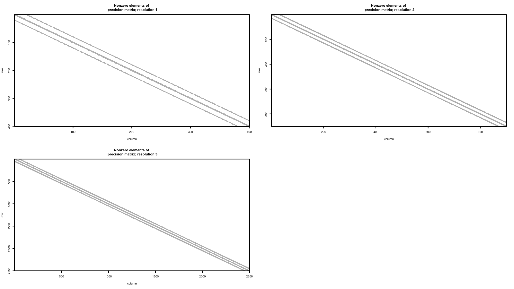

The MRA approach requires a set of grid point at each resolution. The set of grid points at each resolution extends beyond the spatial domain that is highlighted in the black box.


```r
data.frame(
    x = unlist(sapply(1:M, function(i) MRA$locs_grid[[i]][, 1])),
    y = unlist(sapply(1:M, function(i) MRA$locs_grid[[i]][, 2])),
    resolution = factor(unlist(sapply(1:M, function(i) rep(i, each = nrow(MRA$locs_grid[[i]])))))
) %>%
    ggplot(aes(x = x, y = y, color = resolution)) +
    geom_point(alpha = 0.75, size = 0.75) +
    ggtitle("MRA grid points") +
    theme_bw() +
  scale_colour_viridis_d(end = 0.8) +
  geom_rect(
    data = NULL,
    aes(xmin = min(locs[, 1]),
        xmax = max(locs[, 1]),
        ymin = min(locs[, 2]),
        ymax = max(locs[, 2])
    ),
    fill  = NA,
    color = "black",
    alpha = 0.5
  ) +
  theme_custom()
```

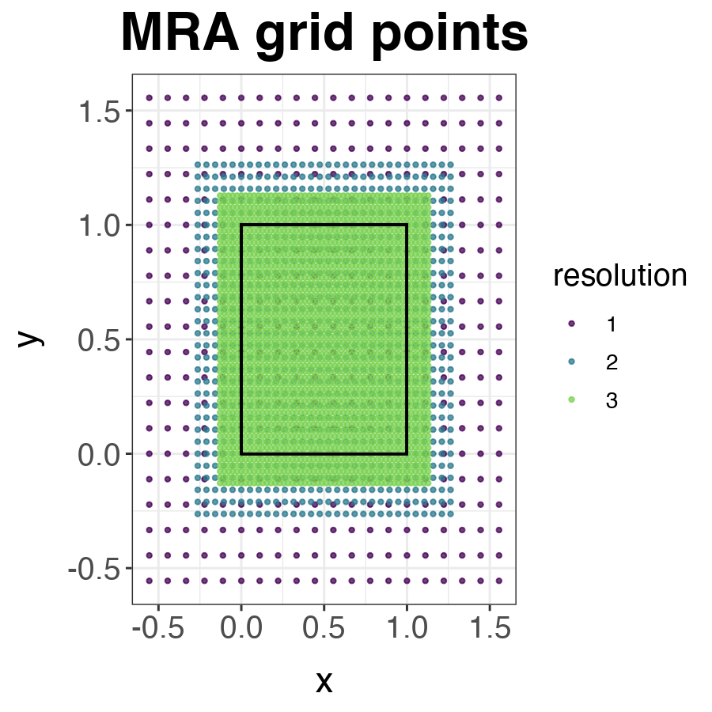

At each internal grid cell, we expect there to be 68 neighbors where the Wendland basis is nonzero. The plot below shows the number of neighbors at each grid point for each resolution.


```r
nnn <- sapply(1:M, function(i) {
  D <- rdist(MRA$locs_grid[[i]])
  sapply(1:nrow(MRA$locs_grid[[i]]), function(j) {
    sum((D[j, ]) < MRA$radius[i])}
  )
})

data.frame(
  x = unlist(sapply(1:M, function(i) MRA$locs_grid[[i]][, 1])),
  y = unlist(sapply(1:M, function(i) MRA$locs_grid[[i]][, 2])),
  resolution = factor(unlist(sapply(1:M, function(i) rep(paste("resolution", i), each = nrow(MRA$locs_grid[[i]]))))),
  neighbors <- unlist(nnn)
)  %>%
  ggplot(aes(x = x, y = y, fill = neighbors)) +
  geom_raster() +
  facet_wrap(~ resolution) +
  ggtitle("number of neighbors") +
  scale_fill_viridis_c() +
    geom_rect(
    data = NULL,
    aes(xmin = min(locs[, 1]),
        xmax = max(locs[, 1]),
        ymin = min(locs[, 2]),
        ymax = max(locs[, 2])
    ),
    fill  = NA,
    color = "black",
    alpha = 0.5
  ) +
  theme_bw() +
  theme_custom()
```

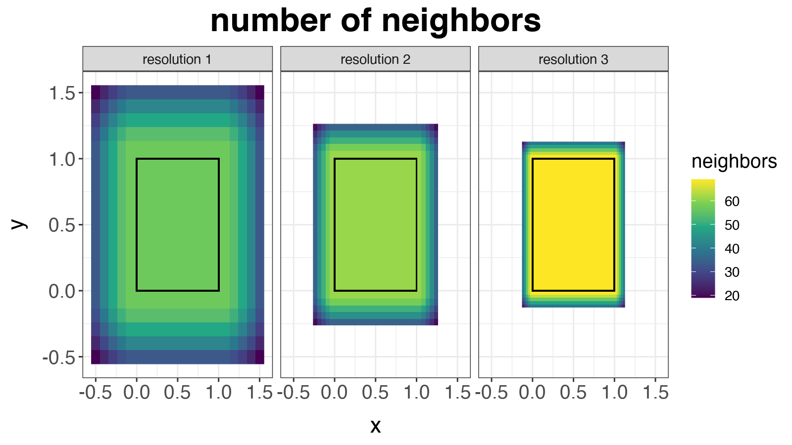

The next plot shows the simulated spatial random effects $\boldsymbol{\alpha}_m$ at each of the grid points. Notice that the variation is largest for the coarse resolution and the variability decreases for each finer resolution.


```r
sim_alphas <- data.frame(
    x = unlist(sapply(1:M, function(i) MRA$locs_grid[[i]][, 1])),
    y = unlist(sapply(1:M, function(i) MRA$locs_grid[[i]][, 2])),
    resolution = factor(unlist(sapply(1:M, function(i) rep(paste("resolution", i), each = nrow(MRA$locs_grid[[i]]))))),
    alpha = unlist(sapply(1:M, function(i) alpha[dims_idx == i]))
) %>%
    ggplot(aes(x = x, y = y, fill = alpha)) +
    geom_raster() +
  ggtitle("MRA spatial random effects") +
    scale_fill_viridis_c() +
    geom_rect(
    data = NULL,
    aes(xmin = min(locs[, 1]),
        xmax = max(locs[, 1]),
        ymin = min(locs[, 2]),
        ymax = max(locs[, 2])
    ),
    fill  = NA,
    color = "black",
    alpha = 0.5
  ) +
  facet_wrap( ~ resolution, ncol = 2) +
  theme_bw() +
  theme_custom()

sim_alphas
```

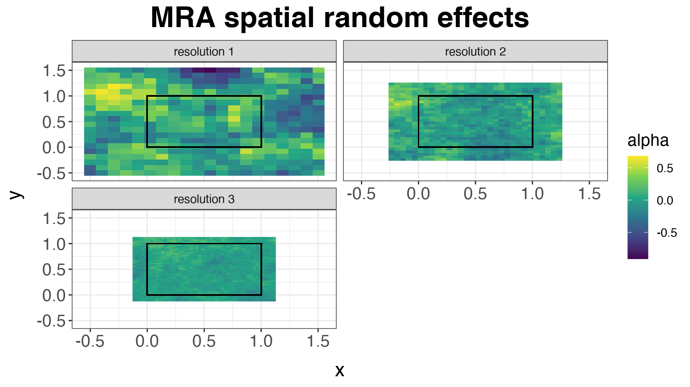

Next, we show a simulated realization of the model. The left figure below shows the fixed effects in the model, the middle figure shows the simulated spatial process, and the right plot shows the observed surface.


```r
zlims <- c(
  min(c(X %*% beta), c(y), c(W %*% alpha)),
  max(c(X %*% beta), c(y), c(W %*% alpha))
)

g_fixed <- data.frame(
  temp = c(X %*% beta),
  x    = locs[, 1],
  y    = locs[, 2]
) %>%
  ggplot(aes(x = x, y = y, fill = temp)) +
  geom_raster() +
  xlab("x") +
  ylab("y") +
  ggtitle("Fixed effects") +
  colorspace::scale_fill_continuous_diverging("Blue-Red 3", limits = zlims) +
  theme_bw() +
  theme_custom(0.70)
```

```
## Error in ggplot2::continuous_scale(aesthetics, "continuous_diverging", : object 'zlims' not found
```

```r
dat_map <- data.frame(
  temp = c(y),
  re   = c(W %*% alpha),
  x    = locs[, 1],
  y    = locs[, 2]
)

g_full <- dat_map %>%
  ggplot(aes(x = x, y = y, fill = temp)) +
  geom_raster() +
  xlab("x") +
  ylab("y") +
  ggtitle("Observed surface") +
  colorspace::scale_fill_continuous_diverging("Blue-Red 3", limits = zlims) +
  theme_bw() +
  theme_custom(0.70)
```

```
## Error in ggplot2::continuous_scale(aesthetics, "continuous_diverging", : object 'zlims' not found
```

```r
g_re <- dat_map %>%
  ggplot(aes(x = x, y = y, fill = re)) +
  geom_raster() +
  xlab("x") +
  ylab("y") +
  ggtitle("Spatial process") +
  colorspace::scale_fill_continuous_diverging("Blue-Red 3", limits = zlims) +
  theme_bw() +
  theme(legend.position = "none") +
  theme_custom(0.70)
```

```
## Error in ggplot2::continuous_scale(aesthetics, "continuous_diverging", : object 'zlims' not found
```

```r
g_fixed + g_re + g_full + plot_layout(guides = "collect")
```

```
## Error in eval(expr, envir, enclos): object 'g_fixed' not found
```

To further examine how the spatial process is constructed, the plot below shows the contribution to the full spatial process (bottom right plot) from each of the different resolutions. The plot shows how the coarsest resolution (top left) produces a coarse process over large spatial resolutions and the finest resolution (lower left) produces a finer-scale process. The three (M) resolutions are added together to produce the full process.


```r
## MRA spatial process
W_alpha_res = unlist(sapply(1:M, function(m) W[, dims_idx == m] %*% alpha[dims_idx == m], simplify = "matrix"))
dimnames(W_alpha_res) <- list(
  site = 1:N,
  res  = paste("resolution", 1:M)
)
dat_locs <- data.frame(
  site = 1:N,
  x    = locs[, 1],
  y    = locs[, 2]
)

sim_MRA <- rbind(
  merge(dat_locs, as.data.frame.table(W_alpha_res, responseName = "W_alpha")),
  data.frame(
    site    = 1:N,
    x       = locs[, 1],
    y       = locs[, 2],
    W_alpha = W %*% alpha,
    res     = "full process"
  )
) %>%
  ggplot(aes(x = x, y = y, fill = W_alpha)) +
  geom_raster() +
  facet_wrap( ~ res, ncol = 2) +
  xlab("x") +
  ylab("y") +
  ggtitle("Multi-resolution process") +
  colorspace::scale_fill_continuous_diverging("Blue-Red 3") +
  theme_bw() +
  theme_custom()
sim_MRA
```

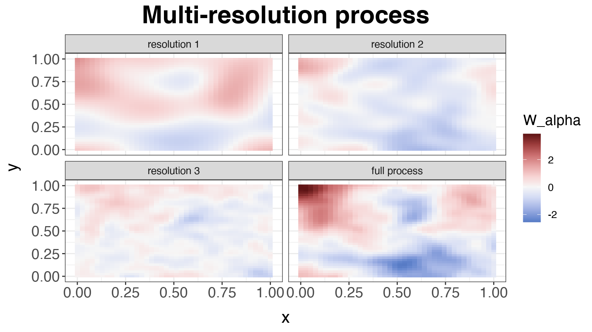

# Fitting the MRA model

To explore how well the fitted model can predict out of sample data, we take a sample $s$ of size $n_{sites}$ from the $N$ simulated points and fit the model using `mcmc_mra()`.


```r
set.seed(111)
n_sites   <- 500
s         <- sample(N, n_sites)
y_s       <- y[s, ]
y_oos     <- y[ - s, ]
X_s       <- X[s, ]
X_oos     <- X[ - s, ]
locs_s    <- locs[s, ]
locs_oos  <- locs[ - s, ]
```

The plot below shows the sampled data to which the model is fit, showing the spatial patterns of the sampled data.


```r
data.frame(
  x     = locs_s[, 1],
  y     = locs_s[, 2],
  site  = factor(1:n_sites),
  y_s     = y_s
) %>%
  ggplot(aes(x = x, y = y, fill = y_s)) +
  geom_raster() +
  colorspace::scale_fill_continuous_diverging("Blue-Red 3", limits = zlims) +
  ggtitle("Sampled y") +
  theme_bw() +
  theme_custom() +
  theme(legend.position = "none")
```

```
## Error in ggplot2::continuous_scale(aesthetics, "continuous_diverging", : object 'zlims' not found
```


To fit the model, we must specify the parameters form model fitting. The parameter `params$n_adapt` determines the number of warm-up MCMC iterations and these iterations are discarded. The parameter `params$n_mcmc` determines the number of post warm-up MCMC iterations (i.e., the total number of MCMC iterations is `params$n_adapt + params$n_mcmc`). The parameter `params$n_thin` determines the thinning rate for keeping posterior samples which is primarily used when the number of MCMC samples to keep stresses the computer memory usage. The total number of samples kept is `params$n_mcmc / params$n_thin`. The parameter `params$n_message` specifies the frequency of messages to display showing the progress of the MCMC algorithm. The object `priors` defines the priors for fitting the model. If `priors` is not specified, default priors are used.


```r
params <- list(
  n_mcmc    = 500,
  n_adapt   = 500,
  n_thin    = 1,
  n_message = 50
)

priors <- list(
  alpha_tau2   = 1,
  beta_tau2    = 1,
  alpha_sigma2 = 1,
  beta_sigma2  = 1,
  mu_beta      = rep(0, ncol(X_s)),
  Sigma_beta   = 5 * diag(ncol(X_s)))
```

Now we can fit the model to the simulated data. Using a [project-oriented workflow](https://www.tidyverse.org/blog/2017/12/workflow-vs-script/), we save the MCMC output that results from `mcmc_mra()` in a folder named `results` in the current project.

## Fitting the model using MCMC


```r
set.seed(999)

if (file.exists(here::here("results", "fit-mra-sim.RData"))) {
  load(here::here("results", "fit-mra-sim.RData"))
} else {
  start   <- Sys.time()
  out     <- mcmc_mra(
    y             = y_s,
    X             = X_s,
    locs          = locs_s,
    params        = params,
    priors        = priors,
    M             = M,
    n_coarse_grid = n_coarse,
    n_cores       = 1L,
    verbose       = FALSE
  )
  end     <- Sys.time()
  runtime <- end - start
  save(out, runtime, file = here::here("results", "fit-mra-sim.RData"))
}
```


The fitting of `mcmc_mra()` took 6.02 mins.


# Examining the MRA MCMC output

After fitting the MCMC using `mcmc_mra()`, we plot the trace plots of the parameters to check for evidence that the model has not converged and to identify that the parameters have mixed. The first trace plots we examine are for the variance parameters and the regression coefficients. Overall, these trace plots look decent although the effective samples size for the $\tau^2$s and $\beta$s might be low and more samples might be needed for making inference with the model.


```r
dat_tau2 <- data.frame(
  tau2      = c(out$tau2),
  iteration = rep(1:nrow(out$tau2), times = M),
  resolution = factor(rep(1:M, each = nrow(out$tau2)))
)

p_tau2 <- ggplot(dat_tau2, aes(x = iteration, y = tau2, group = resolution, color = resolution)) +
  geom_line() +
  scale_color_viridis_d(end = 0.8) +
  ggtitle("Trace plots for tau2") +
  theme_bw() +
  theme_custom(0.7)

dat_lambda <- data.frame(
  lambda      = c(out$lambda),
  iteration = rep(1:nrow(out$lambda), times = M),
  resolution = factor(rep(1:M, each = nrow(out$lambda)))
)

p_lambda <- ggplot(dat_lambda, aes(x = iteration, y = lambda, group = resolution, color = resolution)) +
  geom_line() +
  scale_color_viridis_d(end = 0.8) +
  ggtitle("Trace plots for lambda") +
  theme_bw() +
  theme_custom(0.7)


p_sigma2 <- data.frame(sigma2 = c(out$sigma2), iteration = 1:length(out$sigma2)) %>%
  ggplot(aes(x = iteration, y = sigma2)) +
  geom_line() +
  scale_color_viridis_d(end = 0.8) +
  ggtitle("Trace plots for sigma2") +
  theme_bw() +
  theme_custom(0.7)

dat_beta <- data.frame(
  beta      = c(out$beta),
  iteration = rep(1:nrow(out$beta), times = ncol(X)),
  covariate = factor(rep(1:ncol(X), each = nrow(out$beta)))
)
p_beta  <- ggplot(dat_beta, aes(x = iteration, y = beta, group = covariate, color = covariate)) +
  geom_line() +
  scale_color_viridis_d(end = 0.8) +
  ggtitle("Trace plots for beta") +
  theme_bw() +
  theme_custom(0.7)

(p_tau2 + p_lambda) /  (p_sigma2 + p_beta)
```

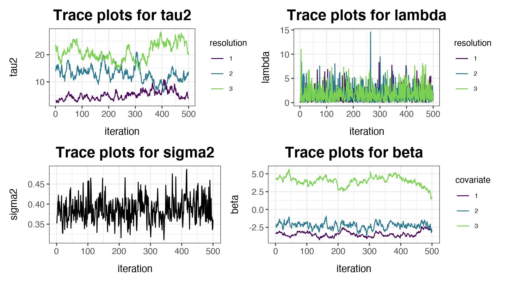

Next, the trace plots for the spatial parameter $\boldsymbol{\alpha}_m$ are shown. Because there are so many parameters, a sample is taken for plotting. These trace plots suggest that perhaps $\boldsymbol{\alpha}$ hasn't entirely converged. However, as there is a non-identifiability between $\tau^2_m$ and $\boldsymbol{\alpha}_m$, this is not surprising and might not be remedied with more samples.


```r
## posterior plots for alpha

dat_alpha <- data.frame(
  alpha = c(out$alpha),
  iteration = rep(1:nrow(out$alpha), each = ncol(out$alpha)),
  knot      = factor(unlist(sapply(1:M, function(m) 1:n_dims[m]))),
  resolution = factor(paste("resolution", dims_idx))
)

plot_idx <- sapply(1:M, function(m) sample(n_dims[m], 10))

dat_alpha %>%
  subset(
    (resolution == "resolution 1" & knot %in% plot_idx[, 1]) |
      (resolution == "resolution 2" & knot %in% plot_idx[, 2]) |
      (resolution == "resolution 3" & knot %in% plot_idx[, 3])
  ) %>%
  ggplot(aes(x = iteration, y = alpha, group = knot, color = knot)) +
  geom_line(alpha = 0.5) +
  facet_wrap( ~ resolution, ncol = 1) +
  scale_color_viridis_d(end = 0.8) +
  ggtitle("Trace plots for alpha") +
  theme_bw() +
  theme_custom(0.7) +
  theme(legend.position = "none")
```

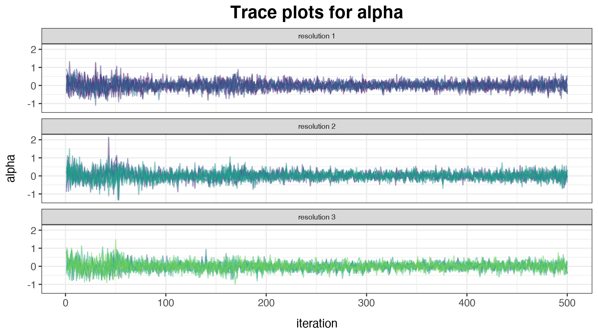

Because the model was fit to simulated data, the posterior predictions can be compared to the simulated parameters to evaluate the model performance. The following plots show the 95\% central credible intervals for different parameters plotted against the simulated parameters. For the regression parameters $\boldsymbol{\beta}$, the model is doing a reasonable job of recovering these parameters. The parameter estimates for $\tau^2_m$ and $\boldsymbol{\alpha}_m$ show poor performance in estimating the true parameters. This is due to a non-identifiability in the model; however, this is not a concern as the spatial process $\sum_{m=1}^M \mathbf{W}_m \boldsymbol{\alpha}_m$ is well estimated which will be shown later.


```r
## predicted vs. estimated beta
dat_plot <- data.frame(
  truth = beta,
  mean  = apply(out$beta, 2, mean),
  lower = apply(out$beta, 2, quantile, prob = 0.025),
  upper = apply(out$beta, 2, quantile, prob = 0.975),
  parameter = factor(1:length(beta))
)

p_beta <- dat_plot %>%
  ggplot(aes(x = truth, y = mean, color = parameter)) +
  scale_color_viridis_d(begin = 0, end = 0.8) +
  geom_point(alpha = 0.5) +
  geom_linerange(aes(ymin = lower, ymax = upper)) +
  ylab("estimate") +
  geom_abline(intercept = 0, slope = 1, col = "red") +
  ggtitle("Estimated vs. predicted beta") +
  theme(legend.position = "none")

## predicted vs. estimated sigma2
p_sigma2 <- data.frame(sigma2 = out$sigma2) %>%
  ggplot(aes(y = sigma2)) +
  geom_boxplot() +
  geom_point(data = data.frame(sigma2 = sigma2),
             aes(x = 0, y = sigma2), color = "red", size = 2) +
  ylab("estimate") +
  xlab("sigma2") +
  ggtitle("Estimated vs. predicted sigma2") +
  theme(legend.position = "none",
        axis.text.x  = element_blank(),
        axis.ticks.x = element_blank())

## predicted vs. estimated tau2
dat_plot <- data.frame(
  truth = tau2,
  mean  = apply(out$tau2, 2, mean),
  lower = apply(out$tau2, 2, quantile, prob = 0.025),
  upper = apply(out$tau2, 2, quantile, prob = 0.975),
  parameter = factor(1:length(tau2))
)


p_tau2 <- dat_plot %>%
  ggplot(aes(x = truth, y = mean, color = parameter)) +
  scale_color_viridis_d(begin = 0, end = 0.8) +
  geom_point(alpha = 0.5) +
  geom_linerange(aes(ymin = lower, ymax = upper)) +
  ylab("estimate") +
  geom_abline(intercept = 0, slope = 1, col = "red") +
  ggtitle("Estimated vs. predicted tau2") +
  theme(legend.position = "none")

# plot alpha estimates
dat_plot <- data.frame(
  truth = alpha,
  mean = apply(out$alpha, 2, mean),
  lower = apply(out$alpha, 2, quantile, prob = 0.025),
  upper = apply(out$alpha, 2, quantile, prob = 0.975),
  parameter = factor(1:length(alpha)),
  res       = factor(dims_idx)
)

p_alpha <- dat_plot %>%
  ggplot(aes(x = truth, y = mean, color = res)) +
  scale_color_viridis_d(begin = 0, end = 0.8) +
  geom_point(alpha = 0.5) +
  geom_linerange(aes(ymin = lower, ymax = upper)) +
  geom_abline(intercept = 0, slope = 1, col = "red") +
  ggtitle("Estimated vs. predicted alpha /nnon-identifialbe but not really a concern") +
  ylab("estimate")

(p_beta + p_sigma2) / (p_tau2 + p_alpha)
```

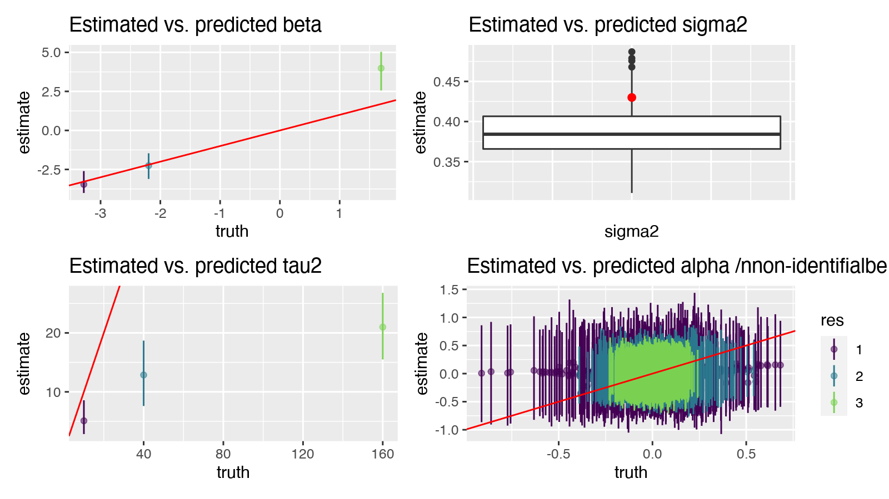


Next, the simulated and estimated $\boldsymbol{\alpha}_m$ are plotted on the spatial grid. The plots show that the $\boldsymbol{\alpha}_m$s are not being identified.


```r
fitted_alphas <- data.frame(
    x = unlist(sapply(1:M, function(i) MRA$locs_grid[[i]][, 1])),
    y = unlist(sapply(1:M, function(i) MRA$locs_grid[[i]][, 2])),
    res = factor(unlist(sapply(1:M, function(i) rep(i, each = nrow(MRA$locs_grid[[i]]))))),
    alpha = unlist(sapply(1:M, function(i) apply(out$alpha, 2, mean)[dims_idx == i]))
) %>%
    ggplot(aes(x = x, y = y, fill = alpha)) +
    geom_raster() +
    scale_fill_viridis_c() +
  ggtitle("Posterior mean spatial random effects") +
  facet_wrap( ~ res, ncol = 2) +
  geom_rect(
    data = NULL,
    aes(xmin = min(locs[, 1]),
        xmax = max(locs[, 1]),
        ymin = min(locs[, 2]),
        ymax = max(locs[, 2])
    ),
    fill  = NA,
    color = "black",
    alpha = 0.5
  ) +
  theme_bw() +
  theme_custom(0.5)
sim_alphas + theme_custom(0.5) + fitted_alphas
```

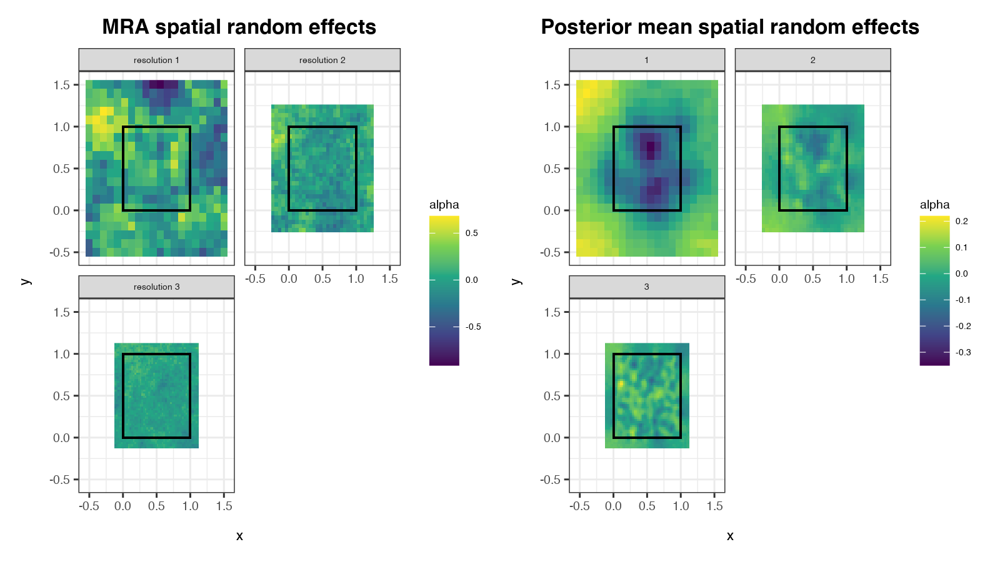

Despite the parameters $\tau^2_m$ and $\boldsymbol{\alpha}_m$ not being identifiable, the following plot shows that the full spatial process $\sum_{m=1}^M \mathbf{W}_m \boldsymbol{\alpha}_m$. The two figures (simulated on the left, fitted on the right) demonstrate that each of the $m$ resolutions of the process $\mathbf{W}_m \boldsymbol{\alpha}_m$ are also non-identifiable.


```r
## Estimated MRA spatial proces
W_alpha_res = unlist(sapply(1:M, function(m) W[, dims_idx == m] %*% apply(out$alpha, 2, mean)[dims_idx == m], simplify = "matrix"))
dimnames(W_alpha_res) <- list(
  site = 1:N,
  res  = paste("resolution", 1:M)
)
dat_locs <- data.frame(
  site = 1:N,
  lat  = locs[, 2],
  lon  = locs[, 1]
)

estimated_MRA <- rbind(
  merge(dat_locs, as.data.frame.table(W_alpha_res, responseName = "W_alpha")),
  data.frame(
    site = 1:N,
    lat  = locs[, 2],
    lon  = locs[, 1],
    W_alpha = W %*% alpha,
    res = "full process"
  )
) %>%
  ggplot(aes(x = lon, y = lat, fill = W_alpha)) +
  geom_raster() +
  facet_wrap( ~ res, ncol = 2) +
  xlab("Longitude") +
  ylab("Latitude") +
  ggtitle("Estimated Multi-resolution process") +
  colorspace::scale_fill_continuous_diverging("Blue-Red 3") +
  theme_bw() +
  theme_custom(0.5)

sim_MRA + theme_custom(0.5) + estimated_MRA
```

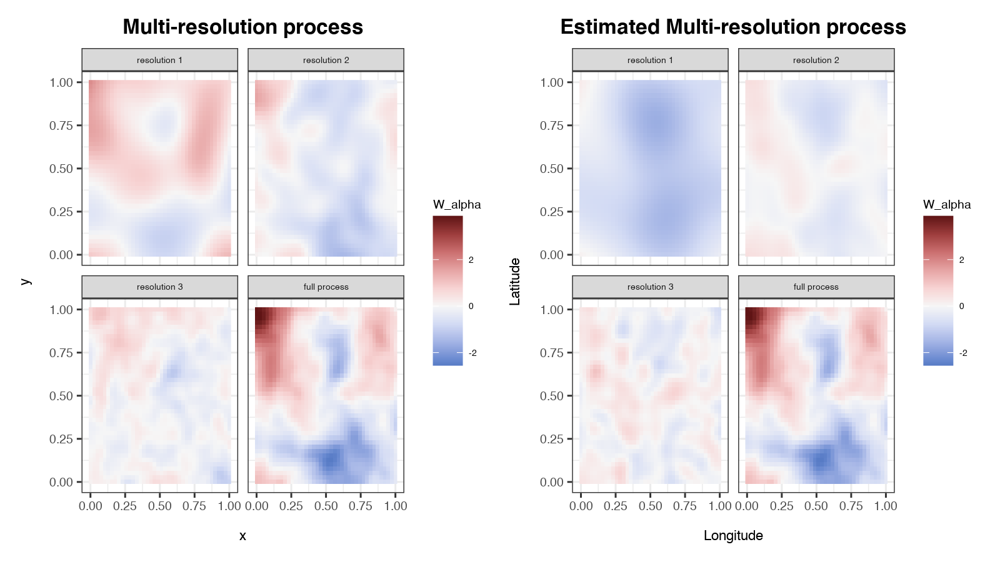

The next plots show the estimated vs. simulated fixed effects, spatial process, and mean response. There is some evidence of non-identifiability between the fixed effects plot and the spatial effects plot (left two plots) as there is a bias in each of the predictions. This is understood to be a consequence of spatial confounding (@hodges2010adding, @hughes2013dimension, @hanks2015restricted).


```r
## plot estimated mean response
Xbeta_post <- t(X_s %*% t(out$beta))
Walpha_post <- t(do.call(cbind, out$MRA$W) %*% t(out$alpha))
mu_post <- Xbeta_post + Walpha_post

dat_plot <- data.frame(
  mean_Xbeta   = apply(Xbeta_post, 2, mean),
  lower_Xbeta  = apply(Xbeta_post, 2, quantile, prob = 0.025),
  upper_Xbeta  = apply(Xbeta_post, 2, quantile, prob = 0.975),
  truth_Xbeta  = X_s %*% beta,

  mean_Walpha  = apply(Walpha_post, 2, mean),
  lower_Walpha = apply(Walpha_post, 2, quantile, prob = 0.025),
  upper_Walpha = apply(Walpha_post, 2, quantile, prob = 0.975),
  truth_Walpha = (W %*% alpha)[s],

  mean_mu      = apply(mu_post, 2, mean),
  lower_mu     = apply(mu_post, 2, quantile, prob = 0.025),
  upper_mu     = apply(mu_post, 2, quantile, prob = 0.975),
  truth_mu     = X_s %*% beta + (W %*% alpha)[s]
)

plot_Xbeta <- dat_plot %>%
  ggplot(aes(x = truth_Xbeta, y = mean_Xbeta)) +
  scale_color_viridis_d(begin = 0, end = 0.8) +
  geom_point(alpha = 0.5) +
  geom_errorbar(aes(ymin = lower_Xbeta, ymax = upper_Xbeta)) +
  geom_abline(intercept = 0, slope = 1, col = "red") +
  ggtitle("Estimated vs. simulated fixed effects")

plot_Walpha <- dat_plot %>%
  ggplot(aes(x = truth_Walpha, y = mean_Walpha)) +
  scale_color_viridis_d(begin = 0, end = 0.8) +
  geom_point(alpha = 0.5) +
  geom_errorbar(aes(ymin = lower_Walpha, ymax = upper_Walpha)) +
  geom_abline(intercept = 0, slope = 1, col = "red") +
  ggtitle("Estimated vs. simulated spatial process")

plot_mu <- dat_plot %>%
  ggplot(aes(x = truth_mu, y = mean_mu)) +
  scale_color_viridis_d(begin = 0, end = 0.8) +
  geom_point(alpha = 0.5) +
  geom_errorbar(aes(ymin = lower_mu, ymax = upper_mu)) +
  geom_abline(intercept = 0, slope = 1, col = "red") +
  ggtitle("Estimated vs. simulated mean response")

plot_Xbeta + plot_Walpha + plot_mu
```

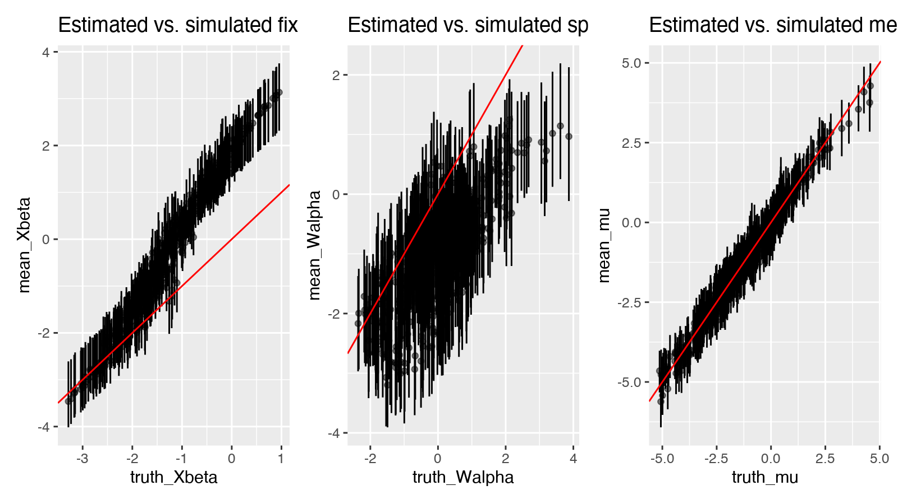


# References


