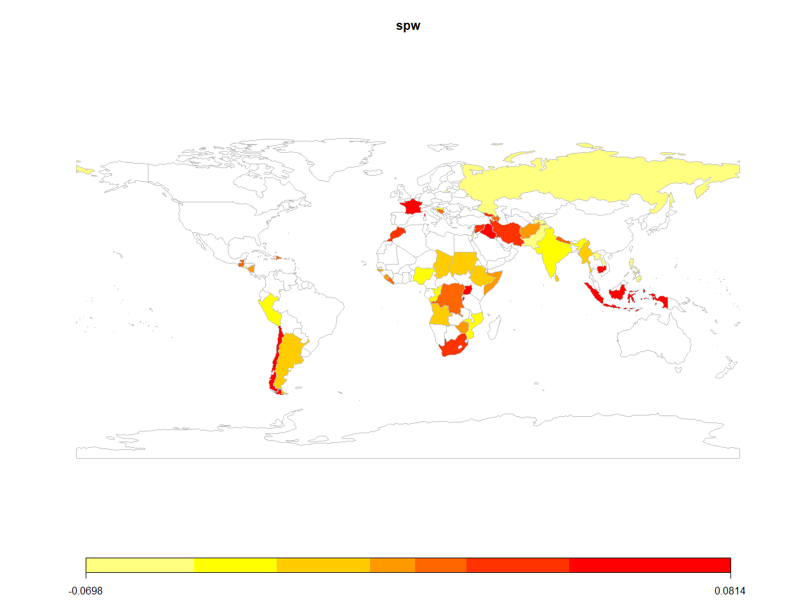
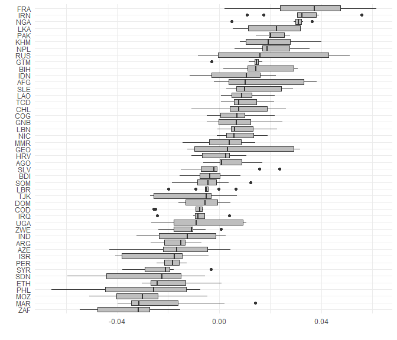

<!-- README.md is generated from README.Rmd. Please edit that file -->

# BayesSPsurv

<!-- badges: start -->

[](https://cran.r-project.org/package=BayesSPsurv)
[](https://github.com/Nicolas-Schmidt/BayesSPsurv/actions)
[](https://www.repostatus.org/#active)
[](https://www.tidyverse.org/lifecycle/#stable)
[](https://github.com/Nicolas-Schmidt/BayesSPsurv)
[](https://opensource.org/licenses/MIT)

<!-- badges: end -->

Bayesian parametric spatial split-population survival models for
clustered event processes. The models account for both structural and
spatial heterogeneity among “at risk” and “immune” populations, and
incorporates time-varying covariates. This package currently implements
Weibull, Exponential and Log-logistic forms for the duration component,
and includes functions for a series of diagnostic tests and plots to
easily visualize convergence and spatial effects. The user can also
create their own spatial weights matrix based on their units and
adjacencies of interest, making the use of these models flexible and
broadly applicable to a variety of research areas.

### Installation

``` r
# Install speech from CRAN
install.packages("BayesSPsurv")

# The development version from GitHub:
if (!require("remotes")) install.packages("remotes")
remotes::install_github("Nicolas-Schmidt/BayesSPsurv")
```

### Functions

| Function         | Description                                                                                                          |
| ---------------- | -------------------------------------------------------------------------------------------------------------------- |
| `spatialSPsurv`  | Markov Chain Monte Carlo (MCMC) to run time-varying Bayesian split population survival model with spatial frailties. |
| `exchangeSPsurv` | Markov Chain Monte Carlo (MCMC) to run Bayesian split population survival model with exchangeable frailties.         |
| `pooledSPsurv`   | Markov Chain Monte Carlo (MCMC) to run Bayesian split population survival model with no frailties                    |
| `summary`        | Returns a summary of exchangeSPsurv, pooledSPsurv or spatialSPsurv object via `coda::summary.mcmc`.                  |
| `spatial_SA`     | Generates a spatial weights matrix with units and adjacencies defined by the user.                                   |
| `SPstats`        | A function to calculate the deviance information criterion (DIC) and Log-likelihood for fitted model oupts.          |

### Example

``` r

library(BayesSPsurv)

## Data
walter <- spduration::add_duration(Walter_2015_JCR,"renewed_war", 
                                   unitID = "ccode", tID = "year", 
                                   freq = "year", ongoing = FALSE)
#> Registered S3 method overwritten by 'quantmod':
#>   method            from
#>   as.zoo.data.frame zoo
walter <- BayesSPsurv::spatial_SA(data = walter, var_ccode = "ccode", threshold = 800L)


set.seed(123456)

model <- 
    spatialSPsurv(
        duration = duration ~ fhcompor1 + lgdpl + comprehensive + victory + 
                              instabl + intensityln + ethfrac + unpko,
        immune   = cured ~ fhcompor1 + lgdpl + victory,
        Y0       = 't.0',
        LY       = 'lastyear',
        S        = 'sp_id' ,
        data     = walter[[1]],
        N        = 500,
        burn     = 10,
        thin     = 10,
        w        = c(1,1,1),
        m        = 10,
        form     = "Weibull",
        prop.var = 1e-05,
        A        = walter[[2]]
    )

print(model)
#> Call:
#> spatialSPsurv(duration = duration ~ fhcompor1 + lgdpl + comprehensive + 
#>     victory + instabl + intensityln + ethfrac + unpko, immune = cured ~ 
#>     fhcompor1 + lgdpl + victory, Y0 = "t.0", LY = "lastyear", 
#>     S = "sp_id", A = walter[[2]], data = walter[[1]], N = 500, 
#>     burn = 10, thin = 10, w = c(1, 1, 1), m = 10, form = "Weibull", 
#>     prop.var = 1e-05)
#> 
#> 
#> Iterations = 1:49
#> Thinning interval = 1 
#> Number of chains = 1 
#> Sample size per chain = 49 
#> 
#> Empirical mean and standard deviation for each variable,
#> plus standard error of the mean:
#> 
#> 
#> Duration equation: 
#>                      Mean         SD   Naive SE Time-series SE
#> (Intercept)    1.00814151 1.08126022 0.15446575     0.43017597
#> fhcompor1     -0.86040095 0.51570840 0.07367263     0.09154776
#> lgdpl          0.01516985 0.11875675 0.01696525     0.05333867
#> comprehensive -0.75590604 0.31156314 0.04450902     0.03266632
#> victory        0.47751228 0.37117992 0.05302570     0.02824285
#> instabl        0.74508684 0.47644646 0.06806378     0.06806378
#> intensityln    0.13956073 0.09491131 0.01355876     0.02921604
#> ethfrac        0.10052477 0.52692819 0.07527546     0.07527546
#> unpko          0.67711562 0.65094311 0.09299187     0.07259810
#> 
#> Inmune equation: 
#>                  Mean       SD  Naive SE Time-series SE
#> (Intercept) -2.224744 4.336817 0.6195454      1.1667720
#> fhcompor1    1.250456 3.846270 0.5494671      0.8986669
#> lgdpl       -2.313382 2.307048 0.3295783      0.3295783
#> victory      1.689145 3.135734 0.4479620      0.6556410

SPstats(model)
#> $DIC
#> [1] -7501.048
#> 
#> $Loglik
#> [1] 23338.27

# ~~~~~~~~~~~~
# Map
# ~~~~~~~~~~~~

spw   <- matrix(apply(model$W, 2, mean), ncol = 1, nrow = ncol(model$W))
ccode <- colnames(model$W)
ISO3  <- countrycode::countrycode(ccode,'gwn','iso3c')
spw   <- data.frame(ccode = ccode, ISO3 = ISO3, spw = spw) 
map   <- rworldmap::joinCountryData2Map(spw, joinCode = "ISO3", nameJoinColumn = "ISO3")
#> 46 codes from your data successfully matched countries in the map
#> 0 codes from your data failed to match with a country code in the map
#> 197 codes from the map weren't represented in your data
rworldmap::mapCountryData(map, nameColumnToPlot = 'spw')
```



## exchangeSPsurv

``` r
walter <- spduration::add_duration(Walter_2015_JCR,"renewed_war", 
                                   unitID = "ccode", tID = "year", 
                                   freq = "year", ongoing = FALSE)

walter$S     <- rep(x = 1:length(unique(walter$ccode)), times = rle(walter$ccode)$lengths)
country <- countrycode::countrycode(unique(walter$ccode),'gwn','iso3c')

set.seed(123456)

model <-
    exchangeSPsurv(
        duration = duration ~ fhcompor1 + lgdpl + comprehensive + victory +
            instabl + intensityln + ethfrac + unpko,
        immune   = cured ~ fhcompor1 + lgdpl + victory,
        Y0       = 't.0',
        LY       = 'lastyear',
        S        = 'S' ,
        data     = walter,
        N        = 100,
        burn     = 10,
        thin     = 10,
        w        = c(1,1,1),
        m        = 10,
        form     = "loglog",
        prop.var = 1e-05,
        id_WV    = country
    )


library(ggplot2)

w_country <- tidyr::pivot_longer(as.data.frame(model$W), cols = 1:ncol(model$W))

ggplot(w_country, aes(x = reorder(factor(name), value, FUN = median), y =  value)) +
    geom_boxplot(fill = 'gray') +  coord_flip() + theme_minimal() + labs(x = "", y = "")
```


