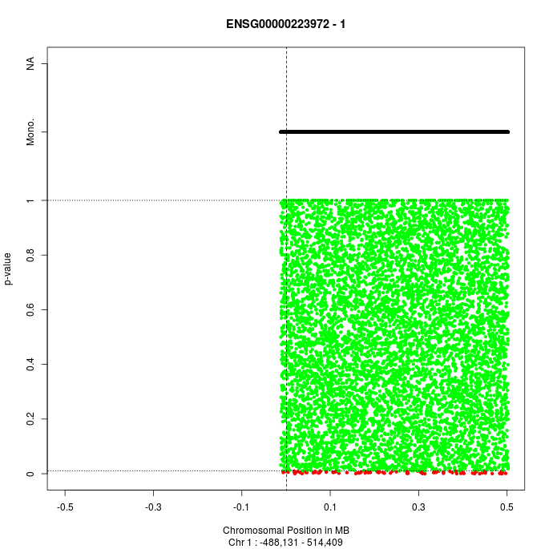
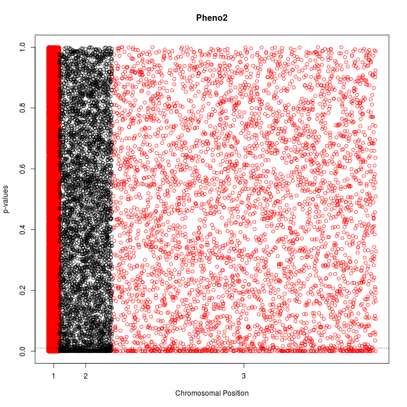
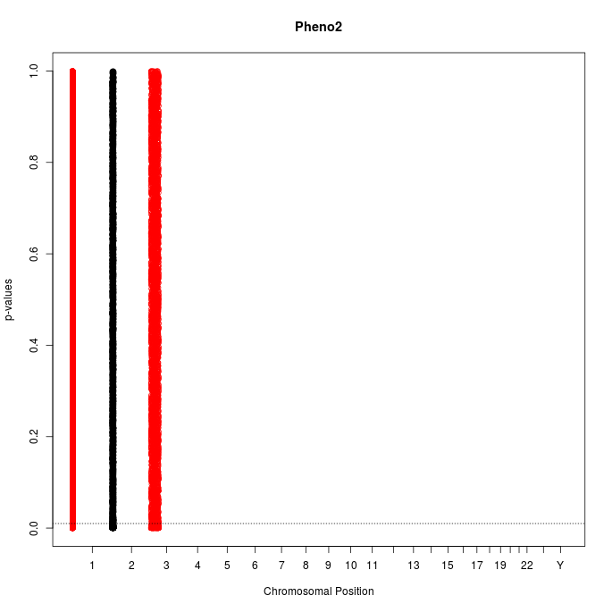
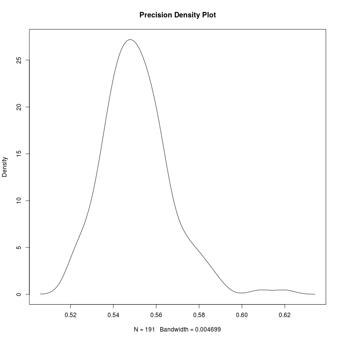

```{r setup, include=FALSE}
library(GenomicTools)
library(knitr)
knitr::opts_chunk$set(echo = TRUE)
knitr::opts_knit$set(base.dir=getwd())
knitr::opts_chunk$set(echo = TRUE,
                      dev=c("png"))
```

# Introduction

The R-package GenomicTools is designed for the analysis of so-called omics data, and here especially on gene expression and SNP data. The 
focus is on performing an eQTL, a QTL or a Multifactor dimensionality reduction (MDR). Although MDR is not limited to the genomic field and
all other kinds of categorical data can be used with it, the implementation is here tailored for genomic data and currently the generalization
to other variables proofs to be difficult. The package comes with a couple of example datasets, further datasets can be downloaded from the 
project page, links are given for that below. The following chapters explain in detail, how the package can be applied in different scenarios
and how the output is to be interpreted.

# Installation of GenomicTools
The latest stable version of GenomicTools is located on Cran and can be installed via

```{r eval=FALSE}
install.packages("GenomicTools")
```

The package depends also on the `snpStats` package from Bioconductor that is not installed automatically from the installation routine in R and needs to
be installed by hand. This can be done in a Bioconductor typical way by typing

```{r eval=FALSE}
source("https://bioconductor.org/biocLite.R")
biocLite("snpStats")
```

The latest developeder version, including the latest bugfixes is located at GitHub and can be installed like this:

```{r eval=FALSE}
library("devtools")
install_github("fischuu/GenomicTools")
```

The GitHub page is located here

[https://github.com/fischuu/GenomicTools](https://github.com/fischuu/GenomicTools)


and bugfixes and comments can easily be handed in via that platform. The package has also an own webpage where additional information may be posted 
and is located here:

[http://genomictools.danielfischer.name/](http://genomictools.danielfischer.name/)

After this webpage is established, it will beside other things also provide a couple of other example datasets.

Once the package is installed, it can be loaded into the workspace by typing 

```{r, warning=FALSE, error=FALSE,message=FALSE}
library("GenomicTools")
```


# Included datasets and the import functions
An overview of the example datasets. Currently many of them are simulated, but they will be moved to real datasets gradually.

## Annotation files
### Simulated Example File
An example annotation track is the `annotTrack` object. It can be loaded to the workspace via

```{r}
data("annotTrack")
```

and the first rows of it look like this

```{r, comment=NA}
annotTrack
```

### An own gtf file
GTF files are provided e.g. from Ensembl and can be downloaded from the corresponding webpage. For example the human annotation for
Ensembl build 85 can be found here:

[ftp://ftp.ensembl.org/pub/release-85/gtf/homo_sapiens/Homo_sapiens.GRCh38.85.gtf.gz](ftp://ftp.ensembl.org/pub/release-85/gtf/homo_sapiens/Homo_sapiens.GRCh38.85.gtf.gz)

After downloading this file, it can be imported to R with

```{r eval=FALSE}
ensGTF <- importGTF(file="Homo_sapiens.GRCh38.85.gtf.gz")
```

## Genotype files
### Simulated Example File
An example annotation track is the `genotData` object. It can be loaded to the workspace via

```{r}
data("genotData")
```

and the first rows of it look like this

```{r, comment=NA}
genotData
```

On 

http://genomictools.danielfischer.name

are also example vcf files available, that were too large to include into the package.

### An own ped/map filepair
An own filepair of ped/map files can be loaded, using the `importPED()` command:

```{r eval=FALSE}
ownGenotypes <- importPED(file="myGenotypes.ped", snps="myGenotypes.map")
```

Here, we assume that the filepair has the name `myGenotypes`.

### An own vcf file
TO import a vcf file to GenomicTools/R, the function `importVCF()` can be used:

```{r eval=FALSE}
ownGenotypes <- importVCF(file="myGenotypes.vcf")
```

## Gene expressions
### Simulated Example File
There is also a simulated example file on board. This can be loaded into the namespace by typing

```{r}
data("geneEXP")
```

and the first rows of it look like this

```{r, comment=NA}
geneEXP[1:5,1:4]
```

This data is a basic data frame respective matrix and own datasets can be loaded with the common commands like e.g. `read.table()` or `read.csv()`.


# General background for eQTL/QTL analyses
There are two methods implemented to perform an (e)QTL that may be picked with the `method=` option in the `eQTL`/`QTL` function. The two options 
are `LM` and `directional`. In case of `LM` a classical linear model is fitted to the data and it is tested if the slope is zero or not. This
is the same method that is practically implemented in all (e)QTL software tools. The second option `directional`, however, uses a directional
test based on probabilistic indices as it was presented in [@Fischer2014]. For the directional test, there is still another parameter option. The
p-values can be either determined using a permutation type test, or using asymptotic results. The options to set this are
either `testType="permutation"` or `testType="asymptotic"`. Currently the required asymptotic test is not implemented in the used R-package
`gMWT`, but this will happen during August 2016 and is then also available in `GenomicTools`.

# Perform an eQTL analysis

## Calculating the results
To run an eQTL first a couple of data objects have to be prepared. In the most simpliest case there is only a single gene that should be tested 
against. We show here the use with the included example datasets, to apply the methods to own data they only need to be imported to R
with the commands `importGTF` (annotation data), `importPED` (genotype data) and `read.table()` (gene expressions).

```{r}
# Make the example data available
  data("annotTrack")   # Standard gtf file, imported with importGTF
  data("geneEXP")      # Matrix with gene expression
  data("genotData")    # An imported Ped/Map filepair, using importPED
  # data("genotDataVCF") # An imported vcf file, using importVCF (too large for Cran)
```

The annotation is usually imported in gtf format. However, the function expects  the data to be in bed format (With the first four columns 
being `Chr`, `Start`, `End`, `Gene`). The function `gtfToBed()` transforms a previous imported `gtf` object into the required format. This
step is, however, only optional, as the functions also accept a `gtf` object and transform the object then internally. Especially if an
own annotation it provided, it might be easier to do that directly in bed format, using the columns as above.

```{r}
# Transform gtf to bed format (not necessarily required)
annot.bed <- gtfToBed(annotTrack)
```

Now run different cis-eQTLs with different options and input parameters:

```{r eval=FALSE}

# cis-eQTL
###############################################

# Most basic cis-eQTL runs:
EQTL1 <- eQTL(gex=geneEXP[,1:10], xAnnot = annotTrack, geno= genotData)

# Same run, if gtf has been transformed to bed previously
EQTL1.1   <- eQTL(gex=geneEXP[,1:10], xAnnot = annot.bed, geno= genotData)

# Same run, when the genotype data wasn't loaded and should be loaded
# here instead
EQTL1.2 <- eQTL(gex=geneEXP[,1:10], xAnnot = annotTrack, 
+               geno= file.path("Datasets","genotypes.ped"))

# Full set of genes, this time filtered with column names
EQTL2   <- eQTL(gex=geneEXP, xAnnot = annot.bed, geno= genotData, 
+               which = colnames(geneEXP)[1:20])

# Single vector of gene expression values, underlying gene is specified
# in the which option
EQTL3   <- eQTL(gex=as.vector(geneEXP[,1]), xAnnot = annot.bed, 
+               geno= genotData, which="ENSG00000223972")

# Same call, but instead of the name the row number in the gtf/bed
# file is provided
EQTL3.2 <- eQTL(gex=geneEXP[,1], xAnnot = annot.bed, geno= genotData,
+               which=1)

# The same expression values are now assigned to three different genes
EQTL4   <- eQTL(gex=as.vector(geneEXP[,1]), xAnnot = annot.bed,
+               geno= genotData, which=1:3)

```

<!-- In case the vcf file is used instead of a ped/map file, the commands are similar:

```{r, eval=FALSE}
EQTL1.vcf <- eQTL(gex=geneEXP[,1:10], xAnnot = annotTrack, geno= genotDataVCF)

# Same run, if gtf has been transformed to bed previously
EQTL1.1.vcf   <- eQTL(gex=geneEXP[,1:10], xAnnot = annot.bed, geno= genotDataVCF)

# Same run, when the genotype data wasn't loaded and should be loaded
# here instead
EQTL1.2.vcf <- eQTL(gex=geneEXP[,1:10], xAnnot = annotTrack, 
+               geno= file.path("Datasets","genotypes.vcf"))

# Full set of genes, this time filtered with column names
EQTL2.vcf   <- eQTL(gex=geneEXP, xAnnot = annot.bed, geno= genotDataVCF, 
+               which = colnames(geneEXP)[1:20])

# Single vector of gene expression values, underlying gene is specified
# in the which option
EQTL3.vcf   <- eQTL(gex=as.vector(geneEXP[,1]), xAnnot = annot.bed, 
+               geno= genotData.vcf, which="ENSG00000223972")

# Same call, but instead of the name the row number in the gtf/bed
# file is provided
EQTL3.2.vcf <- eQTL(gex=geneEXP[,1], xAnnot = annot.bed, geno= genotDataVCF,
+               which=1)

# The same expression values are now assigned to three different genes
EQTL4.vcf   <- eQTL(gex=as.vector(geneEXP[,1]), xAnnot = annot.bed,
+                 geno= genotData.vcf, which=1:3)
```

-->


Instead of the ped/map file also a vcf can be used in a similar way. The vcf created from the available ped/map file pair is available for
download at

http://genomictools.danielfischer.name

The typical (verbose) output of the eQTL run looks then like this

```{r message=FALSE, eval=FALSE}
# Same call, but this time is the corresponding column not casted
EQTL3.1 <- eQTL(gex=geneEXP[,1] , xAnnot = annot.bed, geno= genotData, 
                which="ENSG00000223972")
```

```
A vector of gene expression was provided. These expression values will be used for EACH gene in xAnnot. Please filter xAnnot accordingly, e.g. by using the 'which' option!
We will transform the gene annotations into a list ... done (Mon Sep  5 12:45:57 2016)!
We have for 100 % of the samples in the expression data the genotype information available. 
We have for 100 % of the samples in the genotype data the expression values available. 
We have for 100 % of the expression data the annotations. 
We will test for 1 genes possible eQTLs! 
---------------------------------------------- 
We calculated eQTLs for ENSG00000223972 for 9,799 SNPs (Mon Sep  5 12:46:10 2016)
```

And the same for the trans-eQTL

```{r eval=FALSE}
# Trans-eQTL
######################################

# Trans eQTL for the first and the last gene in our expression matrix
EQTL5   <- eQTL(gex=geneEXP[,c(1,1000)] , xAnnot = annot.bed, 
+               geno= genotData, windowSize = NULL)

# Same call, this time distributed to 8 cores (ony available on 
# Linux computers)
EQTL5   <- eQTL(gex=geneEXP[,c(1,1000)] , xAnnot = annot.bed, 
+               geno= genotData, windowSize = NULL, mc=8)
```

The output here is similar to the output from the cis-eQTL:

```{r, eval=FALSE}
# Expression values from the first gene are used to test the 100st 
# gene for trans-eQTL
EQTL6   <- eQTL(gex=as.vector(geneEXP[,1]) , xAnnot = annot.bed, geno= genotData, windowSize = NULL, which=100)
```

```
Warning in eQTL(gex = as.vector(geneEXP[, 1]), xAnnot = annot.bed, geno = genotData,  :
  You choose trans-eQTL without specifying a 'sig'-value. This can lead to a large output, hence we set sig automatically to 0.001. If you want really
                 all results, please set the 'IHaveSpace'-Option to TRUE.
A vector of gene expression was provided. These expression values will be used for EACH gene in xAnnot. Please filter xAnnot accordingly, e.g. by using the 'which' option!
We will transform the gene annotations into a list ... done (Mon Sep  5 12:47:01 2016)!
Expression values are unnamed. We assume same order in expression and genotype objects and match samples based on that.
We have for 100 % of the samples in the expression data the genotype information available. 
We have for 100 % of the samples in the genotype data the expression values available. 
We have for 100 % of the expression data the annotations. 
We will test for 1 genes possible eQTLs! 
---------------------------------------------- 
We calculated eQTLs for ENSG00000169962 for 50,000 SNPs (Mon Sep  5 12:48:04 2016)
```

## Visualize the results

The easiest way to visualize the results is with the associated S3 method `plot`. For that, just the `eQTL` result has to be fed into the 
function

```{r fig.width=10, fig.height=10, fig.dev='png', eval=FALSE}
#png(file="cisEQTL.png", width=685, height=685)
plot(EQTL3.1)
#dev.off()
```

```{r, fig.retina = NULL, fig.cap="Example for a cis-eQTL", echo=FALSE}

```

and the same for the trans-eQTL

```{r fig.width=10, fig.height=10, fig.dev='png', eval=FALSE}
#png(file="transEQTL.png", width=685, height=685)
plot(EQTL6)
#dev.off()
```

```
Warning in plot.eqtl(EQTL6) :
  Warning!!! No genome information provided, use the default (Ensembl Human, build 68).
```

```{r, fig.retina = NULL, fig.cap="Example for a trans-eQTL", echo=FALSE}

```

# Perform an QTL
The QTL analysis is technically very similar to the eQTL analysis and an example workflow is as follows

## Calculate the QTLs

```{r}
# Make the example data available
  data("phenoData")
  data("genotData")
```

```{r, eval=FALSE}
qtl1 <- QTL(pheno=phenoData[,2:3], geno=genotData)
```

```
We have for 100 % of the samples in the phenotype data the genotype information available. 
We have for 100 % of the samples in the genotype data the phenotype values available. 
We will test for 2 phenotypes possible QTLs! 
---------------------------------------------- 
We calculated QTLs for Pheno2 for 50,000 SNPs (Mon Sep  5 12:56:05 2016)
We calculated QTLs for Pheno3 for 50,000 SNPs (Mon Sep  5 12:57:21 2016)
```

```{r eval=FALSE}
# The most basic approach
  qtl1 <- QTL(pheno=phenoData, geno=genotData)

# Use only a named subset of phenotypes
  qtl2 <- QTL(pheno=phenoData, geno=genotData, which = c("Pheno1", "Pheno4"))

# Use a numbers subset of genotypes, distributed to 3 cores
  qtl2.1 <- QTL(pheno=phenoData, geno=genotData, which = 3:4, mc=3)

# Use a single phenotype only
  qtl2.2 <- QTL(pheno=phenoData, geno=genotData, which = 7)

# Same thing, but filtering applied directly to the data
  qtl3 <- QTL(pheno=phenoData[,5], geno=genotData)

# Also a vector input isntead of a matrix is possible
  qtl3.1 <- QTL(pheno=as.vector(phenoData[,5]), geno=genotData)

# The genotype data can be loaded in runtime, without previous step
  qtl4 <- QTL(pheno=phenoData[,5], geno=file.path("Datasets","genotypes.ped"))
```

Instead of the ped/map file also a vcf can be used in a similar way. The vcf created from the available ped/map file pair is available for
download at

http://genomictools.danielfischer.name

## Visualize QTLs

```{r fig.width=10, fig.height=10, fig.dev='png', eval=FALSE}
# Visualize e.g. the 1st phenotype from previous runs
# png(file="QTL1.png", width=685, height=685)
  plot(qtl1, which=1)
# dev.off()
```

```{r, fig.retina = NULL, fig.cap="Example 1 for a QTL", echo=FALSE}

```

```
Warning in plot.qtlRes(qtl1, which = 1) :
  No genome information provided, we will visualize only the SNPs without further chromosomal length information!
```

If no genome information is provided, the function visualizes only the existing results. However, the user can either provide an own
genome information as a data.frame with the two columns `Chr` and `length`, giving the lengths of each chromosome or use the default
genome that comes with the packge (Human Ensembl build 68). This can be made available with the genome = "Human68" option

```{r fig.width=10, fig.height=10, fig.dev='png', eval=FALSE}
# Visualize e.g. the 1st phenotype from previous runs
# png(file="QTL2.png", width=685, height=685)
  plot(qtl1, which=1, genome = "Human68")
# dev.off()
```

```{r, fig.retina = NULL, fig.cap="Example 2 for a QTL", echo=FALSE}

```


# Perform an MDR

## Calculate the accuracies
An MDR can be performed in the following manner. The SNP information is stored in a matrix, with 0,1,2 format, see e.g. `mdrExample`.

```{r}
data(mdrExample)
mdrSNP <- mdrExample[,1:20]
fit.mdr <- mdr(mdrSNP, mdrExample$Class, fold=3, top=5)
fit.mdr
fit.mdr <- mdr(mdrSNP, mdrExample$Class)
fit.mdr
```


## Use the Ensemble classifier
To use this MDR run to start a MDR ensembl classification from it, just run

```{r eval=TRUE}
data(mdrExample)
mdrSNP.train <- mdrExample[1:350,1:20]
mdrSNP.test <- mdrExample[351:400,1:20]
fit.mdr <- mdr(mdrSNP.train, mdrExample$Class[1:350], fold=2, top=20)
ensResult <- mdrEnsemble(fit.mdr, data = mdrSNP.test)
table(ensResult, mdrExample[351:400,21])
```

## Visualize the results
A density plot over all calculated accuracies can be plotted using again the S3method `plot`:
```{r fig.width=10, fig.height=10, fig.dev='png', eval=FALSE}
#png(file="./MDR.png", width=685, height=685)
plot(fit.mdr)
#dev.off()
```

```{r, fig.retina = NULL, fig.cap="Example for a MDR plot", echo=FALSE}

```

# References