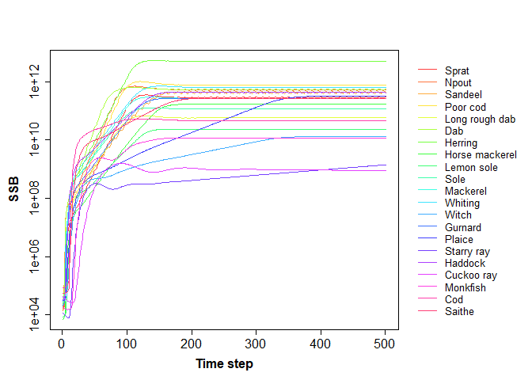

<!-- README.md is generated from README.Rmd. Please edit that file -->
LeMaRns
=======

LeMaRns is an R package to set up, run and explore the outputs of the Length-based Multi-species model LeMans, focused on the marine environment.

Installation
------------

You can install the released version of LeMaRns from [CRAN](https://CRAN.R-project.org) with:

``` r
install.packages("LeMaRns")
```

Example
-------

This is a basic example of how to set up, run and plot the resulting spawning-stock biomass:

``` r
library(LeMaRns)
NS_params <- LeMansParam(NS_par, tau=NS_tau, eta=eta, L50=L50,other=1e12)
#> Warning in .local(df, gdf, ...): The following columns of df do not match any of the species arguments and were therefore added to recruit_params:
#> a, b
effort <- matrix(0.25, 50, dim(NS_params @Qs)[3])
model_run <- run_LeMans(NS_params, years=50, effort=effort)
plot_SSB(NS_params,model_run)
```


