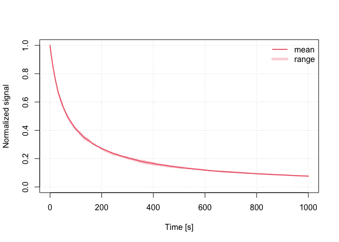

<!-- README.md was auto-generated by README.Rmd. Please DO NOT edit by hand!-->

# RLumCarlo 

The **R** package RLumCarlo provides a collection of R functions
modelling luminescence production in isolators and semiconductors for
various stimulation modes using Monte Carlo methods.

[](https://www.repostatus.org/#active)
[](https://CRAN.R-project.org/package=RLumCarlo)
[](https://zenodo.org/badge/latestdoi/82188344)
[](https://www.r-pkg.org/pkg/RLumCarlo)
[](https://travis-ci.org/R-Lum/RLumCarlo)
[](https://ci.appveyor.com/project/RLumSK/rlumcarlo)
[](https://codecov.io/gh/R-Lum/RLumCarlo)

## Installation

#### i. Requirements

Depending on your OS please download and install one of the following:

-   *Windows*: [Rtools](https://cran.r-project.org/bin/windows/Rtools/)
    (provided by CRAN)
-   *macOS*: [Xcode](https://developer.apple.com) (provided by Apple)
-   *Linux*: [gcc](https://gcc.gnu.org) often comes pre-installed in
    most distributions. Should [gcc](https://gcc.gnu.org) be not
    available, however, we kindly refer to the exhaustive collection of
    installation guides depending on the Linux distribution.

#### ii. Install the package from GitHub

``` r
if(!require("devtools"))
  install.packages("devtools")
devtools::install_github("R-Lum/RLumCarlo@master")
```

## Examples

``` r
run_MC_CW_IRSL_TUN(A = 0.12, rho = 0.003, times = 0:1000) %>%
     plot_RLumCarlo(norm = TRUE, legend = TRUE)
```



## Supported models

| TRANSITION               | BASE MODEL | IRSL  | OSL   | LM-OSL | TL   |
|--------------------------|------------|-------|-------|--------|------|
| Delocalised              | OTOR       | FALSE | TRUE  | TRUE   | TRUE |
| Localised                | GOT        | TRUE  | FALSE | TRUE   | TRUE |
| Excited state tunnelling | LTM        | TRUE  | FALSE | TRUE   | TRUE |

## License

This program is free software: you can redistribute it and/or modify it
under the terms of the GNU General Public License as published by the
Free Software Foundation, either version 3 of the License, or any later
version.

This program is distributed in the hope that it will be useful, but
WITHOUT ANY WARRANTY; without even the implied warranty of
MERCHANTABILITY or FITNESS FOR A PARTICULAR PURPOSE. See the [GNU
General Public
License](https://github.com/R-Lum/RLumCarlo/blob/master/LICENSE) for
more details.

## <span class="glyphicon glyphicon-euro"></span> Funding

The [development of RLumCarlo](https://github.com/R-Lum/RLumCarlo)
benefited from the support by various funding bodies:

-   The initial work by Johannes Friedrich, Sebastian Kreutzer and
    Christoph Schmidt was supported by the [DFG (2015–2018, SCHM
    3051/4-1, “Modelling quartz luminescence signal dynamics relevant
    for dating and dosimetry”, SCHM
    3051/4-1)](https://gepris.dfg.de/gepris/projekt/279969851).

-   Later financial support was secured through the project *‘ULTIMO:
    Unifying Luminescence Models of quartz and feldspar (German Academic
    Exchange Service) DAAD: Deutscher Akademischer Austauschdienst DAAD
    PPP USA 2018, ID: 57387041)’*.

-   The work of Sebastian Kreutzer as maintainer of the package was
    supported by [LabEx LaScArBx (ANR -
    n. ANR-10-LABX-52)](https://lascarbx.labex.u-bordeaux.fr) between
    2017 and 2019.

-   From 2020, Sebastian Kreutzer received funding from the European
    Union’s Horizon 2020 research and innovation programme under the
    Marie Skłodowska-Curie grant agreement No 844457 (project: CREDit).

## Related projects

-   [Luminescence](https://github.com/R-Lum/Luminescence)
-   [RLumModel](https://github.com/R-Lum/RLumModel)
