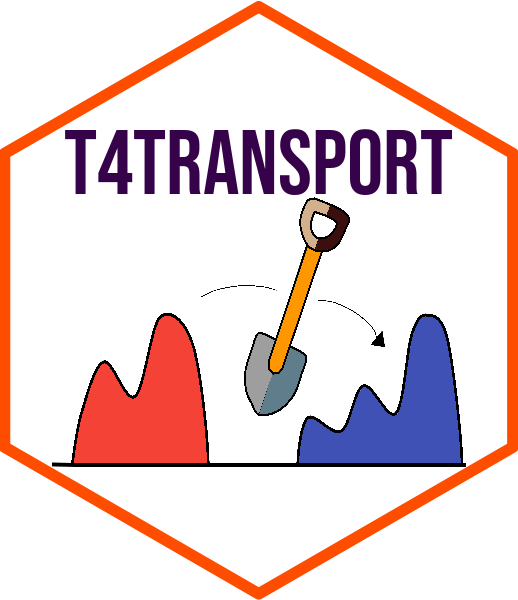

<!-- README.md is generated from README.Rmd. Please edit that file -->

# Tools for Optimal Transport <a href='https://kyoustat.com/T4transport/'></a>

<!-- badges: start -->

[](https://travis-ci.com/kyoustat/T4transport)
<!-- badges: end -->

**T4transport** is an **R** package designed as a computational toolkit
for well-known algorithms in the field of optimal transport.

### Installation

  - Option 1 : **released** version from
    [CRAN](https://CRAN.R-project.org).

<!-- end list -->

``` r
install.packages("T4transport")
```

  - Option 2 : **development** version from
    [GitHub](https://github.com/).

<!-- end list -->

``` r
if (!require("devtools")) {
  install.packages("devtools")
}
devtools::install_github("kyoustat/T4transport")
```
