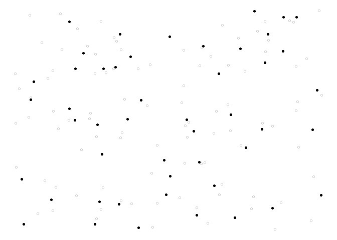

<!-- README.md is generated from README.Rmd. Please edit that file -->

# Weakly Associated Vectors (WAVE) Sampling

Spatial data are generally auto-correlated, meaning that if two units
selected are close to each other, then it is likely that they share the
same properties. For this reason, when sampling in the population it is
often needed that the sample is well spread over space. A new method to
draw a sample from a population with spatial coordinates is proposed.
This method is called `wave` (weakly associated vectors) sampling. It
uses the less correlated vector to a spatial weights matrix to update
the inclusion probabilities vector into a sample. For more details see
Raphaël Jauslin and Yves Tillé (2019)
<https://arxiv.org/abs/1910.13152>.

## Build

[](https://travis-ci.org/RJauslin/WaveSampling)

## Installation

### CRAN version

    install.packages("WaveSampling")

### Latest version

You can install the latest version of the package `WaveSampling` with
the following command:

``` r
# install.packages("devtools")
devtools::install_github("Rjauslin/WaveSampling")
```

## Simple example

This basic example shows you how to solve a common problem. Spatial
coordinates from the function `runif()` are firstly generated.

``` r
library(WaveSampling)
#> Loading required package: Matrix

N <- 144
n <- 48
X <- cbind(runif(N),runif(N))
head(X,10)
#>            [,1]      [,2]
#>  [1,] 0.1345672 0.7266617
#>  [2,] 0.2058343 0.5022601
#>  [3,] 0.4913206 0.3194556
#>  [4,] 0.3520863 0.1338913
#>  [5,] 0.7891532 0.9072055
#>  [6,] 0.3468061 0.1179934
#>  [7,] 0.9940038 0.1593734
#>  [8,] 0.9217319 0.3785051
#>  [9,] 0.1591796 0.9871931
#> [10,] 0.9690687 0.2438429
```

Inclusion probabilities `pik` is set up all equal with the function
`rep()`.

``` r
pik <- rep(n/N,times = N)
```

It only remains to use the function `wave()`,

``` r
s <- wave(X,pik)
```

We can also generate a plot to observe the result.

``` r
library(ggplot2)
ggplot() +
  geom_point(data = data.frame(x = X[,1],y = X[,2]),
             aes(x = x,y = y),
             shape = 1,
             alpha = 0.2)+
  geom_point(data = data.frame(x = X[s == 1,1],y = X[s == 1,2]),
             aes(x,y),
             shape = 16,
             colour = "black")+
  theme_void()
```



## Performance

As explained on the website of Microsoft R open
<https://mran.microsoft.com/open>, R is designed to use only one thread
but could be linked with a multi-threaded version of BLAS/LAPACK. The
package is implemented with the package RcppArmadillo
<http://arma.sourceforge.net/> that provide an integration of various
matrix decompositions with LAPACK library. Intel MKL that is used by the
Microsoft R open use a multi-threaded version of BLAS/LAPACK. Hence the
package could gain time from the Microsoft R open. (Not tested, but
linking R with OpenBLAS should also work).

    N <- 500
    n <- 100
    X <- as.matrix(cbind(runif(N),runif(N)))
    pik <- rep(n/N,N)
    system.time(s <- wave(X,pik,tore = T,shift =T,comment = T))

#### R 3.6.1

    user        system    elapsed 
    42.96       0.67      43.74

#### MRO 3.5.3

    user        system     elapsed 
    53.63       0.87       9.34 

This test was done on PC with a CPU Intel<sup>®</sup> Core™ i5-8500 with
6 cores.
