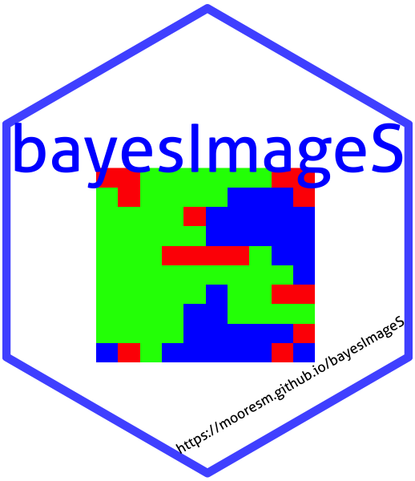
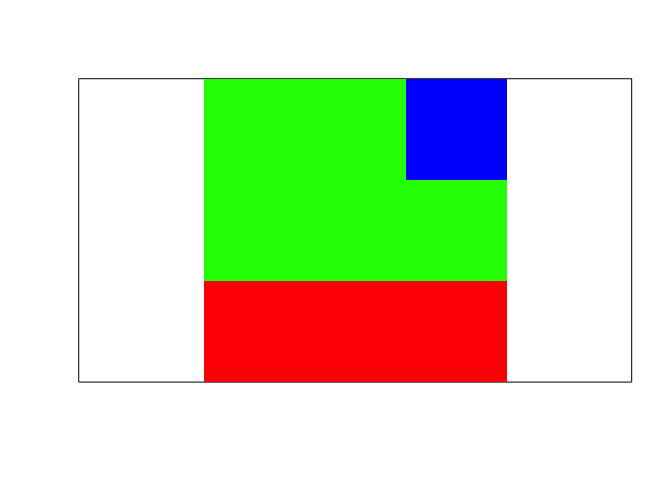
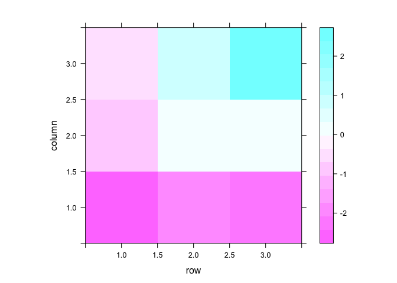
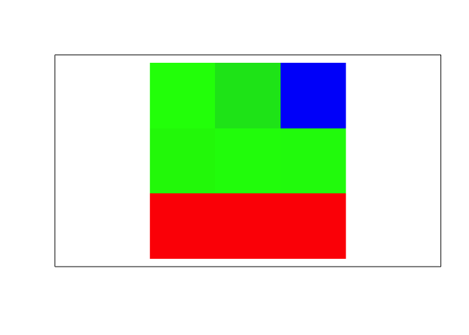
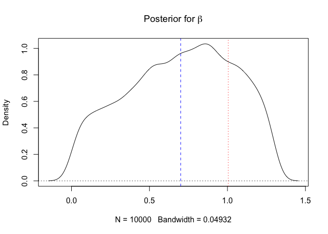

bayesImageS
================

<!--- README.md is generated from README.Rmd. Please edit that file -->

[](https://cran.r-project.org/package=bayesImageS)
[](https://github.com/metacran/cranlogs.app)



`bayesImageS` implements algorithms for segmentation of 2D and 3D
images, such as computed tomography (CT) and satellite remote sensing.
This R package provides functions for Bayesian image analysis using a
hidden Potts/Ising model with external field prior. Latent labels are
updated using chequerboard Gibbs sampling or Swendsen-Wang. Algorithms
for the smoothing parameter include:

  - pseudolikelihood
  - path sampling (thermodynamic integration)
  - approximate exchange algorithm (AEA)
  - approximate Bayesian computation (ABC-MCMC and ABC-SMC)
  - Bayesian indirect likelihood (BIL), including the parametric
    functional approximate Bayesian (PFAB) algorithm

# Installation Instructions

Stable releases, including binary packages for Windows & Mac OS, are
available from CRAN:

  - <https://CRAN.R-project.org/package=bayesImageS>

<!-- end list -->

``` r
install.packages("bayesImageS")
```

The current development version can be installed from Bitbucket:

``` r
devtools::install_git("https://bitbucket.org/Azeari/bayesimages/")
```

# Example Usage

To generate synthetic data for a known value of \(\beta\):

``` r
set.seed(1234)
mask <- matrix(1,3,3)
neigh <- getNeighbors(mask, c(2,2,0,0))
blocks <- getBlocks(mask, 2)
k <- 3
beta <- 0.7
res.sw <- swNoData(beta, k, neigh, blocks, niter=200)
z <- matrix(max.col(res.sw$z)[1:nrow(neigh)], nrow=nrow(mask))
image(z, xaxt = 'n', yaxt='n', col=rainbow(k), asp=1)
```

<!-- -->

Now add some Gaussian noise to the labels, according to the prior:

``` r
priors <- list()
priors$k <- k
priors$mu <- c(-2, 0, 2)
priors$mu.sd <- rep(0.5,k)
priors$sigma <- rep(0.25,k)
priors$sigma.nu <- rep(3, k)
priors$beta <- c(0,1.3*log(1 + sqrt(k)))

m0 <- sort(rnorm(priors$k,priors$mu,priors$mu.sd))
SS0 <- priors$sigma.nu*priors$sigma^2
s0 <- 1/sqrt(rgamma(priors$k,priors$sigma.nu/2,SS0/2))
l <- as.vector(z)
y <- m0[l] + rnorm(nrow(neigh),0,s0[l])
library(lattice)
levelplot(matrix(y, nrow=nrow(mask)))
```

<!-- -->

Image segmentation using ABC-SMC:

``` r
res.smc <- smcPotts(y, neigh, blocks, priors=priors)
#> Initialization took 5sec
#> Iteration 1
#> previous epsilon 7 and ESS 10000 (target: 9500)
#> Took 0sec to update epsilon=2.625 (ESS=9505.29)
#> Took 4sec for 8918 RWMH updates (bw=0.497509)
#> Took 0sec for 10000 iterations to calculate S(z)=7
#> Iteration 2
#> previous epsilon 2.625 and ESS 9505.29 (target: 9030.02)
#> Took 8sec to update epsilon=1 (ESS=7970.86)
#> Took 4sec for 7671 RWMH updates (bw=0.466951)
#> Took 0sec for 10000 iterations to calculate S(z)=6
#> Iteration 3
#> previous epsilon 1 and ESS 7970.86 (target: 7572.32)
#> Took 8sec to update epsilon=4.66632e-302 (ESS=7949.67)
#> Took 3sec for 7968 RWMH updates (bw=0.466673)
#> Took 1sec for 10000 iterations to calculate S(z)=7
# pixel classifications
pred <- res.smc$alloc/rowSums(res.smc$alloc)
predMx <- as.raster(array(pred, dim=c(nrow(mask),ncol(mask),3)))
plot(c(0.5,3.5),c(0.5,3.5),type='n',xaxt='n',yaxt='n',xlab="",ylab="",asp=1)
rasterImage(t(predMx)[nrow(mask):1,], 0.5, 0.5, 3.5, 3.5, interpolate = FALSE)
```

<!-- -->

Note that CODA ignores the particle weights, so we need to resample to
obtain accurate HPD intervals. This step is not usually necessary and
does introduce some noise due to duplication of particles. Depending on
how many SMC iterations have been performed, one or more resampling
steps might have already been done (but not in this specific example).

``` r
seg <- max.col(res.smc$alloc) # posterior mode (0-1 loss)
all.equal(seg, l)
#> [1] TRUE

# filter weights to remove Ninf, NaN
w <- res.smc$wt
w[is.na(w)] <- 0
plot(density(res.smc$beta, weights=w),main=expression(paste("Posterior for ",beta)))
abline(h=0,lty=3)
abline(v=beta,lty=2,col=4)
abline(v=log(1 + sqrt(k)),lty=3,col=2) # critical point
```

<!-- -->

``` r

library(coda)
res.res <- testResample(res.smc$beta, w, cbind(res.smc$mu, res.smc$sigma))
#> Took 0sec to resample 10000 particles
res.coda <- mcmc(cbind(res.res$pseudo, res.res$beta))
varnames(res.coda) <- c(paste("mu",1:k), paste("sd",1:k), "beta")
HPDinterval(res.coda)
#>            lower      upper
#> mu 1 -2.56248597 -1.9038983
#> mu 2 -0.50953511  0.4881316
#> mu 3  1.37933533  2.7939284
#> sd 1  0.11321785  0.4984628
#> sd 2  0.22470066  0.9154286
#> sd 3  0.11011734  0.9105506
#> beta  0.09338037  1.2852256
#> attr(,"Probability")
#> [1] 0.95
m0
#> [1] -2.279614  0.156580  2.208122
s0
#> [1] 0.2785175 0.6092555 0.3153176
beta
#> [1] 0.7
```
