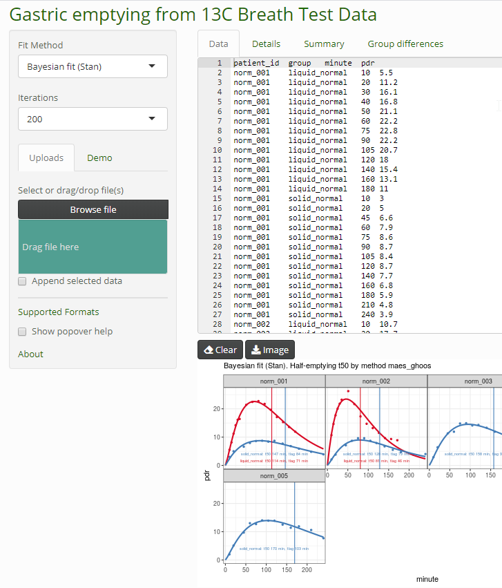
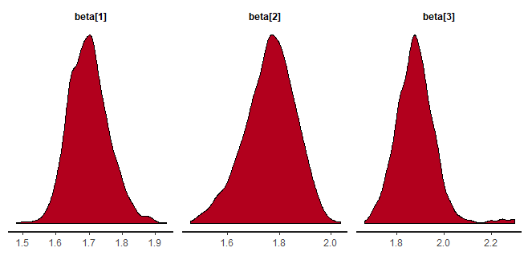

breathteststan: Bayesian fit to 13C Breath Test Time series for gastric emptying
==================================================

Dieter Menne  
Menne Biomed Consulting Tübingen, Germany  
http://www.menne-biomed.de  
dieter.menne@menne-biomed.de   

Dieter Menne
Menne Biomed Consulting
http://www.menne-biomed.de

dieter.menne@menne-biomed.de 

Fit 13C time series data with Bayesian methods using [Stan](http://mc-stan.org/). 
This is an add-on to package [breathtestcore](https://github.com/dmenne/breathtestcore). The Stan functions have been moved to this package to avoid long compile and test times. To test some of the functions with sample data or your own data, try the [online demo](https://apps.menne-biomed.de/breathtestshiny).

