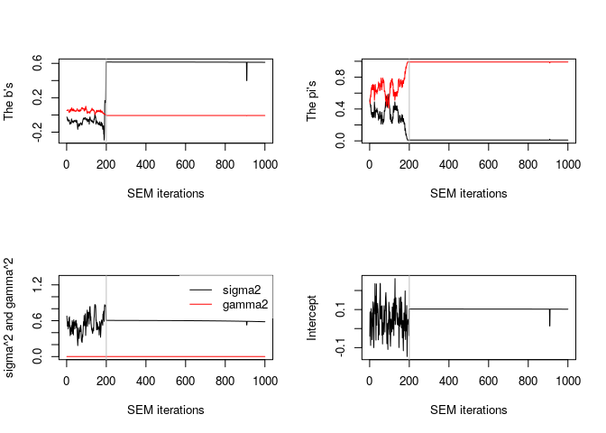

<!-- README.md is generated from README.Rmd. Please edit that file -->

# clere: Simultaneous Variables Clustering and Regression

<!-- badges: start -->

[](https://github.com/mcanouil/clere)
[](https://travis-ci.org/mcanouil/clere)
[](https://codecov.io/gh/mcanouil/clere?branch=master)
[](https://cran.r-project.org/package=clere)
[](https://cran.r-project.org/web/checks/check_results_clere.html)
[](https://cran.r-project.org/package=clere)
<!-- badges: end -->

Implements an empirical Bayes approach for simultaneous variable
clustering and regression. This version also (re)implements in C++ an R
script proposed by Howard Bondell that fits the Pairwise Absolute
Clustering and Sparsity (PACS) methodology (see Sharma et al (2013) doi:
[10.1080/15533174.2012.707849](https://doi.org/10.1080/15533174.2012.707849)).

## Installation

You can install the released version of clere from
[CRAN](https://CRAN.R-project.org) with:

``` r
install.packages("clere")
```

And the development version from [GitHub](https://github.com/) with:

``` r
# install.packages("remotes")
remotes::install_github("mcanouil/clere")
```

## Citing clere

<p>

Yengo L, Jacques J, Biernacki C, Canouil M (2016). “Variable Clustering
in High-Dimensional Linear Regression: The R Package clere.” <em>The R
Journal</em>, <b>8</b>(1), 92–106. doi:
<a href="https://doi.org/10.32614/RJ-2016-006">10.32614/RJ-2016-006</a>.

</p>

    @Article{,
      title = {{Variable Clustering in High-Dimensional Linear Regression: The R Package clere}},
      author = {Loïc Yengo and Julien Jacques and Christophe Biernacki and Mickael Canouil},
      journal = {The R Journal},
      year = {2016},
      month = {apr},
      doi = {10.32614/RJ-2016-006},
      pages = {92--106},
      volume = {8},
      number = {1},
    }

## Example

``` r
library(clere)

x <- matrix(rnorm(50 * 100), nrow = 50, ncol = 100)
y <- rnorm(50)

model <- fitClere(y = y, x = x, g = 2, plotit = FALSE)
model
#>  ~~~ Class: Clere ~~~
#>  ~ y : [50] -0.3663  1.0417  0.8401  0.6298  1.3977 -0.4709
#>  ~ x : [50x100]
#>                  1        2        3        4        5        .    
#>         1      0.54299  0.54408  1.73588 -0.05461 -0.94133 ........
#>         2      1.11327 -1.00079 -0.71194 -2.17234  0.38946 ........
#>         3     -0.97223  0.03499 -1.20295 -1.32578 -1.12280 ........
#>         4      0.71881 -0.92304  0.22933  1.22511  0.35874 ........
#>         5     -0.53657  0.01233 -0.72067 -0.10695 -1.71511 ........
#>         .     ........ ........ ........ ........ ........ ........
#> 
#>  ~ n : 50
#>  ~ p : 100
#>  ~ g : 2
#>  ~ nItMC : 50
#>  ~ nItEM : 1000
#>  ~ nBurn : 200
#>  ~ dp : 5
#>  ~ nsamp : 200
#>  ~ sparse : FALSE
#>  ~ analysis : "fit"
#>  ~ algorithm : "SEM"
#>  ~ initialized : FALSE
#>  ~ maxit : 500
#>  ~ tol : 0.001
#>  ~ seed : 945
#>  ~ b : [2]  0.613709 -0.006548
#>  ~ pi : [2] 0.01002 0.98998
#>  ~ sigma2 : 0.5981
#>  ~ gamma2 : 0.0001097
#>  ~ intercept : 0.1022
#>  ~ likelihood : -64.18
#>  ~ entropy : 0
#>  ~ P : [100x2]
#>              Group 1 Group 2
#>         1       0       1   
#>         2       0       1   
#>         3       0       1   
#>         4       0       1   
#>         5       0       1   
#>         .    ....... .......
#> 
#>  ~ theta : [1000x8]
#>                intercept    b1        b2        pi1       pi2        .    
#>          1     -0.03965  -0.02462   0.05342   0.50000   0.50000  .........
#>          2      0.08769  -0.02585   0.05114   0.53000   0.47000  .........
#>          3      0.03731  -0.03260   0.05189   0.46000   0.54000  .........
#>          4     -0.03508  -0.05160   0.05514   0.45000   0.55000  .........
#>          5     -0.08861  -0.06464   0.05811   0.42000   0.58000  .........
#>          .     ......... ......... ......... ......... ......... .........
#> 
#>  ~ Zw : [100x200]
#>        1 2 3 4 5 .
#>      1 1 1 1 1 1 .
#>      2 1 1 1 1 1 .
#>      3 1 1 1 1 1 .
#>      4 1 1 1 1 1 .
#>      5 1 1 1 1 1 .
#>      . . . . . . .
#> 
#>  ~ Bw : [100x200]
#>                     1          2          3          4          5          .     
#>          1      -7.080e-03 -5.029e-03 -1.654e-02 -9.838e-03 -1.157e-02 ..........
#>          2       1.664e-03 -3.672e-05 -1.369e-02  5.982e-03 -1.140e-02 ..........
#>          3      -6.606e-03 -1.330e-02  3.800e-03 -1.147e-02 -1.297e-02 ..........
#>          4      -8.453e-03  8.423e-03 -1.493e-03  5.931e-03  1.637e-02 ..........
#>          5      -2.101e-02 -5.158e-03 -7.439e-03 -8.822e-03 -1.320e-02 ..........
#>          .      .......... .......... .......... .......... .......... ..........
#> 
#>  ~ Z0 : NA
#>  ~ message : NA

plot(model)
```



``` r

clus <- clusters(model, threshold = NULL)
clus
#>   [1] 2 2 2 2 2 2 2 2 2 2 2 2 2 2 2 2 2 2 2 2 2 2 2 2 2 2 2 2 2 2 2 2 2 2 2 2 2
#>  [38] 2 2 2 2 2 2 2 2 2 2 2 2 2 2 2 2 2 2 2 2 2 2 2 2 2 2 2 2 2 2 2 2 2 2 2 2 2
#>  [75] 2 2 2 2 2 2 2 2 2 2 2 2 2 2 2 1 2 2 2 2 2 2 2 2 2 2

predict(model, newx = x + 1)
#>  [1] -0.41014043  0.58417440  0.07565606  0.12651690  0.10691068 -0.51438081
#>  [7] -0.53730664 -0.38719372  0.96052339  1.04059573 -0.47278984 -0.54533104
#> [13] -0.14680892  0.04529841 -0.44803772  0.48753442 -1.03283097 -0.96206984
#> [19]  0.90252948  0.35887126 -0.59158591  0.27172199  0.73862087 -0.13525905
#> [25]  1.14287637  0.37955118 -0.21296002 -0.66091713  0.22797485  0.04944170
#> [31]  0.52612573 -0.15168824 -0.78401104 -0.53532663 -0.44697030  0.19048671
#> [37]  0.10341728 -0.37691391 -0.69165509  0.52461656  0.60826835  0.01190567
#> [43] -0.50238925  0.22288924 -0.28840397 -0.43573542 -0.26704384  0.49779102
#> [49]  0.08028461  0.41752563

summary(model)
#>  -------------------------------
#>  | CLERE | Yengo et al. (2016) |
#>  -------------------------------
#> 
#>  Model object for  2 groups of variables ( user-specified )
#> 
#>  ---
#>  Estimated parameters using SEM algorithm are
#>  intercept = 0.1022
#>  b         =  0.613709   -0.006548
#>  pi        = 0.01002 0.98998
#>  sigma2    = 0.5981
#>  gamma2    = 0.0001097
#> 
#>  ---
#>  Log-likelihood =  -64.18 
#>  Entropy        =  0 
#>  AIC            =  140.36 
#>  BIC            =  151.84 
#>  ICL            =  151.84
```

## Getting help

If you encounter a clear bug, please file a minimal reproducible example
on [github](https://github.com/mcanouil/NACHO/issues).  
For questions and other discussion, please contact the package
maintainer.

-----

Please note that this project is released with a [Contributor Code of
Conduct](https://github.com/mcanouil/NACHO/blob/master/.github/CODE_OF_CONDUCT.md).  
By participating in this project you agree to abide by its terms.
