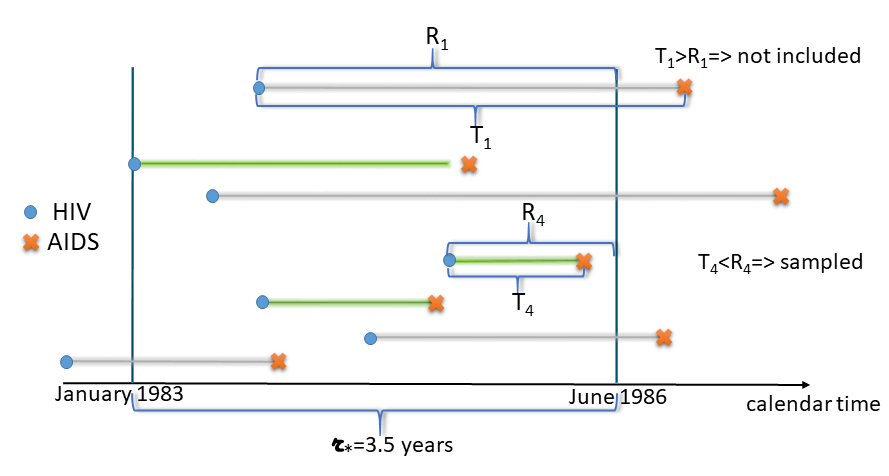
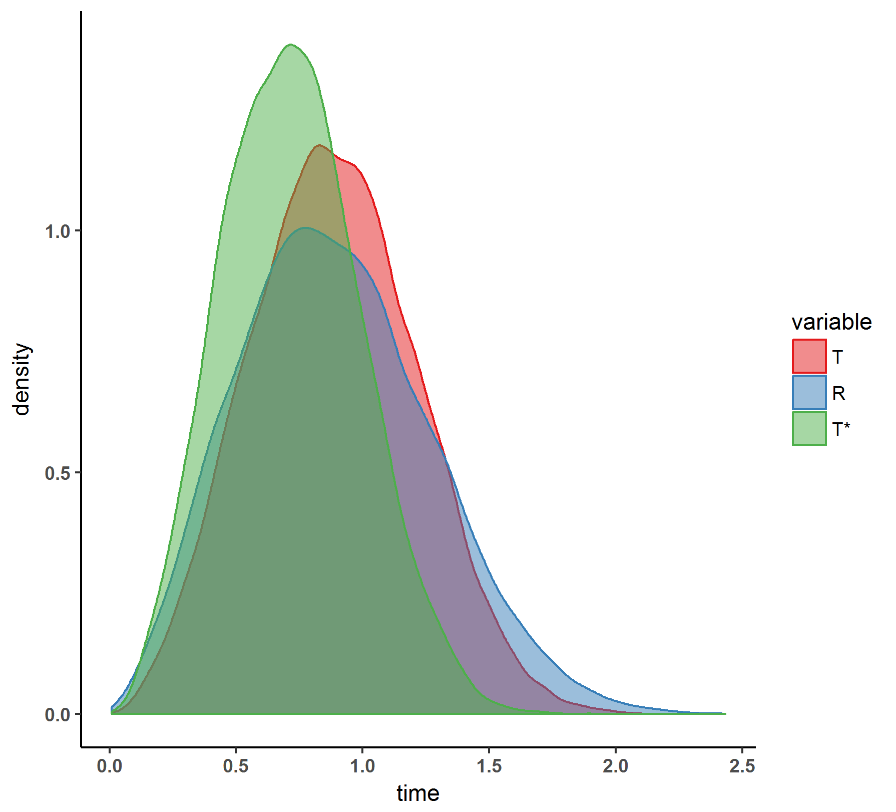

The  `coxrt` package accompanies the paper of [Vakulenko-Lagun, Mandel and Betensky (2019)](https://doi.org/10.1111/biom.13162) and is designed for analysis of right-truncated data.


## What are right-truncated data?

When we are interested in the analysis of lifetimes that start at an initiating event and end up when an event of interest occurs, but we cannot obtain a population of interest to follow them prospectively, retrospective ascertainment of cases could be a good alternative. However, this might result in right-truncated survival data.

Right truncation often happens when we cannot identify the population of interest since their initiating events are latent (like the times of infections), and the population becomes "visible" only when another event, that can be more easily identified, happens. Here we assume that for those who are sampled, the times of  initiating events are known or can be reliably estimated.   


One example of such type of data is the data set on AIDS cases resulted from contaminated blood transfusion [@Kalbfeisch]. Here, the time of interest is the incubation period of AIDS, i.e., the time from HIV infection to development of AIDS. Figure 1 shows schematically how these data were collected. The individuals who developed AIDS by June 30, 1986 (the date when the AIDS cases were retrospectively ascertained) were selected, satisfying by this the condition $T_i< R_i$, where $T_i$ is an incubation period for the $i^{th}$ person and $R_i$ is his/her truncation time, defined as the time from HIV infection to June 30, 1986. 

In the two functions of the package, `coxph.RT` and `coxph.RT.a0`, we assume that  $T_i$ are observed exactly and there is no censoring. The analysis is based only on sampled events. Those who belong to the population but have not developed AIDS by the time of collection of data remain unobserved. 


```{r fig1, echo=FALSE, label=fig1, fig.cap="Figure 1. Illustration of retrospective ascertainment of AIDS cases", out.width = '80%'}
    
```


The sampling condition $T_i< R_i$ means that we tend to sample shorter lifetimes than longer ones. And an important complication of such sampling scheme is that the follow-up is limited: on Figure 1, $r_*$, defined as the time from the earliest HIV infection (January 1983) to June 30 1986, is the maximum follow-up time in this data set. This is an important statistic, since it allows us to realize whether our sampling covers the whole range of possible incubation periods or not. If the follow-up is too short, most likely we do not capture longer incubation periods, and they will not only be underrepresented in our sample, but even worse, they are likely to be non-represented at all. We shall call the condition $P(T>r_*)=0$ a **positivity** assumption. 

For example in the AIDS data, positivity does not hold since the incubation period of AIDS can be longer than the maximum observed follow-up time in this data set that equals 3.5 years. 
Under such short retrospective follow-up there was no chance to observe longer incubation times, which means that $P(T>r_*)>0$, or equivalently, the support of observed $T^*$ is shorter than the support of the original $T$ in the population. 


## Right truncation causes distortion of the original distribution 

Even if positivity holds, truncation anyway results in distorted distribution, and it is important to account for this bias.
For example, on Figure 2 we illustrate the problem of distortion of the original distribution using simulated data. Here, the population lifetime $T$ follows *Weibull* distribution as `rweibull(20000, shape=3, scale=1)`. 
And the population truncation time $R$ was generated (independently of $T$) from `rweibull(20000, shape=2.5, scale=1)`.
The sampled lifetimes $T^*$ comprise all observations from the population that satisfy $T_i<R_i$. This resulted in truncation probability $P(T>R)=0.5$.
Figure 2 shows densities of $T$, $R$ and $T^*$. It is clear that distributions of $T$ and $T^*$ are different. 
Importantly, in this example positivity holds since the supports of $T$ and $R$ are the same, so that every possible lifetime has a chance to be sampled, and this kind of bias can be easily corrected. 


```{r fig2, echo=FALSE, fig.cap="Figure 2. Right truncation causes distortion of the original distribution of T", out.width = '60%'}
    
```


## Why is it important to adjust for right truncation in regression?

Even if we do not aim to estimate the whole distribution and are interested only in estimation of the effects of some covariates on the incubation period, we still need to adjust for right truncation, since, as we illustrate below, the right truncation blurs the difference between subgroups.

Suppose we have one binary covariate $Z$. Figure 3 shows distributions in the two subpopulations defined by $Z$. The lifetime $T$ is generated from the proportional hazard regression model $h(t;z)=h_0(t)\exp(\beta z)$ with $\beta=2$:

```{r  fig.height=4, fig.width=4, fig.align='center',  fig.cap="Figure 3. Two sub-populations defined by a covariate Z."}
library(ggplot2)
library(survival)
set.seed(17)
N <- 20000
Z <- as.numeric(runif(N,0,1) < 0.5)				# binary explanatory variable     
X <-rweibull(N, shape=3, scale=1*exp(-(2*Z)/3))	# shape a=3, scale b=1, beta=2
m <- max(X)
d.tr <- data.frame(time=c(X), variable=c(Z))
d.tr$variable=as.factor(d.tr$variable)
levels(d.tr$variable) <- c( "T | Z=0", "T | Z=1", " ")
p <- ggplot(d.tr) +
  geom_density(aes(x=time, color=variable, fill=variable), alpha=0.5) + 
  scale_color_brewer(palette = "Set1")+
  scale_fill_brewer(palette = "Set1")+
  theme_classic() +
  labs(x = "time")+
  ggtitle("In the population")+
  theme(axis.text.x = element_text(face="bold"),
        axis.text.y = element_text(face="bold"),
        plot.title = element_text(hjust = 0.5) )+ xlim(0, m)
p
```


Figure 4 shows sample distributions under right truncation with positivity. For this illustration we use the same population as in Figure 3, but truncate it using uniformly distributed $R$:

```{r}

  set.seed(0)
  r <- runif(N, 0, m)
  ind <- X<r
  cat("P(T<R) = selection probability = ", mean(ind), "\n")
  d.tr <- data.frame(time=c(X[ind],r), variable=c(Z[ind], rep(3, N)))
  d.tr$variable=as.factor(d.tr$variable)
  levels(d.tr$variable) <- c( "T* | Z*=0", "T* | Z*=1", "R")
```
  
```{r fig.height=4, fig.width=4, echo=FALSE, fig.align='center',  fig.cap="Figure 4. Sample distributions under right truncation and positivity."}
    p <- ggplot(d.tr) +
    geom_density(aes(x=time, color=variable, fill=variable), alpha=0.5) + 
    scale_color_brewer(palette = "Set1")+
    scale_fill_brewer(palette = "Set1")+
    theme_classic() +
    labs(x = "time")+
      ggtitle(paste("In the sample with R~U[0,", round(m,1), "]", sep=""))+
    theme(axis.text.x = element_text(face="bold"),
          axis.text.y = element_text(face="bold"),
        plot.title = element_text(hjust = 0.5)  ) + xlim(0, m) #+ ylim(0,6.3)
  p
```
Despite the 30% chance of truncation, both Figures 3 and 4 look relatively similar to each other. 


On Figure 5, we shorten the follow-up time by using $r_*=1.1$. This leads to violation of positivity, since longer lifetimes have no chance to be sampled, and the sub-groups become more similar to each other. In such case, without any adjustment, the estimators of $\beta$ will be biased and it is likely we will not able to discover the difference between subgroups. 


```{r fig.height=4, fig.width=4, echo=FALSE, fig.align='center', fig.cap="Figure 5. Sample distributions under mild violation of positivity."}
  
set.seed(0)
  r <- runif(N, 0, m/2)
  ind <- X<r
  d.tr <- data.frame(time=c(X[ind],r), variable=c(Z[ind], rep(3, N)))
  d.tr$variable=as.factor(d.tr$variable)
  levels(d.tr$variable) <- c( "T* | Z*=0", "T* | Z*=1", "R")
  
  p <- ggplot(d.tr) +
    geom_density(aes(x=time, color=variable, fill=variable), alpha=0.5) + 
    scale_color_brewer(palette = "Set1")+
    scale_fill_brewer(palette = "Set1")+
    theme_classic() +
    labs(x = "time")+
      ggtitle(paste("In the sample with R~U[0,", round(m/2,1), "]", sep=""))+
    theme(axis.text.x = element_text(face="bold"),
          axis.text.y = element_text(face="bold"),
        plot.title = element_text(hjust = 0.5)  ) + xlim(0, m) #+ ylim(0,6.3)
  p
```


On Figure 6, severe violation of positivity with $R\sim U(0,0.4)$ causes the groups to be almost identical:  

```{r fig.height=4, fig.width=4, echo=FALSE,  fig.align='center', fig.cap="Figure 6. Sample distributions under severe violation of positivity."}
  set.seed(0)
  r <- runif(N, 0, m*4/20)
  ind <- X<r
  d.tr <- data.frame(time=c(X[ind],r), variable=c(Z[ind], rep(3, N)))
  d.tr$variable=as.factor(d.tr$variable)
  levels(d.tr$variable) <- c( "T* | Z*=0", "T* | Z*=1", "R")
  
  p <- ggplot(d.tr) +
    geom_density(aes(x=time, color=variable, fill=variable), alpha=0.5) + 
    scale_color_brewer(palette = "Set1")+
    scale_fill_brewer(palette = "Set1")+
    theme_classic() +
    labs(x = "time")+
      ggtitle(paste("In the sample with R~U[0,", round(m*4/20,1), "]", sep=""))+
    theme(axis.text.x = element_text(face="bold"),
          axis.text.y = element_text(face="bold"),
        plot.title = element_text(hjust = 0.5)  ) + xlim(0, m) #+ ylim(0,6.3)
  p
```
And the situation becomes more complicated when there are several dependent covariates, as described in @RT. 


## What does `coxrt` suggest for right-truncated data?

The `coxrt` package allows to estimate regression coefficients $\beta$ in the proportional hazards model $h(t;z)=h_0(t)\exp(\beta z)$. 

### Under positivity use `coxph.RT`

Function `coxph.RT` implements estimating equations denoted as `IPW-S` in @RT.  This function assumes positivity (as, e.g., on Figure 4).

For example, for AIDS data we can fit proportional hazards regression of incubation time on age:
```{r, warning=FALSE, results='asis'}
library(gss)
library(coxrt)
data(aids)
all <- data.frame(age=aids$age, ageg=as.numeric(aids$age<=59), T=aids$incu, R=aids$infe, hiv.mon =102-aids$infe)
all$T[all$T==0] <- 0.5 # as in Kalbfeisch and Lawless (1989)
s <- all[all$hiv.mon>60,] # select those who were infected in 1983 or later
# analysis assuming positivity
# we request bootstrap estimate of Asymptotic Standard Error (ASE) as well:
sol <- try(coxph.RT(T~ageg, right=R, data=s, bs=TRUE, nbs.rep=500) )
knitr::kable(sol$summary) # print the summary of fit based on the analytic ASE
knitr::kable(sol$bs$summary) # print the summary of fit based on the bootstrap sample distribution
```

Technically, for point estimation `coxph.RT` uses the standard `coxph` function from the `survival` package. However, the estimator of the standard error (SE) obtained from `coxph` even with `robust` option might underestimate for smaller samples (of $<1000$ observations).
Although `coxph.RT` includes both analytic and bootstrap estimates of a SE, the inference based on the analytic SE estimate, implemented in `coxph.RT`, is more reliable than based on its bootstrap counterpart, since bootstrap resampling does not always capture the variability in data that comes from near-zero sampling probabilities $P(R>T_i)$.  

Since the Inverse-Probability-Weighting (IPW) approach, implemented in `coxrt`, relies on "blowing up" the sampled lifetimes $T_i$ in order to obtain the unbiased pseudo-population, which should recreate the same probability law as in the original population, `coxph.RT` in general will give biased estimators in case there is an unobservable right tail of the distribution. Hence the function `coxph.RT.a0` aims to adjust for this violation of positivity by using the structural assumption of the Cox model in the population and the information on $a_0=P(T>r_*\mid Z=0)$.


### Without positivity use `coxph.RT.a0`

For the situations without positivity (as in Figures 5 and 6), if $a_0$ can be hypothesized, based on the subject matter knowledge, or if $a_0$ is unknown but its interval can be guessed, this information can be used in `coxph.RT.a0`. This function implements estimating equations denoted as `IPW-SA` in the original paper. `IPW-SA` uses stabilized weights. Technically, `coxph.RT.a0` solves non-linear equations using `BBsolve` function from [BB](https://CRAN.R-project.org/package=BB) package using default parameter settings.
For example, in order to estimate $\beta$, the effect of age at HIV on the incubation period, given that $a_0=0.2$, we run: 
```{r, warning=FALSE, results='asis'}
# analysis using adjusted estimating equations for a0=0.2
sol.02 <- try(coxph.RT.a0(T~ageg, right=R, data=s, a0=0.2, bs=TRUE, nbs.rep = 500))
knitr::kable(round(sol.02$bs$summary,2)) 
```

We can do a sensitivity analysis for $\hat{\beta}$ for different values of a sensitivity parameter $a_0$: 

```{r, warning=FALSE}
# for a0=0:
sol <- try(coxph.RT(T~ageg, right=R, data=s, bs=FALSE) )
# senstivity analysis for different values of a0
a_ <- seq(0.05, 0.55, by=0.05)
est <- CI.L <- CI.U <- NULL
start_time <- Sys.time()
for(q in 1:length(a_))
{
 sol.a <- try(coxph.RT.a0(T~ageg, right=R, data=s, a0=a_[q], bs=TRUE))
 if (sol.a$convergence!=0)
 {
   cat("a0=", a_[q], ". Error occurred in BBsolve.\n")
 } else
 {
   est <- c(est, sol.a$coef)
   CI.L <- c(CI.L, sol.a$bs$summary$CI.L)
   CI.U <- c(CI.U, sol.a$bs$summary$CI.U)
 }
}
end_time <- Sys.time()
end_time - start_time # It takes some time to solve nonlinear estimating equations and to run bootstrap for each value of a0 ...
```
```{r, warning=FALSE, results='asis', fig.height=5, fig.width=5, fig.align='center', fig.cap="Figure 7. Sensitivity analysis for AIDS data"}
require(ggplot2)
res.d <- data.frame(a0=c(0, a_), beta=c(sol$coef, est),
                   L.95=c(sol$summary$CI.L, CI.L), U.95=c(sol$summary$CI.U, CI.U))
knitr::kable(round(res.d, 2)) 
p <- ggplot(res.d, aes(x=a0, y=beta)) +
 geom_ribbon(aes(ymin=L.95, ymax=U.95), alpha=0.2) +
 geom_line() + geom_point() +
 geom_hline(yintercept=0)
p + xlab(expression( paste(a[0], "=P(T>", r['*']," | z=0)" , sep="")) )+
 ylab(expression( paste(hat(beta), "(", a[0], ")" , sep="")) ) +
 scale_x_continuous(breaks=res.d$a0, labels=res.d$a0) +
 theme(axis.text.x = element_text(face="bold", angle=45),
         axis.text.y = element_text(face="bold"))
```
In `coxph.RT.a0`, only the bootstrap estimator of SE is available. 


## Some remarks
- Positivity cannot be tested. This assumption is based on the subject matter knowledge.

- The approach assumes independence between $T$ and ($R$, $Z$) in the original population. If there is dependence between $T$ and $R$, it can be discovered by Kendall's tau test which can be done using packages [tranSurv](https://CRAN.R-project.org/package=tranSurv) or   [SurvTrunc](https://CRAN.R-project.org/package=SurvTrunc), or by more powerful permutation tests which can be done using package [permDep](https://CRAN.R-project.org/package=permDep).

- If a non-terminal event of interest cannot be observed because death preceded it, that is the event of interest is **truncated by death**, the approach implemented here can be used only if two lifetimes, time to an intermediate event (=$T$) and time to death (=$R$), are independent, otherwise the results might be biased. 


## Some limitations of the `coxrt` package

- Although in practice, it is possible to have additional left or interval censoring in right-truncated data, the package assumes that the exact lifetimes, without any censoring, are observed. 

- The current implementation allows for only time-independent covariates.

- The package estimates only covariate effects $\beta$, and does not provide estimates for the baseline hazard $h_0(t)$ in the Cox model.


## References


