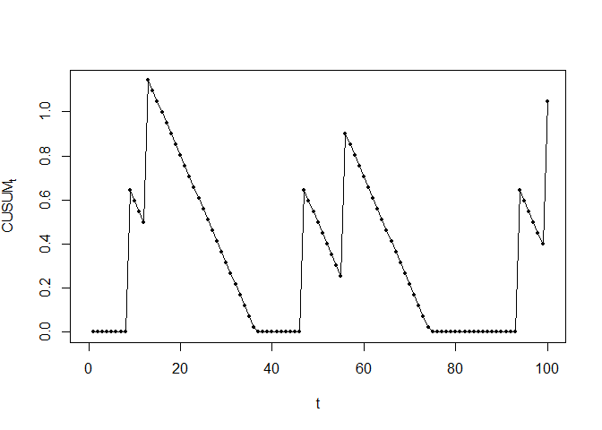

<!-- README.md is generated from README.Rmd. Please edit that file -->

<!-- badges: start -->

[](https://travis-ci.org/lhubig/cusum)
[](https://codecov.io/gh/lhubig/cusum?branch=master)
<!-- badges: end -->

# cusum

The goal of cusum is to provide functions for constructing and
evaluating CUSUM charts and RA-CUSUM charts with focus on false signal
probability.

## Installation

You can install the released version of cusum from
[CRAN](https://CRAN.R-project.org) with:

``` r
install.packages("cusum")
```

Or the pre-release version from github with:

``` r
devtools::install_github("lhubig/cusum")
```

## Example

This is a basic example which shows you how to construct CUSUM charts
with simulated control limits:

``` r
library(cusum)

limit <- cusum_limit_sim(failure_probability = 0.05,
                          n_patients = 100,
                          odds_multiplier = 2,
                          n_simulation = 1000,
                          alpha = 0.05,
                          seed = 2018)
print(limit)
#> [1] 2.696187
set.seed(2018)
patient_outcomes <- as.logical(rbinom(n = 100, size = 1, prob = 0.05))

cs <- cusum(failure_probability = 0.05,
            patient_outcomes,
            limit,
            odds_multiplier = 2)

plot(cs)
```


