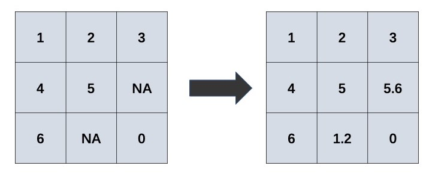
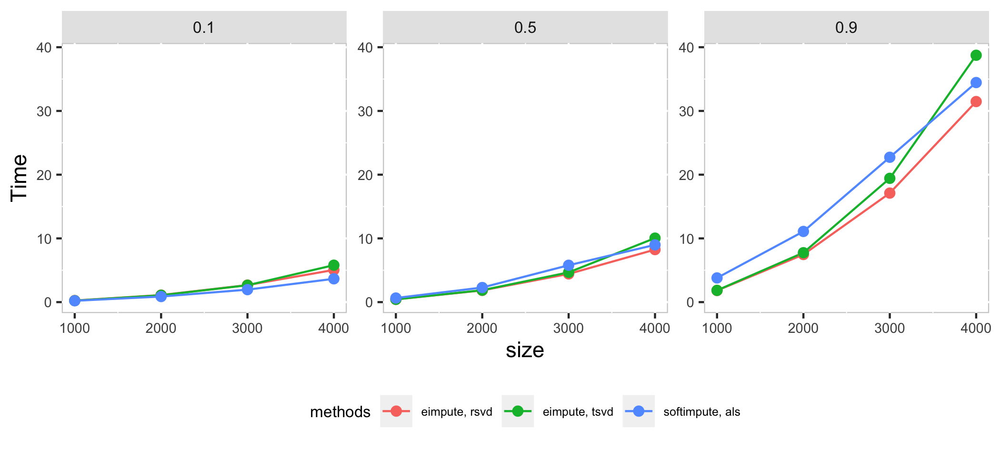
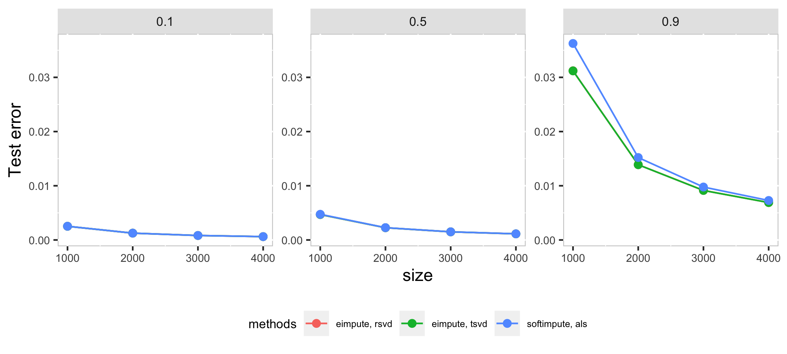

# eimpute: Efficiently IMPUTE Large Scale Incomplete Matrix

Introduction
----------
Matrix completion is a procedure for imputing the missing elements in matrices by using the information of observed elements. This procedure can be visualized as:



Matrix completion has attracted a lot of attention, it is widely applied in:
- tabular data imputation: recover the missing elements in data table;
- recommend system: estimate users' potential preference for items pending purchased;
- image inpainting: inpaint the missing elements in digit images.


Software
----------
A computationally efficient R package, **eimpute** is developed for matrix completion.

### Installation
Install the stable version from CRAN:        
```R
install.packages("eimpute")
```

### Advantage
In **eimpute**, matrix completion problem is solved by iteratively performing low-rank approximation and data calibration, which enjoy two admirable advantages:
- unbiased low-rank approximation for incomplete matrix
- less time consumption via truncated singular-value decomposition.
Moreover, **eimpute** also supports flexible data standardization.

Compare **eimpute** and **softimpute** by synthetic square matrices with missing observations:

- the number of row/column is chosen as 1000, 2000, 3000, 4000
- the proportion missing observations is chosen as 0.1, 0.5, 0.9.




In high dimension case, als method in **softimpute** is a little faster than **eimpute** in low proportion of missing observations, as the proportion of missing observations increase, rsvd method in **eimpute** have a better performance than **softimpute** in time cost and test error. Compare with two method in **eimpute**, rsvd method is better than tsvd in time cost.

References
----------
- Rahul Mazumder, Trevor Hastie and Rob Tibshirani (2010) Spectra Regularization Algorithms for Learning Large Incomplete Matrices, Journal of Machine Learning Research 11, 2287-2322

- Nathan Halko, Per-Gunnar Martinsson, Joel A. Tropp (2011) Finding Structure with Randomness: Probabilistic Algorithms for Constructing Approximate Matrix Decompositions, SIAM Review Vol. 53, num. 2, pp. 217-288

Bug report
----------
Send an email to Zhe Gao at gaozh8@mail2.sysu.edu.cn
