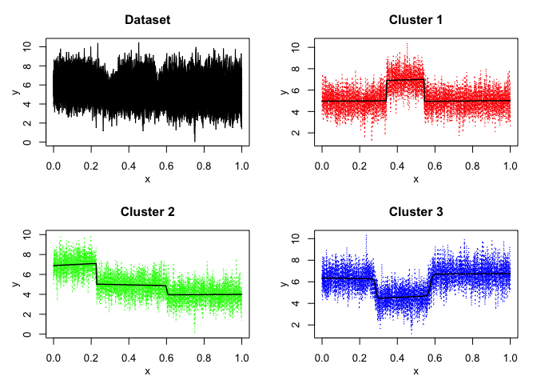
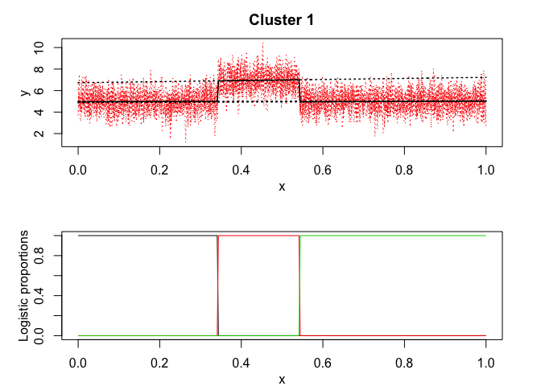
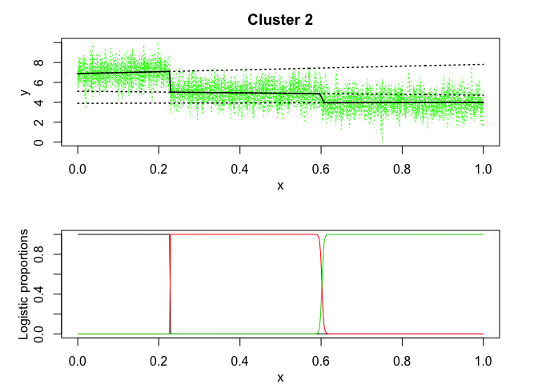
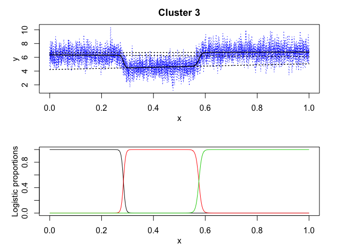
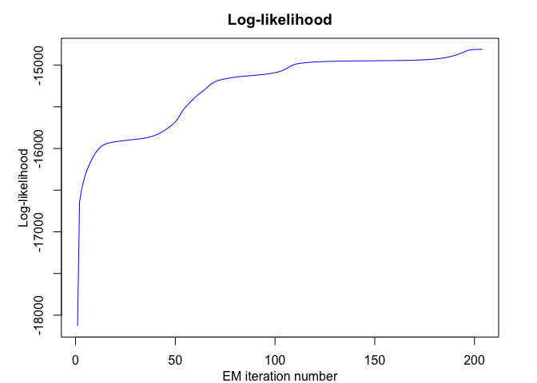
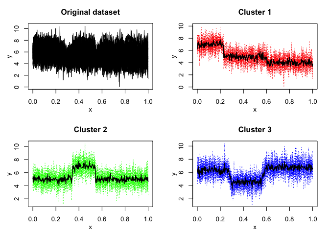
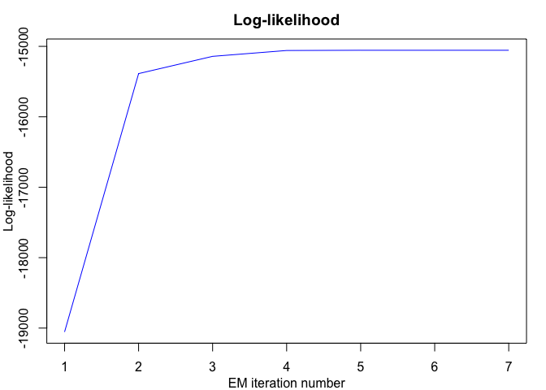
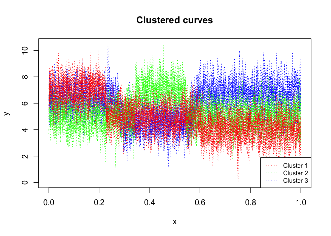
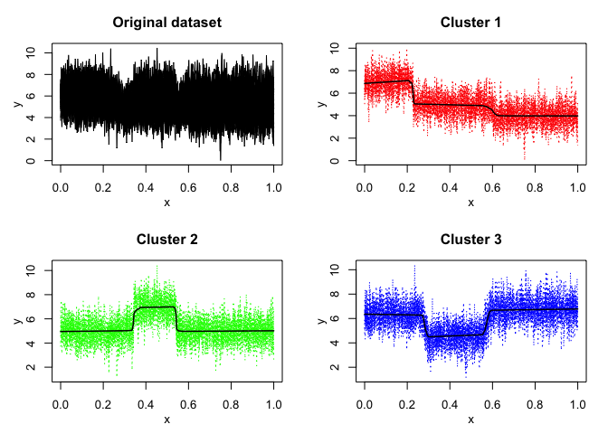
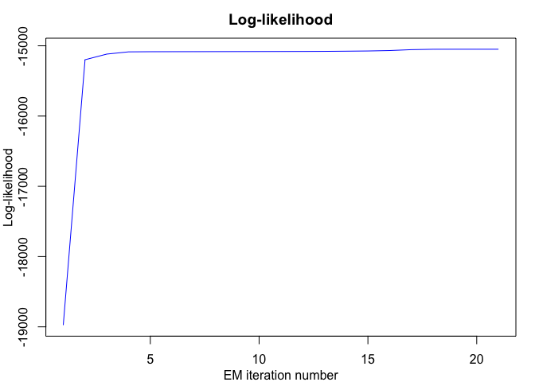

<!-- README.md is generated from README.Rmd. Please edit that file -->

<!-- badges: start -->

[](https://travis-ci.org/fchamroukhi/FLaMingos)
<!-- badges: end -->

# **FLaMingos**: **F**unctional **L**atent dat**A** **M**odels for cluster**ING** heterogene**O**us curve**S**

flamingos is an open-source toolbox (available in R and in Matlab) for
the simultaneous clustering and segmentation of heterogeneous functional
data (i.e time-series ore more generally longitudinal data), with
original and flexible functional latent variable models, fitted by
unsupervised algorithms, including EM algorithms.

Our nice FLaMingos are mainly:

  - mixRHLP;
  - mixHMM;
  - mixHMMR.

The models and algorithms are developped and written in Matlab by Faicel
Chamroukhi, and translated and designed into R packages by Florian
Lecocq, Marius Bartcus and Faicel Chamroukhi.

# Installation

You can install the **flamingos** package from
[GitHub](https://github.com/fchamroukhi/FLaMingos) with:

``` r
# install.packages("devtools")
devtools::install_github("fchamroukhi/FLaMingos")
```

To build *vignettes* for examples of usage, type the command below
instead:

``` r
# install.packages("devtools")
devtools::install_github("fchamroukhi/FLaMingos", 
                         build_opts = c("--no-resave-data", "--no-manual"), 
                         build_vignettes = TRUE)
```

Use the following command to display vignettes:

``` r
browseVignettes("flamingos")
```

# Usage

``` r
library(flamingos)
```

<details>

<summary>mixRHLP</summary>

``` r
data("toydataset")
x <- toydataset$x
Y <- t(toydataset[,2:ncol(toydataset)])

K <- 3 # Number of clusters
R <- 3 # Number of regimes (polynomial regression components)
p <- 1 # Degree of the polynomials
q <- 1 # Order of the logistic regression (by default 1 for contiguous segmentation)
variance_type <- "heteroskedastic" # "heteroskedastic" or "homoskedastic" model

n_tries <- 1
max_iter <- 1000
threshold <- 1e-5
verbose <- TRUE
verbose_IRLS <- FALSE
init_kmeans <- TRUE

mixrhlp <- emMixRHLP(X = x, Y = Y, K, R, p, q, variance_type, init_kmeans, 
                     n_tries, max_iter, threshold, verbose, verbose_IRLS)
#> EM - mixRHLP: Iteration: 1 | log-likelihood: -18129.8169520025
#> EM - mixRHLP: Iteration: 2 | log-likelihood: -16642.732267463
#> EM - mixRHLP: Iteration: 3 | log-likelihood: -16496.947898833
#> EM - mixRHLP: Iteration: 4 | log-likelihood: -16391.6755568235
#> EM - mixRHLP: Iteration: 5 | log-likelihood: -16308.151649539
#> EM - mixRHLP: Iteration: 6 | log-likelihood: -16242.6749975019
#> EM - mixRHLP: Iteration: 7 | log-likelihood: -16187.9951484578
#> EM - mixRHLP: Iteration: 8 | log-likelihood: -16138.360050325
#> EM - mixRHLP: Iteration: 9 | log-likelihood: -16092.9430959116
#> EM - mixRHLP: Iteration: 10 | log-likelihood: -16053.588838999
#> EM - mixRHLP: Iteration: 11 | log-likelihood: -16020.7365667916
#> EM - mixRHLP: Iteration: 12 | log-likelihood: -15993.7513179937
#> EM - mixRHLP: Iteration: 13 | log-likelihood: -15972.7088032469
#> EM - mixRHLP: Iteration: 14 | log-likelihood: -15957.3889127412
#> EM - mixRHLP: Iteration: 15 | log-likelihood: -15946.5663566082
#> EM - mixRHLP: Iteration: 16 | log-likelihood: -15938.693534838
#> EM - mixRHLP: Iteration: 17 | log-likelihood: -15932.584112949
#> EM - mixRHLP: Iteration: 18 | log-likelihood: -15927.5299507605
#> EM - mixRHLP: Iteration: 19 | log-likelihood: -15923.1499635319
#> EM - mixRHLP: Iteration: 20 | log-likelihood: -15919.2392546398
#> EM - mixRHLP: Iteration: 21 | log-likelihood: -15915.6795793534
#> EM - mixRHLP: Iteration: 22 | log-likelihood: -15912.3944381959
#> EM - mixRHLP: Iteration: 23 | log-likelihood: -15909.327585346
#> EM - mixRHLP: Iteration: 24 | log-likelihood: -15906.4326405988
#> EM - mixRHLP: Iteration: 25 | log-likelihood: -15903.6678636145
#> EM - mixRHLP: Iteration: 26 | log-likelihood: -15900.9933370165
#> EM - mixRHLP: Iteration: 27 | log-likelihood: -15898.3692402859
#> EM - mixRHLP: Iteration: 28 | log-likelihood: -15895.7545341827
#> EM - mixRHLP: Iteration: 29 | log-likelihood: -15893.1056775993
#> EM - mixRHLP: Iteration: 30 | log-likelihood: -15890.3751610539
#> EM - mixRHLP: Iteration: 31 | log-likelihood: -15887.5097378815
#> EM - mixRHLP: Iteration: 32 | log-likelihood: -15884.4482946475
#> EM - mixRHLP: Iteration: 33 | log-likelihood: -15881.1193453446
#> EM - mixRHLP: Iteration: 34 | log-likelihood: -15877.4381561224
#> EM - mixRHLP: Iteration: 35 | log-likelihood: -15873.3037170772
#> EM - mixRHLP: Iteration: 36 | log-likelihood: -15868.595660791
#> EM - mixRHLP: Iteration: 37 | log-likelihood: -15863.171868441
#> EM - mixRHLP: Iteration: 38 | log-likelihood: -15856.8678694783
#> EM - mixRHLP: Iteration: 39 | log-likelihood: -15849.5002500459
#> EM - mixRHLP: Iteration: 40 | log-likelihood: -15840.8778843568
#> EM - mixRHLP: Iteration: 41 | log-likelihood: -15830.8267303162
#> EM - mixRHLP: Iteration: 42 | log-likelihood: -15819.2343887404
#> EM - mixRHLP: Iteration: 43 | log-likelihood: -15806.11425583
#> EM - mixRHLP: Iteration: 44 | log-likelihood: -15791.6651550126
#> EM - mixRHLP: Iteration: 45 | log-likelihood: -15776.2575311116
#> EM - mixRHLP: Iteration: 46 | log-likelihood: -15760.2525673176
#> EM - mixRHLP: Iteration: 47 | log-likelihood: -15743.6600428386
#> EM - mixRHLP: Iteration: 48 | log-likelihood: -15725.8494727209
#> EM - mixRHLP: Iteration: 49 | log-likelihood: -15705.5392028324
#> EM - mixRHLP: Iteration: 50 | log-likelihood: -15681.0330055801
#> EM - mixRHLP: Iteration: 51 | log-likelihood: -15650.7058006772
#> EM - mixRHLP: Iteration: 52 | log-likelihood: -15614.1891628978
#> EM - mixRHLP: Iteration: 53 | log-likelihood: -15574.3209962234
#> EM - mixRHLP: Iteration: 54 | log-likelihood: -15536.9561042095
#> EM - mixRHLP: Iteration: 55 | log-likelihood: -15505.9888676546
#> EM - mixRHLP: Iteration: 56 | log-likelihood: -15480.3479747868
#> EM - mixRHLP: Iteration: 57 | log-likelihood: -15456.7432033066
#> EM - mixRHLP: Iteration: 58 | log-likelihood: -15432.855894347
#> EM - mixRHLP: Iteration: 59 | log-likelihood: -15408.4123139152
#> EM - mixRHLP: Iteration: 60 | log-likelihood: -15384.7708355233
#> EM - mixRHLP: Iteration: 61 | log-likelihood: -15363.3704926307
#> EM - mixRHLP: Iteration: 62 | log-likelihood: -15344.3247788467
#> EM - mixRHLP: Iteration: 63 | log-likelihood: -15326.444200793
#> EM - mixRHLP: Iteration: 64 | log-likelihood: -15308.1502066517
#> EM - mixRHLP: Iteration: 65 | log-likelihood: -15288.3650661699
#> EM - mixRHLP: Iteration: 66 | log-likelihood: -15267.1380314858
#> EM - mixRHLP: Iteration: 67 | log-likelihood: -15245.8151021308
#> EM - mixRHLP: Iteration: 68 | log-likelihood: -15226.3007649639
#> EM - mixRHLP: Iteration: 69 | log-likelihood: -15209.9671868432
#> EM - mixRHLP: Iteration: 70 | log-likelihood: -15197.3697193674
#> EM - mixRHLP: Iteration: 71 | log-likelihood: -15187.8845852548
#> EM - mixRHLP: Iteration: 72 | log-likelihood: -15180.4065779427
#> EM - mixRHLP: Iteration: 73 | log-likelihood: -15174.1897193241
#> EM - mixRHLP: Iteration: 74 | log-likelihood: -15168.8680084075
#> EM - mixRHLP: Iteration: 75 | log-likelihood: -15164.1615627415
#> EM - mixRHLP: Iteration: 76 | log-likelihood: -15159.6679572457
#> EM - mixRHLP: Iteration: 77 | log-likelihood: -15155.1488045656
#> EM - mixRHLP: Iteration: 78 | log-likelihood: -15150.9231858137
#> EM - mixRHLP: Iteration: 79 | log-likelihood: -15147.2212168192
#> EM - mixRHLP: Iteration: 80 | log-likelihood: -15144.078942659
#> EM - mixRHLP: Iteration: 81 | log-likelihood: -15141.3516305636
#> EM - mixRHLP: Iteration: 82 | log-likelihood: -15138.8602529876
#> EM - mixRHLP: Iteration: 83 | log-likelihood: -15136.5059345662
#> EM - mixRHLP: Iteration: 84 | log-likelihood: -15134.2384537766
#> EM - mixRHLP: Iteration: 85 | log-likelihood: -15132.0298589309
#> EM - mixRHLP: Iteration: 86 | log-likelihood: -15129.8608706576
#> EM - mixRHLP: Iteration: 87 | log-likelihood: -15127.7157936565
#> EM - mixRHLP: Iteration: 88 | log-likelihood: -15125.5797196054
#> EM - mixRHLP: Iteration: 89 | log-likelihood: -15123.4372146492
#> EM - mixRHLP: Iteration: 90 | log-likelihood: -15121.2712280838
#> EM - mixRHLP: Iteration: 91 | log-likelihood: -15119.0622569401
#> EM - mixRHLP: Iteration: 92 | log-likelihood: -15116.7874031382
#> EM - mixRHLP: Iteration: 93 | log-likelihood: -15114.4192658119
#> EM - mixRHLP: Iteration: 94 | log-likelihood: -15111.9245293407
#> EM - mixRHLP: Iteration: 95 | log-likelihood: -15109.262047444
#> EM - mixRHLP: Iteration: 96 | log-likelihood: -15106.3802520661
#> EM - mixRHLP: Iteration: 97 | log-likelihood: -15103.2137059945
#> EM - mixRHLP: Iteration: 98 | log-likelihood: -15099.6787565231
#> EM - mixRHLP: Iteration: 99 | log-likelihood: -15095.6664401258
#> EM - mixRHLP: Iteration: 100 | log-likelihood: -15091.0341403017
#> EM - mixRHLP: Iteration: 101 | log-likelihood: -15085.5952981967
#> EM - mixRHLP: Iteration: 102 | log-likelihood: -15079.1100803411
#> EM - mixRHLP: Iteration: 103 | log-likelihood: -15071.2863215881
#> EM - mixRHLP: Iteration: 104 | log-likelihood: -15061.8155026615
#> EM - mixRHLP: Iteration: 105 | log-likelihood: -15050.4931948422
#> EM - mixRHLP: Iteration: 106 | log-likelihood: -15037.4728804542
#> EM - mixRHLP: Iteration: 107 | log-likelihood: -15023.5663638262
#> EM - mixRHLP: Iteration: 108 | log-likelihood: -15010.227713049
#> EM - mixRHLP: Iteration: 109 | log-likelihood: -14998.9216243488
#> EM - mixRHLP: Iteration: 110 | log-likelihood: -14990.3428946115
#> EM - mixRHLP: Iteration: 111 | log-likelihood: -14984.2931646741
#> EM - mixRHLP: Iteration: 112 | log-likelihood: -14980.0317050997
#> EM - mixRHLP: Iteration: 113 | log-likelihood: -14976.7574542595
#> EM - mixRHLP: Iteration: 114 | log-likelihood: -14973.9768267566
#> EM - mixRHLP: Iteration: 115 | log-likelihood: -14971.5304235767
#> EM - mixRHLP: Iteration: 116 | log-likelihood: -14969.3710026547
#> EM - mixRHLP: Iteration: 117 | log-likelihood: -14967.3301314624
#> EM - mixRHLP: Iteration: 118 | log-likelihood: -14965.1319732928
#> EM - mixRHLP: Iteration: 119 | log-likelihood: -14962.818626259
#> EM - mixRHLP: Iteration: 120 | log-likelihood: -14961.1657986148
#> EM - mixRHLP: Iteration: 121 | log-likelihood: -14960.1001793804
#> EM - mixRHLP: Iteration: 122 | log-likelihood: -14959.2029493404
#> EM - mixRHLP: Iteration: 123 | log-likelihood: -14958.3643653619
#> EM - mixRHLP: Iteration: 124 | log-likelihood: -14957.5579272948
#> EM - mixRHLP: Iteration: 125 | log-likelihood: -14956.7769206505
#> EM - mixRHLP: Iteration: 126 | log-likelihood: -14956.0220832192
#> EM - mixRHLP: Iteration: 127 | log-likelihood: -14955.2990068376
#> EM - mixRHLP: Iteration: 128 | log-likelihood: -14954.6080936987
#> EM - mixRHLP: Iteration: 129 | log-likelihood: -14953.9546052572
#> EM - mixRHLP: Iteration: 130 | log-likelihood: -14953.3424683065
#> EM - mixRHLP: Iteration: 131 | log-likelihood: -14952.7742704947
#> EM - mixRHLP: Iteration: 132 | log-likelihood: -14952.2512735504
#> EM - mixRHLP: Iteration: 133 | log-likelihood: -14951.7732467988
#> EM - mixRHLP: Iteration: 134 | log-likelihood: -14951.3384384815
#> EM - mixRHLP: Iteration: 135 | log-likelihood: -14950.9439547413
#> EM - mixRHLP: Iteration: 136 | log-likelihood: -14950.5860673359
#> EM - mixRHLP: Iteration: 137 | log-likelihood: -14950.2605961901
#> EM - mixRHLP: Iteration: 138 | log-likelihood: -14949.9632302133
#> EM - mixRHLP: Iteration: 139 | log-likelihood: -14949.6897803656
#> EM - mixRHLP: Iteration: 140 | log-likelihood: -14949.4363440458
#> EM - mixRHLP: Iteration: 141 | log-likelihood: -14949.1993934329
#> EM - mixRHLP: Iteration: 142 | log-likelihood: -14948.9758045711
#> EM - mixRHLP: Iteration: 143 | log-likelihood: -14948.7628462595
#> EM - mixRHLP: Iteration: 144 | log-likelihood: -14948.5581447387
#> EM - mixRHLP: Iteration: 145 | log-likelihood: -14948.3596363733
#> EM - mixRHLP: Iteration: 146 | log-likelihood: -14948.1655161518
#> EM - mixRHLP: Iteration: 147 | log-likelihood: -14947.9741866833
#> EM - mixRHLP: Iteration: 148 | log-likelihood: -14947.7842100466
#> EM - mixRHLP: Iteration: 149 | log-likelihood: -14947.5942633197
#> EM - mixRHLP: Iteration: 150 | log-likelihood: -14947.4030977377
#> EM - mixRHLP: Iteration: 151 | log-likelihood: -14947.2095010109
#> EM - mixRHLP: Iteration: 152 | log-likelihood: -14947.0122620331
#> EM - mixRHLP: Iteration: 153 | log-likelihood: -14946.8101371804
#> EM - mixRHLP: Iteration: 154 | log-likelihood: -14946.6018173877
#> EM - mixRHLP: Iteration: 155 | log-likelihood: -14946.3858952193
#> EM - mixRHLP: Iteration: 156 | log-likelihood: -14946.1608312027
#> EM - mixRHLP: Iteration: 157 | log-likelihood: -14945.9249187549
#> EM - mixRHLP: Iteration: 158 | log-likelihood: -14945.676247118
#> EM - mixRHLP: Iteration: 159 | log-likelihood: -14945.4126618353
#> EM - mixRHLP: Iteration: 160 | log-likelihood: -14945.1317224602
#> EM - mixRHLP: Iteration: 161 | log-likelihood: -14944.8306573941
#> EM - mixRHLP: Iteration: 162 | log-likelihood: -14944.5063160023
#> EM - mixRHLP: Iteration: 163 | log-likelihood: -14944.1551184229
#> EM - mixRHLP: Iteration: 164 | log-likelihood: -14943.7730037188
#> EM - mixRHLP: Iteration: 165 | log-likelihood: -14943.355377134
#> EM - mixRHLP: Iteration: 166 | log-likelihood: -14942.8970570836
#> EM - mixRHLP: Iteration: 167 | log-likelihood: -14942.3922219831
#> EM - mixRHLP: Iteration: 168 | log-likelihood: -14941.8343559995
#> EM - mixRHLP: Iteration: 169 | log-likelihood: -14941.2161912546
#> EM - mixRHLP: Iteration: 170 | log-likelihood: -14940.5296397031
#> EM - mixRHLP: Iteration: 171 | log-likelihood: -14939.7657190993
#> EM - mixRHLP: Iteration: 172 | log-likelihood: -14938.9144460343
#> EM - mixRHLP: Iteration: 173 | log-likelihood: -14937.9647057519
#> EM - mixRHLP: Iteration: 174 | log-likelihood: -14936.9040831122
#> EM - mixRHLP: Iteration: 175 | log-likelihood: -14935.7186499891
#> EM - mixRHLP: Iteration: 176 | log-likelihood: -14934.3927038884
#> EM - mixRHLP: Iteration: 177 | log-likelihood: -14932.9084527435
#> EM - mixRHLP: Iteration: 178 | log-likelihood: -14931.245639997
#> EM - mixRHLP: Iteration: 179 | log-likelihood: -14929.3811026273
#> EM - mixRHLP: Iteration: 180 | log-likelihood: -14927.2882537299
#> EM - mixRHLP: Iteration: 181 | log-likelihood: -14924.9364821865
#> EM - mixRHLP: Iteration: 182 | log-likelihood: -14922.2904675358
#> EM - mixRHLP: Iteration: 183 | log-likelihood: -14919.3094231961
#> EM - mixRHLP: Iteration: 184 | log-likelihood: -14915.9463144684
#> EM - mixRHLP: Iteration: 185 | log-likelihood: -14912.1471647651
#> EM - mixRHLP: Iteration: 186 | log-likelihood: -14907.8506901999
#> EM - mixRHLP: Iteration: 187 | log-likelihood: -14902.9887290339
#> EM - mixRHLP: Iteration: 188 | log-likelihood: -14897.4883102736
#> EM - mixRHLP: Iteration: 189 | log-likelihood: -14891.27676833
#> EM - mixRHLP: Iteration: 190 | log-likelihood: -14884.2919447409
#> EM - mixRHLP: Iteration: 191 | log-likelihood: -14876.4995909623
#> EM - mixRHLP: Iteration: 192 | log-likelihood: -14867.9179321727
#> EM - mixRHLP: Iteration: 193 | log-likelihood: -14858.6442978196
#> EM - mixRHLP: Iteration: 194 | log-likelihood: -14848.8804338117
#> EM - mixRHLP: Iteration: 195 | log-likelihood: -14838.9872847758
#> EM - mixRHLP: Iteration: 196 | log-likelihood: -14829.6292321768
#> EM - mixRHLP: Iteration: 197 | log-likelihood: -14821.8717823403
#> EM - mixRHLP: Iteration: 198 | log-likelihood: -14816.6461672058
#> EM - mixRHLP: Iteration: 199 | log-likelihood: -14813.7497363742
#> EM - mixRHLP: Iteration: 200 | log-likelihood: -14812.2267827519
#> EM - mixRHLP: Iteration: 201 | log-likelihood: -14811.4198287137
#> EM - mixRHLP: Iteration: 202 | log-likelihood: -14811.0049217051
#> EM - mixRHLP: Iteration: 203 | log-likelihood: -14810.7960368513
#> EM - mixRHLP: Iteration: 204 | log-likelihood: -14810.6883875777

mixrhlp$summary()
#> ------------------------
#> Fitted mixRHLP model
#> ------------------------
#> 
#> MixRHLP model with K = 3 clusters and R = 3 regimes:
#> 
#>  log-likelihood nu       AIC       BIC       ICL
#>       -14810.69 41 -14851.69 -14880.41 -14880.41
#> 
#> Clustering table (Number of curves in each clusters):
#> 
#>  1  2  3 
#> 10 10 10 
#> 
#> Mixing probabilities (cluster weights):
#>          1         2         3
#>  0.3333333 0.3333333 0.3333333
#> 
#> 
#> --------------------
#> Cluster 1 (k = 1):
#> 
#> Regression coefficients for each regime/segment r (r=1...R):
#> 
#>     Beta(r = 1) Beta(r = 2) Beta(r = 3)
#> 1    4.96556671   6.7326717   4.8807183
#> X^1  0.08880479   0.4984443   0.1350271
#> 
#> Variances:
#> 
#>  Sigma2(r = 1) Sigma2(r = 2) Sigma2(r = 3)
#>      0.9559969       1.03849     0.9506928
#> 
#> --------------------
#> Cluster 2 (k = 2):
#> 
#> Regression coefficients for each regime/segment r (r=1...R):
#> 
#>     Beta(r = 1) Beta(r = 2) Beta(r = 3)
#> 1     6.8902863   5.1134337  3.90153421
#> X^1   0.9265632  -0.3959402  0.08748466
#> 
#> Variances:
#> 
#>  Sigma2(r = 1) Sigma2(r = 2) Sigma2(r = 3)
#>       0.981915     0.9787717     0.9702211
#> 
#> --------------------
#> Cluster 3 (k = 3):
#> 
#> Regression coefficients for each regime/segment r (r=1...R):
#> 
#>     Beta(r = 1) Beta(r = 2) Beta(r = 3)
#> 1     6.3513369    4.214736   6.6536553
#> X^1  -0.2449377    0.839666   0.1024863
#> 
#> Variances:
#> 
#>  Sigma2(r = 1) Sigma2(r = 2) Sigma2(r = 3)
#>      0.9498285     0.9270384      1.001413

mixrhlp$plot()
```



</details>

<details>

<summary>mixHMM</summary>

``` r
data("toydataset")
Y <- t(toydataset[,2:ncol(toydataset)])

K <- 3 # Number of clusters
R <- 3 # Number of regimes (HMM states)
variance_type <- "heteroskedastic" # "heteroskedastic" or "homoskedastic" model

ordered_states <- TRUE
n_tries <- 1
max_iter <- 1000
init_kmeans <- TRUE
threshold <- 1e-6
verbose <- TRUE

mixhmm <- emMixHMM(Y = Y, K, R, variance_type, ordered_states, init_kmeans, 
                   n_tries, max_iter, threshold, verbose)
#> EM - mixHMMs: Iteration: 1 | log-likelihood: -19054.7157954833
#> EM - mixHMMs: Iteration: 2 | log-likelihood: -15386.7973253636
#> EM - mixHMMs: Iteration: 3 | log-likelihood: -15141.8435629464
#> EM - mixHMMs: Iteration: 4 | log-likelihood: -15058.7251666378
#> EM - mixHMMs: Iteration: 5 | log-likelihood: -15055.5058566489
#> EM - mixHMMs: Iteration: 6 | log-likelihood: -15055.4877310423
#> EM - mixHMMs: Iteration: 7 | log-likelihood: -15055.4876146553

mixhmm$summary()
#> -----------------------
#> Fitted mixHMM model
#> -----------------------
#> 
#> MixHMM model with K = 3 clusters and R = 3 regimes:
#> 
#>  log-likelihood nu       AIC       BIC
#>       -15055.49 41 -15096.49 -15125.21
#> 
#> Clustering table (Number of curves in each clusters):
#> 
#>  1  2  3 
#> 10 10 10 
#> 
#> Mixing probabilities (cluster weights):
#>          1         2         3
#>  0.3333333 0.3333333 0.3333333
#> 
#> 
#> -------------------
#> Cluster 1 (k = 1):
#> 
#> Means:
#> 
#>    r = 1    r = 2    r = 3
#>  7.00202 4.964273 3.979626
#> 
#> Variances:
#> 
#>  Sigma2(r = 1) Sigma2(r = 2) Sigma2(r = 3)
#>      0.9858726     0.9884542     0.9651437
#> 
#> -------------------
#> Cluster 2 (k = 2):
#> 
#> Means:
#> 
#>     r = 1    r = 2    r = 3
#>  4.987066 6.963998 4.987279
#> 
#> Variances:
#> 
#>  Sigma2(r = 1) Sigma2(r = 2) Sigma2(r = 3)
#>      0.9578459      1.045573      0.952294
#> 
#> -------------------
#> Cluster 3 (k = 3):
#> 
#> Means:
#> 
#>     r = 1    r = 2    r = 3
#>  6.319189 4.583954 6.722627
#> 
#> Variances:
#> 
#>  Sigma2(r = 1) Sigma2(r = 2) Sigma2(r = 3)
#>      0.9571803     0.9504731       1.01553

mixhmm$plot()
```



</details>

<details>

<summary>mixHMMR</summary>

``` r
data("toydataset")
x <- toydataset$x
Y <- t(toydataset[,2:ncol(toydataset)])

K <- 3 # Number of clusters
R <- 3 # Number of regimes/states
p <- 1 # Degree of the polynomial regression
variance_type <- "heteroskedastic" # "heteroskedastic" or "homoskedastic" model

ordered_states <- TRUE
n_tries <- 1
max_iter <- 1000
init_kmeans <- TRUE
threshold <- 1e-6
verbose <- TRUE

mixhmmr <- emMixHMMR(X = x, Y = Y, K, R, p, variance_type, ordered_states, 
                     init_kmeans, n_tries, max_iter, threshold, verbose)
#> EM - mixHMMR: Iteration: 1 || log-likelihood: -18975.6323298895
#> EM - mixHMMR: Iteration: 2 || log-likelihood: -15198.5811534058
#> EM - mixHMMR: Iteration: 3 || log-likelihood: -15118.0350455527
#> EM - mixHMMR: Iteration: 4 || log-likelihood: -15086.2933826057
#> EM - mixHMMR: Iteration: 5 || log-likelihood: -15084.2502053712
#> EM - mixHMMR: Iteration: 6 || log-likelihood: -15083.7770153797
#> EM - mixHMMR: Iteration: 7 || log-likelihood: -15083.3586992156
#> EM - mixHMMR: Iteration: 8 || log-likelihood: -15082.8291034608
#> EM - mixHMMR: Iteration: 9 || log-likelihood: -15082.2407744542
#> EM - mixHMMR: Iteration: 10 || log-likelihood: -15081.6808462523
#> EM - mixHMMR: Iteration: 11 || log-likelihood: -15081.175618676
#> EM - mixHMMR: Iteration: 12 || log-likelihood: -15080.5819574865
#> EM - mixHMMR: Iteration: 13 || log-likelihood: -15079.3118011276
#> EM - mixHMMR: Iteration: 14 || log-likelihood: -15076.8073408977
#> EM - mixHMMR: Iteration: 15 || log-likelihood: -15073.8399600893
#> EM - mixHMMR: Iteration: 16 || log-likelihood: -15067.6884092484
#> EM - mixHMMR: Iteration: 17 || log-likelihood: -15054.9127597414
#> EM - mixHMMR: Iteration: 18 || log-likelihood: -15049.4000307536
#> EM - mixHMMR: Iteration: 19 || log-likelihood: -15049.0221351022
#> EM - mixHMMR: Iteration: 20 || log-likelihood: -15048.997021329
#> EM - mixHMMR: Iteration: 21 || log-likelihood: -15048.9949507534

mixhmmr$summary()
#> ------------------------
#> Fitted mixHMMR model
#> ------------------------
#> 
#> MixHMMR model with K = 3 clusters and R = 3 regimes:
#> 
#>  log-likelihood nu       AIC       BIC       ICL
#>       -15048.99 50 -15098.99 -15134.02 -15134.02
#> 
#> Clustering table (Number of curves in each clusters):
#> 
#>  1  2  3 
#> 10 10 10 
#> 
#> Mixing probabilities (cluster weights):
#>          1         2         3
#>  0.3333333 0.3333333 0.3333333
#> 
#> 
#> --------------------
#> Cluster 1 (k = 1):
#> 
#> Regression coefficients for each regime/segment r (r=1...R):
#> 
#>     Beta(r = 1) Beta(r = 2) Beta(r = 3)
#> 1      6.870328   5.1511267   3.9901300
#> X^1    1.204150  -0.4601777  -0.0155753
#> 
#> Variances:
#> 
#>  Sigma2(r = 1) Sigma2(r = 2) Sigma2(r = 3)
#>      0.9776399     0.9895623       0.96457
#> 
#> --------------------
#> Cluster 2 (k = 2):
#> 
#> Regression coefficients for each regime/segment r (r=1...R):
#> 
#>     Beta(r = 1) Beta(r = 2) Beta(r = 3)
#> 1     4.9512819   6.8393804   4.9076599
#> X^1   0.2099508   0.2822775   0.1031626
#> 
#> Variances:
#> 
#>  Sigma2(r = 1) Sigma2(r = 2) Sigma2(r = 3)
#>      0.9576192      1.045043      0.952047
#> 
#> --------------------
#> Cluster 3 (k = 3):
#> 
#> Regression coefficients for each regime/segment r (r=1...R):
#> 
#>     Beta(r = 1) Beta(r = 2) Beta(r = 3)
#> 1     6.3552432   4.2868818   6.5327846
#> X^1  -0.2865404   0.6907212   0.2429291
#> 
#> Variances:
#> 
#>  Sigma2(r = 1) Sigma2(r = 2) Sigma2(r = 3)
#>      0.9587975     0.9481068       1.01388

mixhmmr$plot()
```



</details>

# References

<div id="refs" class="references">

<div id="ref-Chamroukhi-FDA-2018">

Chamroukhi, Faicel, and Hien D. Nguyen. 2019. “Model-Based Clustering
and Classification of Functional Data.” *Wiley Interdisciplinary
Reviews: Data Mining and Knowledge Discovery*.
<https://chamroukhi.com/papers/MBCC-FDA.pdf>.

</div>

<div id="ref-Chamroukhi-RobustEMMixReg2015">

Chamroukhi, F. 2016. “Unsupervised Learning of Regression Mixture Models
with Unknown Number of Components.” *Journal of Statistical Computation
and Simulation* 86 (November): 2308–34.
<https://chamroukhi.com/papers/Chamroukhi-JSCS-2015.pdf>.

</div>

<div id="ref-Chamroukhi-PWRM-2016">

Chamroukhi, Faicel. 2016. “Piecewise Regression Mixture for Simultaneous
Functional Data Clustering and Optimal Segmentation.” *Journal of
Classification* 33 (3): 374–411.
<https://chamroukhi.com/papers/Chamroukhi-PWRM-JournalClassif-2016.pdf>.

</div>

<div id="ref-Chamroukhi-HDR-2015">

Chamroukhi, F. 2015. “Statistical Learning of Latent Data Models for
Complex Data Analysis.” Habilitation Thesis (HDR), Université de Toulon.
<https://chamroukhi.com/Dossier/FChamroukhi-Habilitation.pdf>.

</div>

<div id="ref-Chamroukhi-FMDA-neucomp2013">

Chamroukhi, F., H. Glotin, and A. Samé. 2013. “Model-Based Functional
Mixture Discriminant Analysis with Hidden Process Regression for Curve
Classification.” *Neurocomputing* 112: 153–63.
<https://chamroukhi.com/papers/chamroukhi_et_al_neucomp2013a.pdf>.

</div>

<div id="ref-Chamroukhi-IJCNN-2012">

Chamroukhi, F., and H. Glotin. 2012. “Mixture Model-Based Functional
Discriminant Analysis for Curve Classification.” In *Proceedings of the
International Joint Conference on Neural Networks (IJCNN), IEEE*, 1–8.
Brisbane, Australia.
<https://chamroukhi.com/papers/Chamroukhi-ijcnn-2012.pdf>.

</div>

<div id="ref-Chamroukhi-MixRHLP-2011">

Samé, A., F. Chamroukhi, Gérard Govaert, and P. Aknin. 2011.
“Model-Based Clustering and Segmentation of Time Series with Changes
in Regime.” *Advances in Data Analysis and Classification* 5 (4):
301–21. <https://chamroukhi.com/papers/adac-2011.pdf>.

</div>

<div id="ref-Chamroukhi-IJCNN-2011">

Chamroukhi, F., A. Samé, P. Aknin, and G. Govaert. 2011. “Model-Based
Clustering with Hidden Markov Model Regression for Time Series with
Regime Changes.” In *Proceedings of the International Joint Conference
on Neural Networks (IJCNN), IEEE*, 2814–21.
<https://chamroukhi.com/papers/Chamroukhi-ijcnn-2011.pdf>.

</div>

<div id="ref-chamroukhi_et_al_neurocomp2010">

Chamroukhi, F., A. Samé, G. Govaert, and P. Aknin. 2010. “A Hidden
Process Regression Model for Functional Data Description. Application to
Curve Discrimination.” *Neurocomputing* 73 (7-9): 1210–21.
<https://chamroukhi.com/papers/chamroukhi_neucomp_2010.pdf>.

</div>

<div id="ref-Chamroukhi_PhD_2010">

Chamroukhi, F. 2010. “Hidden Process Regression for Curve Modeling,
Classification and Tracking.” Ph.D. Thesis, Université de Technologie de
Compiègne. <https://chamroukhi.com/papers/FChamroukhi-Thesis.pdf>.

</div>

</div>
