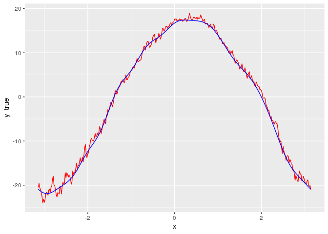

<!-- README.md is generated from README.Rmd. Please edit that file -->

# geoFKF

<!-- badges: start -->

<!-- badges: end -->

The goal of geoFKF is to implement a kriging method for spatial
functional data.

## Installation

You can install the development version of geoFKF from
[GitHub](https://github.com/) using `devtools` package.

``` r
# install.packages("devtools")
devtools::install_github("gilberto-sassi/geoFKF")
```

## Example

This is a basic example which shows you how to solve a common problem:

``` r
library(ggplot2)
library(geoFKF)
data("datasetCanada")

m_data <- as.matrix(datasetCanada$m_data)
m_coord <- as.matrix(datasetCanada$m_coord[, 1:2])
pos <- 18
log_pos <- !(seq_len(nrow(m_coord)) %in% pos)
new_loc <- m_coord[pos, ]
m_coord <- m_coord[log_pos, ]
y_true <- m_data[, pos]
m_data <- m_data[, log_pos]

x <- seq(from = -pi, to = pi, length.out = length(y_true))

fit <- geo_fkf(m_data, m_coord, new_loc, t = x)

df <- data.frame(x , y_true, y_est = fit$estimates)

ggplot(df) +
  geom_line(aes(x, y_true), color = "red") +
  geom_line(aes(x, y_est), color = "blue")
```


