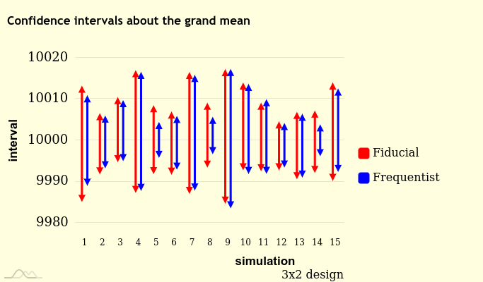
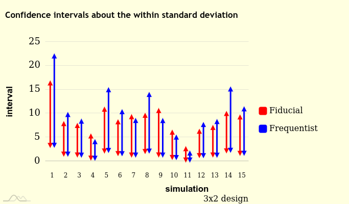
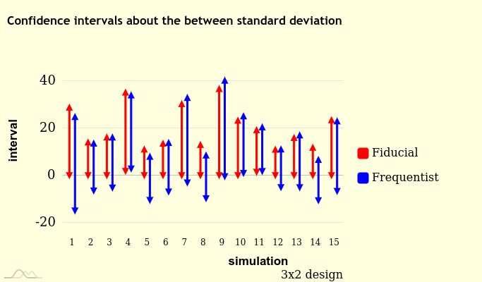
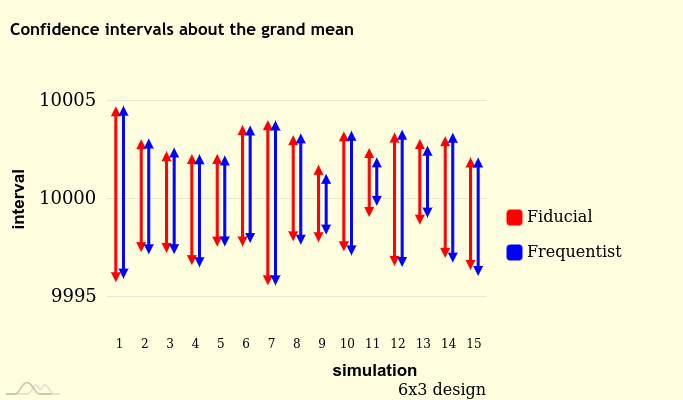
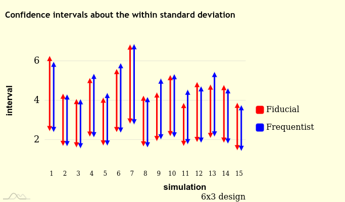
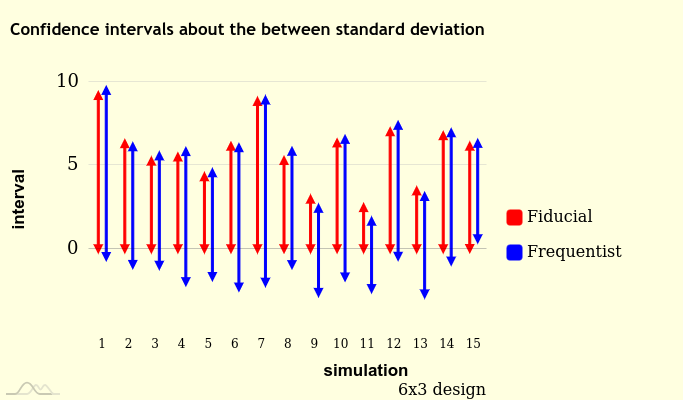

```{r, include = FALSE}
knitr::opts_chunk$set(
  collapse = TRUE,
  comment = "#>",
  warning = FALSE,
  fig.width = 5, 
  fig.height = 4.5
)
```

## What does it do?

The 'gfilmm' package allows to generate simulations from the generalized 
fiducial distribution of the parameters of a Gaussian linear mixed model with 
categorical random effects (numeric random effects are not supported) and 
interval data. It also provides some helper functions to get summary statistics 
and confidence intervals.

The algorithm implemented in 'gfilmm' is the one described in the paper 
*Generalized fiducial inference for normal linear mixed models* written by 
Jessi Cisewski and Jan Hannig. It is coded in C++ and the code is based on the 
original Matlab code written by Jessi Cisewski.

Fiducial inference has something similar to Bayesian inference: the 
uncertainty about the parameters are represented by a distribution, the 
fiducial distribution, with the help of which we conduct inference on the 
parameters in a way similar to the Bayesian way, based on the posterior 
distribution of the parameters. The main difference is that there is no prior 
distribution (so fiducial inference is similar to *objective* Bayesian 
inference). The fiducial inference yields results close to the ones of the 
frequentist inference. 

### Note 

Some pieces of code in the algorithm are run in parallel. In the examples below, 
as well as in the examples of the package documentation, I set `nthreads = 2L` 
because of CRAN restrictions: CRAN does not allow more than two threads and then
it would not accept the package if a higher number of threads were set.


## First example: a non-mixed linear model

The data must be given as a dataframe. Here we simulate data from a simple 
linear regression model:

```{r simulations_linreg}
set.seed(666L)
n <- 30L
x <- 1L:n
y <- rnorm(n, mean = x, sd = 2)
y_rounded <- round(y, digits = 1L)
dat <- data.frame(
  ylwr = y_rounded - 0.05,
  yupr = y_rounded + 0.05,
  x = x
)
```

Now we run the fiducial sampler:

```{r gfi_linreg}
library(gfilmm)
fidSims <- gfilmm(
  y = ~ cbind(ylwr, yupr), # interval data
  fixed = ~ x,             # fixed effects
  random = NULL,           # random effects
  data = dat,              # data
  N = 30000L,              # number of simulations
  nthreads = 2L
)
```

A summary of the fiducial simulations (the `Pr(=0)` column will be explained 
latter):

```{r gfiSummary_linreg}
gfiSummary(fidSims)
```

The fiducial confidence intervals are close to the frequentist ones:

```{r lm_linreg}
lmfit <- lm(y ~ x)
confint(lmfit)
```

The fiducial cumulative distribution function of the slope:

```{r gfiCDF_linreg}
Fslope <- gfiCDF(~ x, fidSims)
plot(Fslope, main = "Slope", ylab = expression("Pr("<="x)"))
```

To get a fiducial density, I recommend the 'kde1d' package:

```{r gfiDensity_linreg}
library(kde1d)
kfit <- kde1d(fidSims$VERTEX[["x"]], weights = fidSims$WEIGHT, mult = 4)
curve(dkde1d(x, kfit), from = 0.7, to = 1.1, col = "red", lwd = 2)
# observe the resemblance with the distribution of the 
# frequentist estimate of the slope:
curve(
  dnorm(x, coef(lmfit)["x"], sqrt(vcov(lmfit)["x","x"])), add = TRUE, 
  col = "blue", lwd = 2, lty = "dashed"
)
```

The fiducial simulations are weighted, so it makes no sense to plot them 
without taking the weights into account. We can get "pseudo-simulations" 
of the fiducial distribution by picking the fiducial simulations at random 
according to their weight:

```{r scatterplot}
indcs <- sample.int(30000L, replace = TRUE, prob = fidSims$WEIGHT)
pseudoSims <- fidSims$VERTEX[indcs,]
library(GGally)
ggpairs(
  pseudoSims,
  upper = list(continuous = ggally_density),
  lower = list(continuous = wrap("points", alpha = 0.1))
)
```

The scatterplot of the intercept and the slope has the same shape as 
the frequentist confidence ellipse of these two parameters:

```{r ellipse}
library(car)
dataEllipse(
  pseudoSims[["(Intercept)"]], pseudoSims[["x"]], 
  levels = c(0.5,0.95), col = c("black", "red"),
  xlab = "Intercept", ylab = "Slope"
)
confidenceEllipse(
  lmfit, 1:2, levels = c(0.5,0.95), add = TRUE, 
  col = "blue", lty = "dashed"
)
```


### Fiducial predictive inference. 

The `gfilmmPredictive` function samples the generalized fiducial predictive
distribution. All the functions seen above can be applied to the output.

```{r gfilmmPredictive}
fpd <- gfilmmPredictive(fidSims, newdata = data.frame(x = c(1, 30)))
gfiSummary(fpd)
```

Compare with the frequentist approach:

```{r lmpredict}
predict(lmfit, newdata = data.frame(x = c(1, 30)), interval = "prediction")
```


## A mixed model

Now let us simulate some data from a one-way ANOVA model with a random factor:

```{r simulations_AOV1R}
mu           <- 10000 # grand mean
sigmaBetween <- 2
sigmaWithin  <- 3
I            <- 6L # number of groups
J            <- 5L # sample size per group

set.seed(31415926L)
groupmeans <- rnorm(I, mu, sigmaBetween)
y          <- c(
  vapply(groupmeans, function(gmean) rnorm(J, gmean, sigmaWithin), numeric(J))
)
y_rounded  <- round(y, digits = 1L)
dat        <- data.frame(
                ylwr = y_rounded - 0.05,
                yupr = y_rounded + 0.05,
                group = gl(J, I)
              )
```

We run the fiducial sampler:

```{r gfilmm_AOV1R}
fidSims <- gfilmm(
  ~ cbind(ylwr, yupr), ~ 1, ~ group, data = dat, N = 30000L, nthreads = 2L
)
```

Observe that the between standard deviation `sigma_group` has a positive value 
in the `Pr(=0)` column:

```{r gfiSummary_AOV1R}
gfiSummary(fidSims)
```

What does it mean? The fiducial distributions of the variance components have a 
mass at zero, and this value is the probability that the between standard 
deviation equals zero. So you have to be careful if you are interested in the 
fiducial density of a standard deviation: if `Pr(=0)` is not null for the 
standard deviation you are interested in, the fiducial distribution of this 
standard deviation *does not have a density*. It has a mass at zero, and a 
density on the strictly positive real numbers.

Compare the fiducial confidence interval of the grand mean to its Kenward-Roger 
confidence interval:

```{r KenwardRoger, message=FALSE}
library(lmerTest)
library(emmeans)
fit <- lmer(y ~ (1|group), data = dat)
emmeans(fit, ~ 1)
```

Actually the design is balanced, and we can get the same confidence interval by 
the frequentist method:

```{r AOV1R}
library(AOV1R)
aovfit <- aov1r(y ~ dat$group)
confint(aovfit)
```

With `gfiConfInt` we can get a fiducial confidence interval for *any* parameter 
of interest, for example the coefficient of total variation:

```{r gfiConfInt_CV_AOV1R}
gfiConfInt(~ sqrt(sigma_group^2 + sigma_error^2)/`(Intercept)`, fidSims)
```

## How many fiducial simulations should we run?

This is a good question. Unfortunately I have no clue about the answer. A good 
practice consists in running several fiducial samplers and to check whether the 
results change. Since we have already tried 30000 simulations, let us try with 
40000 and 50000:

```{r parallel}
gfs <- lapply(c(40000L, 50000L), function(N){
  gfilmm(~ cbind(ylwr, yupr), ~ 1, ~ group, data = dat, N = N, nthreads = 2L)  
})
lapply(gfs, gfiSummary)
```

We find similar results, so `N = 30000L` should be enough.

### Note 

Never combine the fiducial simulations of two different runs. That makes no 
sense.

## A small simulation study

I have performed some simulations to evaluate the frequentist coverage of the 
fiducial 95%-confidence intervals for two different designs of a one-way ANOVA
model with a random factor: the first one with three groups and two replicates 
per group (3x2 design), and the second one with six groups and three replicates
per group (6x3 design). I compared with the frequentist confidence intervals 
calculated by the 'AOV1R' package. These ones are theoretically exact, except 
the one about the between standard deviation.

### 3x2 design

Here are the coverage probabilities of the frequentist confidence intervals:

```
           Interval
Parameter   two-sided left-sided right-sided
  grandMean    95.250     97.800       97.45
  within       94.600     97.550       97.05
  between      94.575     96.975       97.60
```

And the ones of the fiducial confidence intervals:

```
           Interval
Parameter   two-sided left-sided right-sided
  grandMean    99.450     99.750     99.700
  within       95.800     97.950     97.850
  between      99.425     99.975     99.450
  total        96.850     99.925     96.925
  CV           96.850     99.925     96.925
```

The figures below show the confidence intervals for fifteen simulations.








### 6x3 design

Coverage probabilities of the frequentist confidence intervals:

```
           Interval
Parameter   two-sided left-sided right-sided
  grandMean     95.10     97.400      97.700
  within        94.85     97.450      97.400
  between       94.95     97.275      97.675
```

Coverage probabilities of the fiducial confidence intervals:

```
           Interval
Parameter   two-sided left-sided right-sided
  grandMean    96.925     98.400      98.525
  within       95.475     97.925      97.550
  between      98.325     99.675      98.650
  total        95.950     99.375      96.575
  CV           95.975     99.375      96.600
```

Confidence intervals for fifteen simulations:






