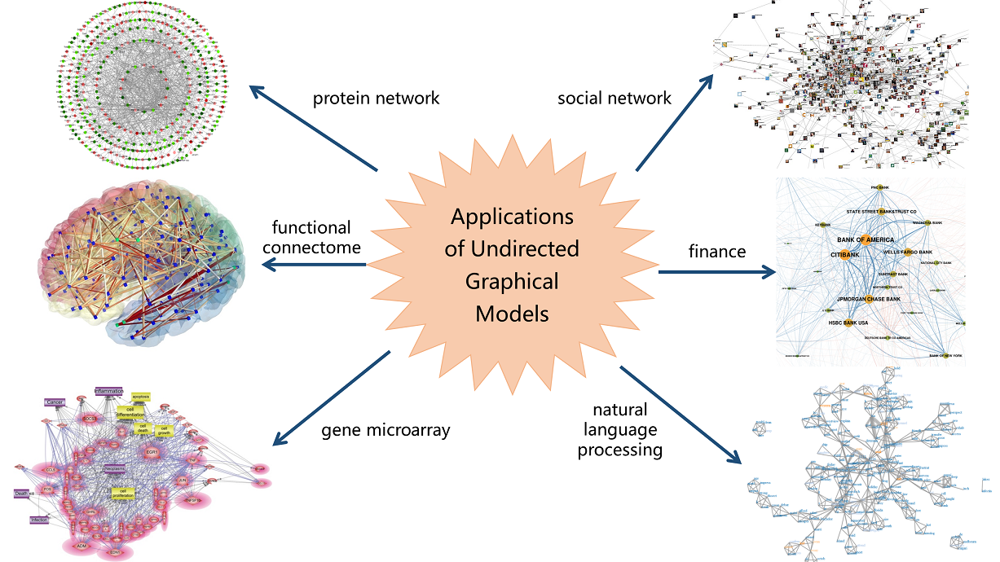
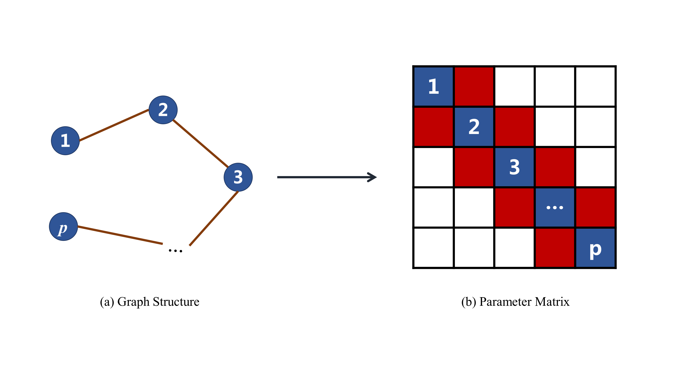

 Graphical Independence Filtering
=====================

### Introduction
One of the fundamental problems in data mining and statistical analysis is to detect the relationships among a set of variables. To this end, researchers apply undirected graphical models in work, which combine graph theory and probability theory to create networks that model complex probabilistic relationships. By estimating the underlying graphical model, one can capture the direct dependence between variables. In the last few decades, undirected graphical models have attracted numerous attention in various areas such as [genetics](https://www.e-ceo.org/journal/Figure.php?xn=ceo-8-345.xml&id=F2-ceo-8-345&number=394&p_name=1044_394), [neuroscience](http://blog.myesr.org/mri-reveals-the-human-connectome/), [finance](https://networkdatascience.ceu.edu/article/2017-03-13/shock-propagation-and-regulation-interacting-economic-networks), [social science](https://www.sciencedirect.com/topics/computer-science/social-network-analysis) and [machine learning](http://clockworkchaos.com/project7/?q=taxonomy/term/8).



When the data is multivariate Gaussian distributed, detecting the graphical model is equivalent to estimating the inverse covariance matrix. **gif** package provides efficient solutions for this problem. The core functions in **gif** package are **hgt** and **sgt**.

These functions based on graphical independence filtering have several advantages:

- It's applicable to high-dimensional multivariate data and is comparable to or better than the state-of-the-art methods in respect to both graph structure recovery and parameter estimation.

- The program is very efficient and can provide solutions for problem with over 10,000 variables in less than one minute. The following table shows the time comparison of **gif** functions and other efficient approaches. 

| Method  | \(p = 1000\) | \(p = 4000\) | \(p = 10000\) | 
| ------  | ------------ | ------------ | ------------- | 
|  hgt    | 0.395s       | 6.668s       | 46.993s       | 
|  sgt    | 0.225s       | 3.099s       | 21.454s       | 
|  QUIC   | 1.580s       | 117.041s     | 1945.648s     | 
|fastclime| 62.704s      | ***          | ***           | 

- It has comparable performance when dealing with continuous data under various distributions though it was designed for multivariate Gaussian distribution.

Particularly, **hgt** provides a solution for best subset selection problem in Gaussian graphical models and **sgt** offers closed-form solution equivalent to *graphical lasso* when the graph structure is acyclic.

### Installation
#### CRAN Version
To install the **gif** R package from CRAN, just run:

```r
install.packages("gif")
```

#### Github Version
To install the development version from Github, run:
```r
library(devtools)
install_github("Mamba413/gif/R-package", build_vignettes = TRUE)
```
*Windows* user will need to install [Rtools](https://cran.r-project.org/bin/windows/Rtools/) first.       

### Usage
Take a synthetic dataset as a simple example to illustrate how to use **hgt** and **sgt** to estimate the underlying graphical model.

#### Simulated Data
We extract 200 samples from the graphical model with \(p = 100\) and whose graph structure is the so-called *AR(1)*. A sketch of the example could be seen in the following picture.

 

#### **hgt**
Users estimate the underlying \(K\)-sparse graph model via  *Hard Graphical Thresholding* algorithm when a specific model size \(K\) is given. The **hgt** function would return a \(p \times p\) matrix with number of non-zero off-diagonal entries in the upper-triangular part equal to \(K\) and a \(K \times 2\) matrix marks down the corresponding active entries.

```r
data("ar1")
res <- hgt(ar1[["x"]], size = 99)
```

#### **sgt**
For *Soft Graphpical Thresholding* algorithm, users could estimate the underlying model with given regularization parameter \(\lambda\). In the *return*, we not only provide the parameter matrix and the corresponding active entries mentioned above, but also a boolean flag indicating whether the estimated graph structure is acyclic, since the solution would be equivalent to *graphical lasso* if the graph is acyclic.

```r
res <- sgt(ar1[["x"]], lambda = 0.01)
```

### License
GPL (>= 2)

### Reference
- Luo, Shikai, Rui Song, and Daniela Witten (2014). [Sure Screening for Gaussian Graphical Models](https://arxiv.org/abs/1407.7819). arXiv preprint arXiv:1407.7819. 
- Dempster, A.P. (1972). [Covariance Selection](https://www.jstor.org/stable/2528966). Biometrics, 28(1), 157-175. 
- Fattahi, Salar, and Somayeh Sojoudi. [Graphical Lasso and Thresholding: Equivalence and Closed-form Solutions](http://jmlr.org/papers/v20/17-501.html). Journal of Machine Learning Research 20.10 (2019): 1-44. 
