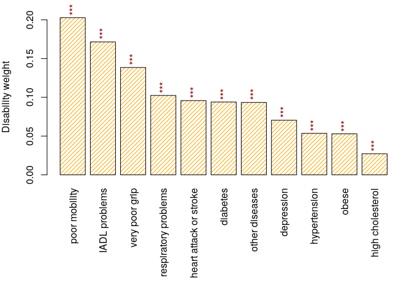
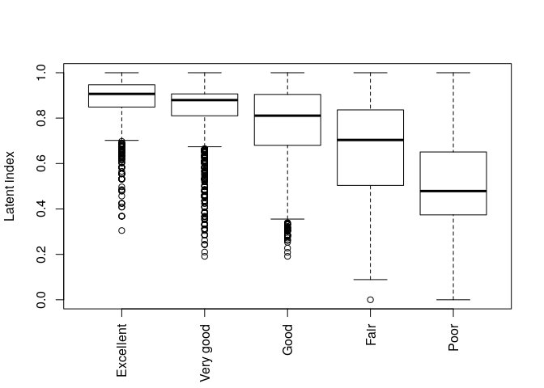
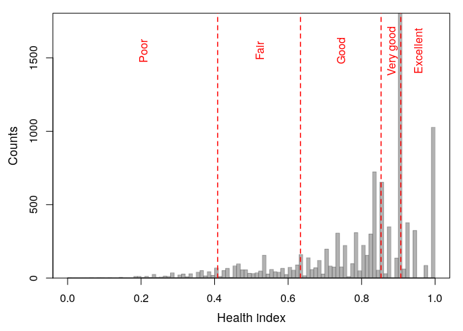
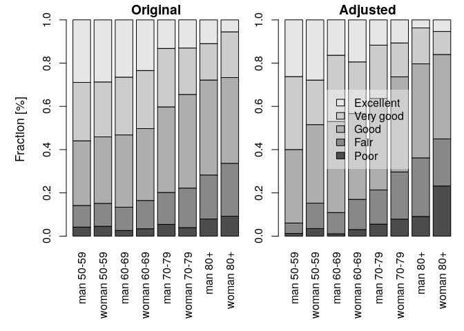

[](https://cran.r-project.org/package=hopit)
[](https://travis-ci.org/MaciejDanko/hopit)
[](https://ci.appveyor.com/project/MaciejDanko/hopit)
[](http://joss.theoj.org/papers/73b926670df79a6cfa48cffa7d4775a6)
[](https://r-pkg.org/pkg/hopit)
[](https://r-pkg.org/pkg/hopit)
[](https://github.com/MaciejDanko/hopit/blob/master/LICENSE)

# R-package *hopit*: Hierarchical ordered probit models with application to reporting heterogeneity.

Self-reported health, happiness, attitudes, and other statuses or
perceptions are often the subject of biases that may come from different
sources. For example, the evaluation of an individual’s own health may
depend on previous medical diagnoses, functional status, and symptoms
and signs of illness; as on well as life-style behaviors, including
contextual social, gender, age-specific, linguistic and other cultural
factors (Oksuzyan et al. 2019). The **hopit** package offers versatile
functions for analyzing different self-reported ordinal variables, and
for helping to estimate their biases. Specifically, the package provides
the function to fit a generalized ordered probit model that regresses
original self-reported status measures on two sets of independent
variables (King et al. 2004; Jurges 2007; Oksuzyan et al. 2019). The
first set of variables (e.g., health variables) included in the
regression are individual statuses and characteristics that are directly
related to the self-reported variable. In the case of self-reported
health, these could be chronic conditions, mobility level, difficulties
with daily activities, performance on grip strength tests,
anthropometric measures, and lifestyle behaviors. The second set of
independent variables (threshold variables) is used to model cut-points
between adjacent self-reported response categories as functions of
individual characteristics, such as gender, age group, education, and
country (Oksuzyan et al. 2019). The model helps to adjust for specific
socio-demographic and cultural differences in how the continuous latent
health is projected onto the ordinal self-rated measure. The fitted
model can be used to calculate an individual predicted latent status
variable, a latent index, and standardized latent coefficients; and
makes it possible to reclassify a categorical status measure that has
been adjusted for inter-individual differences in reporting behavior.

### Installation

1.  Make sure you have the most recent version of R

2.  Run the following code in your R console
    
    ``` r
    install.packages("hopit") 
    ```

### Updating to the latest version of `hopit` package

You can track (and contribute to) the development of `hopit` at
<https://github.com/MaciejDanko/hopit>. To install it:

1.  Install the release version of `devtools` from CRAN with
    `install.packages("devtools")`.

2.  Make sure you have a working development environment.
    
      - **Windows**: Install
        [Rtools](https://CRAN.R-project.org/bin/windows/Rtools/).
      - **Mac**: Install `Xcode` from the Mac App Store.
      - **Linux**: Install a compiler and various development libraries
        (details vary across different flavors of Linux).

3.  To install the development version of `hopit` run:
    
    ``` r
    devtools::install_github("MaciejDanko/hopit")
    ```

### Introduction and packacke manual

Get started with `hopit` by checking the
[vignette](https://github.com/MaciejDanko/hopit/blob/master/vignettes/vig_hopit.pdf)
or run:

``` r
browseVignettes(package = "hopit") 
```

#### Exemplary usage

To load the package simply run the following code:

``` r
library(hopit)
```

In the example presented below I use `healthsurvey`, which is a
completely artificial data set that is simulated using the distributions
of some major health and socio-demographic characteristics. The
distributions and the data structure are roughly based on the WAVE1
SHARE database (DOIs: 10.6103/SHARE.w1.600); see Borsch et al. (2013)
for technical details about the SHARE database. The structure of
`healthsurvey` for the first six individuals (IDs) is presented below.

``` r
data("healthsurvey")
print(t(healthsurvey[1:6,-1]), quote=FALSE, na.print='NA', right=TRUE)
##                                 1       2       3       4         5       6
##  health                 Very good    Good    Good    Good Excellent    Good
##  diabetes                      no      no     yes      no        no      no
##  obese                         no      no      no      no        no      no
##  IADL_problems                 no      no      no      no        no      no
##  hypertension                  no     yes      no      no        no     yes
##  high_cholesterol              no     yes      no      no        no     yes
##  respiratory_problems          no      no      no      no        no     yes
##  heart_attack_or_stroke        no     yes      no      no        no      no
##  poor_mobility                 no      no      no      no        no     yes
##  very_poor_grip                no      no      no      no        no      no
##  depression                    no      no      no     yes        no      no
##  other_diseases               yes     yes      no      no        no     yes
##  sex                          man     man     man     man     woman     man
##  ageclass                     80+   70-79   50-59   60-69       80+     80+
##  education                  prim-   prim-   prim-    sec+     prim-   prim-
##  country                        Y       Y       X       Y         Z       Y
##  csw                      2407.48 1198.12  885.26  772.04   1304.24  917.16
##  psu                           YB      YB      XC      YA        ZB      YD
```

The first variable on the list (`health`) is the categorical
self-reported health status. This variable is followed by 11
determinants of health, which include information on the presence of
chronic diseases and other health conditions. The `sex`, `ageclass`,
`education`, and `country` variables describe the contextual
characteristics of individuals. The last group of variables (`csw`,
`psu`, and `ssu`) describes the survey design.

The generalized ordered probit models can be fitted using the `hopit`
function. The function takes two kinds of formulas: (1)
`latent.formula`, which models the impact of the latent variables on
categorical health; and (2) `thresh.formula`, which models the
thresholds.  
One of the crucial steps needed for the proper interpretation of the
model results is determining the order of the dependent variable, which
must be a `factor`.

``` r
library(hopit)
levels(healthsurvey$health)
##  [1] "Excellent" "Very good" "Good"      "Fair"      "Poor"
```

To fit the model, the `hopit` function is called. Because the order is
decreasing (from the best to the worst health state), the `hopit`
parameter `decreasing.levels` is set to `TRUE`.

``` r
model1 <- hopit(latent.formula = health ~ hypertension + 
                             high_cholesterol + 
                             heart_attack_or_stroke + 
                             poor_mobility + 
                             very_poor_grip + 
                             depression + 
                             respiratory_problems + 
                             IADL_problems + 
                             obese + 
                             diabetes + 
                             other_diseases, 
               thresh.formula = ~ sex + ageclass,
               decreasing.levels = TRUE,
               data = healthsurvey)
```

The summary of the fitted model can be created using the `summary`
function.

``` r
summary(model1)
##  Formula (latent variables): 
##  health ~ hypertension + high_cholesterol + heart_attack_or_stroke +  
##      poor_mobility + very_poor_grip + depression + respiratory_problems +  
##      IADL_problems + obese + diabetes + other_diseases
##  Formula (threshold variables): ~sex + ageclass
##  Link: probit
##  Number of cases: 10000
##  Response levels: Excellent, Very good, Good, Fair, Poor
##  
##  Robust SE were used (sandwich estimator of the variance-covariance matrix).
##  
##                            Estimate Std. Error z value Pr(>|z|)    
##  hypertensionyes            0.19232    0.02478    7.76  8.4e-15 ***
##  high_cholesterolyes        0.09780    0.02918    3.35  0.00080 ***
##  heart_attack_or_strokeyes  0.34401    0.03183   10.81  < 2e-16 ***
##  poor_mobilityyes           0.72832    0.03564   20.44  < 2e-16 ***
##  very_poor_gripyes          0.49720    0.12299    4.04  5.3e-05 ***
##  depressionyes              0.25323    0.02390   10.59  < 2e-16 ***
##  respiratory_problemsyes    0.36777    0.03337   11.02  < 2e-16 ***
##  IADL_problemsyes           0.61579    0.03637   16.93  < 2e-16 ***
##  obeseyes                   0.18991    0.03295    5.76  8.3e-09 ***
##  diabetesyes                0.33726    0.04010    8.41  < 2e-16 ***
##  other_diseasesyes          0.33533    0.02370   14.15  < 2e-16 ***
##  (L).1|2                   -0.09248    0.03194   -2.90  0.00379 ** 
##  (L).2|3                   -0.26826    0.03236   -8.29  < 2e-16 ***
##  (L).3|4                    0.07514    0.02905    2.59  0.00968 ** 
##  (L).4|5                   -0.20346    0.05222   -3.90  9.8e-05 ***
##  (G).sexwoman.1|2           0.02373    0.03015    0.79  0.43111    
##  (G).sexwoman.2|3           0.01366    0.03460    0.39  0.69304    
##  (G).sexwoman.3|4           0.03661    0.02869    1.28  0.20193    
##  (G).sexwoman.4|5           0.11847    0.05039    2.35  0.01872 *  
##  (G).ageclass60-69.1|2     -0.01835    0.03383   -0.54  0.58763    
##  (G).ageclass60-69.2|3      0.05336    0.04068    1.31  0.18963    
##  (G).ageclass60-69.3|4      0.06003    0.03616    1.66  0.09693 .  
##  (G).ageclass60-69.4|5      0.16842    0.06492    2.59  0.00949 ** 
##  (G).ageclass70-79.1|2     -0.32157    0.04391   -7.32  2.4e-13 ***
##  (G).ageclass70-79.2|3      0.17131    0.04774    3.59  0.00033 ***
##  (G).ageclass70-79.3|4      0.19360    0.03777    5.13  3.0e-07 ***
##  (G).ageclass70-79.4|5      0.23235    0.06653    3.49  0.00048 ***
##  (G).ageclass80+.1|2       -0.33134    0.07274   -4.56  5.2e-06 ***
##  (G).ageclass80+.2|3        0.14976    0.07590    1.97  0.04848 *  
##  (G).ageclass80+.3|4        0.17851    0.05025    3.55  0.00038 ***
##  (G).ageclass80+.4|5        0.22379    0.07674    2.92  0.00354 ** 
##  ---
##  Signif. codes:  0 '***' 0.001 '**' 0.01 '*' 0.05 '.' 0.1 ' ' 1
##  Sigma: 1
##  Log-likelihood: -12945.98
##  Deviance: 25891.96
##  AIC: 25953.96
```

`model1` contains 11 dichotomous health variables and two threshold
variables. The fitted coefficient includes beta (`latent.params`, first
11 coefficients in the summary), lambda (`thresh.lambda`, threshold
intercepts, “(L)” prefix in the summary), and gamma (`thresh.gamma`,
parameters related to threshold covariates, “(G)” prefix in the
summary). The model coefficients can be accessed directly by the generic
`coef(model1, aslist = TRUE)` function, which has an option to group
parameters into a list (`aslist = TRUE`); or simply by calling
`model1$coef.ls`. The fitted model can be further used to analyze
reporting heterogeneity.

The latent health variables can be directly accessed using
`model1$coef.ls$latent.params`. We can, however, standardize these
coefficients using Jürges’ approach (Jurges 2007) in order to obtain so
called disability weights. The disability weights are the same for each
individual in the modeled population. The standardization is done using
the `standardizeCoef` function.

``` r
txtfun <- function(x) gsub('_',' ',substr(x, 1, nchar(x)-3))
sc <- standardizeCoef(model1, namesf = txtfun)
plot(sc)
```



**Figure 1.** Disability weights.

The `namesf` argument is a function or a character vector that is used
to rename the coefficients. The exact values of disability weights are
stored in `sc`:

``` r
print(sc, show.coef.names=FALSE)
##                         Std. coef
##  hypertension           0.0536   
##  high cholesterol       0.0272   
##  heart attack or stroke 0.0958   
##  poor mobility          0.2028   
##  very poor grip         0.1385   
##  depression             0.0705   
##  respiratory problems   0.1024   
##  IADL problems          0.1715   
##  obese                  0.0529   
##  diabetes               0.0939   
##  other diseases         0.0934
```

The standardized health status for each individual is called the health
index (or the latent index). It is simply calculated using the
`latentIndex` function.

``` r
hi <- latentIndex(model1)
plot(hi)
```



**Figure 2.** Health index vs. self-reported health.

The main aim of the reporting heterogeneity analyses is to determine the
cut-points used to calculate the adjusted health status for each
individual. The calculation of cut-points is realized using the
`getCutPoints` function.

``` r
z <- getCutPoints(model1)
plot(z)
```



**Figure 3.** Health index cut-points for adjusted health levels.

Returned cut-points:

``` r
round(z$cutpoints, 4)
##   4.41% 17.68% 52.34% 77.63% 
##  0.4083 0.6339 0.8531 0.9066
```

The function also returns adjusted health levels for each individual
that are calculated according the Jurges (2007) method:

``` r
rev(table(z$adjusted.levels))
##  
##  Excellent Very good      Good      Fair      Poor 
##       1876      2422      3923      1325       454
```

The analysis of health level frequencies is performed using the
`getLevels` function:

``` r
hl <- getLevels(model = model1, formula = ~ sex + ageclass, sep = ' ')
plot(hl)
```



**Figure 4.** Adjusted and original health levels.

The formula describes the grouping variables. It is set to the threshold
formula by default, but it can be changed. Here, the country variable is
omitted, which means that the age-gender-specific frequencies are
calculated for the combined countries. The results are plotted by
setting the `plotf = TRUE` option (Fig. 4). The differences between the
original and the adjusted frequencies (%) can be calculated directly
using the `getLevels` output:

``` r
round(100*(hl$original - hl$adjusted),2) 
##               
##                  Poor   Fair   Good Very good Excellent
##    man 50-59     2.93   5.17  -4.08     -6.72      2.70
##    woman 50-59   1.07  -1.16  -5.57      4.80      0.87
##    man 60-69     1.53   0.96  -8.68     -3.96     10.15
##    woman 60-69   0.37  -0.87  -6.48      2.99      3.99
##    man 70-79    -0.10  -1.05  -2.78      2.39      1.53
##    woman 70-79  -3.94  -3.56  -0.66      5.81      2.34
##    man 80+      -1.17  -6.78   0.47      0.23      7.24
##    woman 80+   -13.96   2.67   0.62     10.47      0.21
```

The package offers the `boot_hopit` and `percentile_CI` functions for
calculating the confidence intervals for any measure derived from the
model using parametric bootstrap methods. In each of the bootstrap
repetitions, a new set of model coefficients is drawn from the
multivariate normal distribution, taking the originally estimated model
coefficients as a mean, and using the model estimated
variance-covariance matrix. The drawn coefficients are then used to
calculate the measure of interest via a user-defined function. In the
example below, I calculate the confidence intervals of the difference
between the original and the adjusted frequencies of bad health. The bad
health is determined by the presence of “`Poor`” or “`Fair`” self-rated
health categories.

First, a function to be bootstrapped is defined, which is then used to
calculate the mentioned difference:

``` r
diff_BadHealth <- function(model) {
  hl <- getLevels(model = model, formula = ~ sex + ageclass, sep = ' ')
  hl$original[,1] + hl$original[,2] - hl$adjusted[,1]- hl$adjusted[,2]
}
```

The function is used in the `boot_hopit` function, which also needs to
specify a fitted model and the data used to fit `model1`

``` r
B <- boot_hopit(model = model1, func = diff_BadHealth, nboot = 100)
```

The confidence intervals are calculated using the `percentile_CI`

``` r
est.CI <- percentile_CI(B)
```

The same function is used to calculate the difference based on the
estimates of the model.

``` r
est.org <- diff_BadHealth(model = model1)
```

The code below plots the differences and the bootstrapped confidence
intervals

``` r
pmar <- par('mar'); par(mar = c(7, 5, 0.5, 0.5))
m <- max(abs(est.CI))
pos <- barplot(est.org, names.arg = names(est.org), las = 3, 
ylab = 'Original - adjusted differences \nin the prevalences of bad health (%)', 
ylim = c(-m, m), density = 20, angle = c(45, -45), col = c('blue', 'orange'))
for (k in seq_along(pos)) 
   lines(c(pos[k,1],pos[k,1]), est.CI[,k], lwd = 2, col = 2)
abline(h = 0); box(); par(mar = pmar)
```


**Figure 5.** Difference between the original and the adjusted
prevalences of bad health. The confidence intervals were calculated
using the percentile bootstrap method.

The results (Fig. 5) show that men tend to over-report bad health at
ages (50,60\] and (50,70\], whereas women tend to over-report bad health
at ages \[70,80); and that both sexes tend to under-report bad health at
ages (80, 120\]. See also Oksuzyan et al. (2019) for similar analyses
that were performed using real SHARE data.

### Contributing

This software is an academic project. Any issues and pull requests are
welcome. \* If `hopit` is malfunctioning, please report the case by
submitting an issue on GitHub. Please see CONTRIBUTING.md for further
details.

### Acknowledgements

I thank Anna Oksuzyan, Vladimir M. Shkolnikov, Christian Dudel, Marius
Pascariu, Laszlo Nemeth, and Oskar Burger for their comments and
suggestions; I thank @alexhanna, the editor of the JOSS journal, and two
JOSS peer reviewers @soodoku and @mkearney for their suggestions and
corrections. I also thank the Max Planck Institute for Demographic
Research for all their support.

The artificially generated data used in the package examples are based
on the distributions of some major socio-demographic and health-related
characteristics of the WAVE 1 SHARE database. None of the records
represent any part of the real data.

The SHARE data collection has been primarily funded by the European
Commission through FP5 (QLK6-CT-2001-00360), FP6 (SHARE-I3:
RII-CT-2006-062193, COMPARE: CIT5-CT-2005-028857, SHARELIFE:
CIT4-CT-2006-028812) and FP7 (SHARE-PREP: N°211909, SHARE-LEAP:
N°227822, SHARE M4: N°261982). Additional funding from the German
Ministry of Education and Research, the Max Planck Society for the
Advancement of Science, the U.S. National Institute on Aging
(U01\_AG09740-13S2, P01\_AG005842, P01\_AG08291, P30\_AG12815,
R21\_AG025169, Y1-AG-4553-01, IAG\_BSR06-11, OGHA\_04-064,
HHSN271-201300071C), and various national funding sources is gratefully
acknowledged (see www. share-project.org).

### References

Borsch-Supan A, Brandt M, Hunkler C, Kneip T, Korbmacher J, Malter F,
Schaan B, Stuck S, and Zuber S. (2013). “Data Resource Profile: The
Survey of Health, Ageing and Retirement in Europe (Share).”
International Journal of Epidemiology 42 (4): 992–1001. doi:
10.1093/ije/dyt088.

Jurges H,. (2007). “True health vs response styles: exploring
cross-country differences in self-reported health.” Health Economics,
16(2), pp. 163-178. doi: 10.1002/hec.1134.

King GC, Murray JL, Salomon JA, and Tandon A. (2004). “Enhancing the
Validity and Cross-Cultural Comparability of Measurement in Survey
Research.” American Political Science Review 98 (1). Cambridge
University Press: 191–207. doi: 10.1017/S000305540400108X.

Oksuzyan A, Danko MJ, Caputo J, Jasilionis D, and Shkolnikov V. (2019).
“Is the story about sensitive women and stoical men true? Gender
differences in health after adjustment for reporting behavior.” Social
Science & Medicine, 228, pp. 41-50. doi:
10.1016/j.socscimed.2019.03.002.
