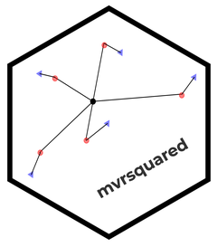

<!-- badges: start -->
[](https://ci.appveyor.com/project/TommyJones/mvrsquared)
[](https://travis-ci.com/TommyJones/mvrsquared)
[](https://codecov.io/gh/tommyjones/mvrsquared/branch/main)
[](https://cran.r-project.org/package=mvrsquared)
[](https://CRAN.R-project.org/package=mvrsquared)
<!-- badges: end -->

# mvrsquared 

Welcome to the `mvrsquared` package! This package does one thing: calculate the coefficient of determination or R-squared. However, this implementation is different from what you may be familiar with. In addition to the standard R-squared used frequently in linear regression, `mvrsquared` calculates R-squared for multivariate outcomes. (This is why there is an 'mv' in `mvrsquared`).

`mvrsquared` implements R-squared based on a derivation in [this paper](https://arxiv.org/abs/1911.11061). It's the same definition of R-squared you're probably familiar with (1 - SSE/SST) but generalized to n-dimensions.

In the standard case, your outcome `y` and prediction `yhat` are vectors. In other words, each observation is a single number. This is fine if you are predicting a single variable. But what if you are predicting multiple variables at once? In that case, `y` and `yhat` are matrices. This situation occurs frequently in topic modeling or simultaneous equation modeling.

### Installation

You can install from CRAN with

```
install.packages("mvrsquared")
```

You can get the development version with 

```
install.packages("remotes")

remotes::install_github("tommyjones/mvrsquared")
```

### Check out the vignette to see how to...

1. Calculate the regular R-squared we all know and love!
2. Calculate R-squared for multiple outcome variables at once (like a multinomial regression)!
3. Calculate R-squared for probabilistic (e.g. LDA) and non-probabilistic (e.g. LSA) topic models!
4. Split your BIG DATA into batches and calculate R-squared with a parallel/distributed map-reduce framework!

