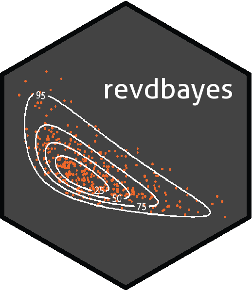

<!-- README.md is generated from README.Rmd. Please edit that file -->

# revdbayes 

[](https://travis-ci.org/paulnorthrop/revdbayes)
[](https://ci.appveyor.com/project/paulnorthrop/revdbayes)
[](https://codecov.io/github/paulnorthrop/revdbayes?branch=master)
[](https://cran.r-project.org/package=revdbayes)

### Ratio-of-uniforms Sampling for Bayesian Extreme Value Analysis

### What does revdbayes do?

The `revdbayes` package uses the ratio-of-uniforms method to produce
random samples from the posterior distributions that occur in some
relatively simple Bayesian extreme value analyses. The functionality of
revdbayes is similar to the [`evdbayes`
package](https://cran.r-project.org/package=evdbayes), which uses Markov
Chain Monte Carlo (MCMC) methods for posterior simulation. Advantages of
the ratio-of-uniforms method over MCMC in this context are that the user
is not required to set tuning parameters nor to monitor convergence and
a random posterior sample is produced. Use of the [Rcpp
package](https://cran.r-project.org/package=evdbayes) enables
`revdbayes` to be faster than `evdbayes`. Also provided are functions
for making inferences about the extremal index, using the K-gaps model
of [Suveges and Davison (2010)](https://doi.org/10.1214/09-AOAS292).

### A simple example

The two main functions in `revdbayes` are `set_prior` and `rpost`.
`set_prior` sets a prior for extreme value parameters. `rpost` samples
from the posterior produced by updating this prior using the likelihood
of observed data under an extreme value model. The following code sets a
prior for Generalised Extreme Value (GEV) parameters based on a
multivariate normal distribution and then simulates a random sample of
size 1000 from the posterior distribution based on a dataset of annual
maximum sea levels.

``` r
data(portpirie)
mat <- diag(c(10000, 10000, 100))
pn <- set_prior(prior = "norm", model = "gev", mean = c(0,0,0), cov = mat)
gevp  <- rpost(n = 1000, model = "gev", prior = pn, data = portpirie)
plot(gevp)
```

From version 1.2.0 onwards the faster function `rpost_rcpp` can be
used.  
See the vignette “Faster simulation using revdbayes and Rcpp” for
details. The functions `rpost` and `post_rcpp` have the same syntax. For
example:

``` r
gevp_rcpp  <- rpost_rcpp(n = 1000, model = "gev", prior = pn, data = portpirie)
```

### Installation

To get the current released version from CRAN:

``` r
install.packages("revdbayes")
```

### Vignettes

See `vignette("revdbayes-vignette", package = "revdbayes")` for an
overview of the package and `vignette("revdbayes-using-rcpp-vignette",
package = "revdbayes")` for an illustration of the improvements in
efficiency produced using the Rcpp package. See
`vignette("revdbayes-predictive-vignette", package = "revdbayes")` for
an outline of how to use revdbayes to perform posterior predictive
extreme value inference. Inference for the extremal index using the
K-gaps model is described in `vignette("revdbayes-kgaps-vignette",
package = "revdbayes")`
