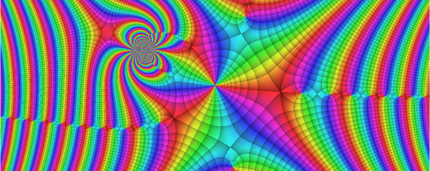

<!-- README.md is generated from README.Rmd. Please edit that file -->

# viscomplexr

<!-- badges: start -->

[](https://github.com/PeterBiber/viscomplexr/actions)
[](https://cran.r-project.org/package=viscomplexr)
[](https://cran.r-project.org/package=viscomplexr)
[](https://codecov.io/gh/PeterBiber/viscomplexr?branch=master)
[](https://www.gnu.org/licenses/gpl-3.0.en.html)
[](https://www.tidyverse.org/lifecycle/#stable)
<!-- badges: end -->

<!-- Make a pretty banner. The code is executed but not displayed here. Below, it is displayed in the example section, but not executed -->

<!-- Currently deactivated. Loading the banner as a pre-built file seems better -->

<!-- Load banner from file -->

 <br>

With *viscomplexr* you can create phase portraits of functions on the
complex number plane. While the main purpose of this package are
scientific, educational and technical applications, the sheer beauty of
phase portraits may be motivation enough to explore the fascinating
realm of complex functions. The package is embedded in the framework of
R base graphics and allows for print quality graphics files. To a great
deal, *viscomplexr* follows the conventions published by Wegert (2012).
Since version 1.1.0, the package also allows for plots based on polar
chessboards.

For a detailed step-by-step introduction see the package’s vignette.
After installing *viscomplexr* on your machine, you can view the
vignette by calling:

``` r
vignette("viscomplexr-vignette")
```

Besides making you acquainted with how to work with the package, the
vignette also tells you more about some shenanigans going on behind the
scenes; among them parallel processing and *viscomplexr*’s temporary
file system.

## Installation

In order to work with viscomplexr you require an installation of R
(version \>= 4.0) on your system. The installation files for R itself
are available [here](https://cran.r-project.org/). The released version
of *viscomplexr* can be installed from
[CRAN](https://CRAN.R-project.org/package=viscomplexr) with:

``` r
install.packages("viscomplexr")
```

And the development version from
[GitHub](https://github.com/PeterBiber/viscomplexr) with:

``` r
# install.packages("devtools")
devtools::install_github("PeterBiber/viscomplexr")
```

## Example

Let’s plot a phase portrait of the function `f(z)=sin(z^3/(z-1i+2))`.
This function is portrayed in the banner above, and the code below
produces exactly that banner. The workhorse function of *viscomplexr* is
called `phasePortrait`, and besides its specific input variables, it
also accepts all parameters that are accepted by R’s `plot.default`
function, like `axes`, `xaxs`, and `yaxs` in the example below. Other
often useful ones are `main`, `xlab`, and `ylab`, especially for
scientific, technical or educational applications.

``` r
# Make a phase portrait of the function 
# f(z) = sin(z^3/(z - 1i + 2))
# in the domain [-6, 6] (real), and [-2.4, 2.4] (imaginary)

library(viscomplexr)

# You can open any R graphics device here (bmp, jpeg, png, tiff, pdf,
# windows, x11, ...), see R documentation if you are not familiar with these.
# This example, as it is, plots into the default graphics device.

# reduce plot margin to 0, store previous graphics parameter settings in op
op <- par(mar = c(0, 0, 0, 0))
# call the function phasePortrait
phasePortrait("sin(z^3/(z - 1i + 2))",               # define the function
              xlim = c(-6, 6), ylim = c(-2.4, 2.4),  # define the domain
              axes = FALSE,                          # suppress axes
              xaxs = "i", yaxs = "i")          # no empty zone around plot
# set graphics parameters to previous values
par(op)

# If you have initially opened a graphics device that plots into a file, you 
# must close it here with
# dev.off()
```

While there are many options and a few useful supporting functions (see
vignette and documentation), this example shows the core way of plotting
phase portraits. It could even be reduced to just the function to be
portrayed (here provided as a character string) and the parameters
`xlim` and `ylim`. The other parameters in the example, and also the
omission of the plot margins before calling *phasePortrait*, were only
used in order to obtain a pretty banner for this README.

## Acknowledgments

While this package is a leisure project, it would have been a mission
impossible without the background of my (P.B.) daily work with R as a
Forest Scientist at the Technical University of Munich (TUM).
Fortunately, I have a job that allows me to learn about Nature by asking
her questions (or trying to simulate what she is doing) with
ever-improving methods and tools. I would like to thank everyone at the
Chair of Forest Growth and Yield Science at TUM who keep me involved in
discussions like: *How can this be solved in R …*

``` r
switch(1 + trunc(runif(1, 0, 6)),
       "... at all?",
       "... in a quick-and-dirty way?",
       "... in Hadley-Wickham-style?",
       "... without a loop?",
       "... without nested loops?",
       "... in a way somebody can understand?")
```

**Veronika Biber** provided expert advice for improving the vignette.
**Johannes Biber** turned out the most patient pre-release tester one
can imagine, boosting things with his high-end gaming machine. Thanks,
guys\! Also thanks to **Gregor Seyer** for his helpful review of the
CRAN submission.

Clearly, programming in R would not be what it is, weren’t there some R
titans who generously share their knowledge online. While I keep
learning from all of them, I would like to thank especially **Hadley
Wickham** and **Dirk Eddelbüttel**.

## References

<div id="refs" class="references">

<div id="ref-wegert_visualcpx_2012">

Wegert, Elias. 2012. *Visual Complex Functions. An Introduction with
Phase Portraits*. Basel Heidelberg New York Dordrecht London: Springer.

</div>

</div>
