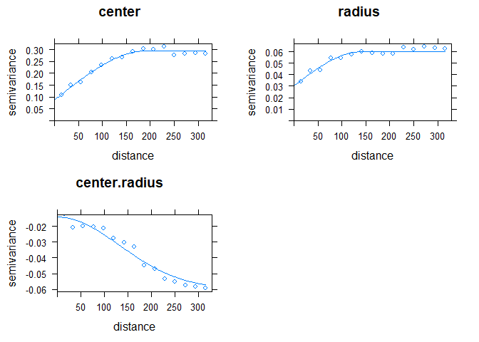

<!-- README.md is generated from README.Rmd. Please edit that file -->

[](https://travis-ci.org/beanb2/intkrige)

# intkrige

This package implements the interval-valued kriging models described in
Bean et. al. (2019a). Details regarding the algorithmic implementation
can be found in Bean et. al. (2019b).

## Installation

The package can be most conveniently installed using the command

``` r
install.packages("intkrige")
```

For the most up to date version, please use the command

``` r
devtools::install_github("beanb2/intkrige")
```

Note that the github installation makes use of the devtools package
(Wickham, Hester, and Chang 2019). The most current version of this
package can be found at .

## Package Contents

The package revolves around its main function named *intkrige*.
Information about this function can be obtained by entering

``` r
?intkrige::intkrige
```

in the console.

The package also contains an interval-valued design ground snow load
dataset named *utsnow* and an interval-valued temperature dataset named
*ohtemp*. These data are available by installing the intkrige package
and invoking the command

``` r
data(utsnow)
```

with dataset documentation obtained by

``` r
?utsnow
```

## Intro

Once installed, this package runs simple and ordinary interval-valued
kriging models. The following example comes from the design ground snow
load application described in Bean et. al. (Bean, Sun, and Maguire
2019a). The snow load problem requires a proper consideration of the
effect of elevation on ground snow loads prior to input into kriging.
The current interval-valued kriging models allow for linear
considerations of secondary variables in the model predictions. Such
models are akin to “kriging with an external drift” (Goovaerts 1997) or
“simple kriging with varying local means” (Goovaerts 2000).

The example shows how to make an interval valued kriging design ground
snow load prediction (after removing the effect of elevation) for Logan,
Utah. Many of the functions in the following examples are wrappers to
functions in the gstat and sp packages (Pebesma 2004; Gräler, Pebesma,
and Heuvelink 2016; Bivand et al. 2013) designed to make the
interval-valued spatial analysis more convenient. Additional details are
provided in the vignette associated with this package. This vignette can
be accessed with the command

``` r
vignette("intkriging-workflow")
```

## Defining Classes and Variograms

The intkrige package relies on interval-valued spatial objects. These
objects are named *intsp* and *intgrd* respectively. *intsp* inherits
directly from *SpatialPointsDataFrame* objects in the sp class, while
*intgrd* inherits from *SpatialPixelsDataFrame*. These class extensions
are created using the *interval()* function as demonstrated below.

``` r
library(intkrige)
#> Loading required package: sp
#> Loading required package: gstat
#> Registered S3 method overwritten by 'xts':
#>   method     from
#>   as.zoo.xts zoo
#> Loading required package: raster

# First, define the location and elevation of interest. 
# (In this case we pick coordinates of Utah State University)
templocs <- data.frame(lat = 41.745, long = -111.810, ELEVATION = 1456)
sp::coordinates(templocs) <- c("long", "lat")
sp::proj4string(templocs) <- "+proj=longlat +ellps=WGS84
                              +datum=WGS84 +no_defs +towgs84=0,0,0"

# Load the Utah Snow Load Data
data(utsnow)
utsnow.sp <- utsnow

# Convert to an 'intsp' object that inherits a SpatialPointsDataFrame
sp::coordinates(utsnow.sp) <- c("LONGITUDE", "LATITUDE")
sp::proj4string(utsnow.sp) <- sp::proj4string(templocs)
interval(utsnow.sp) <- c("minDL", "maxDL")
```

The objects are defined by the interval slot. Intervals must be defined
according to their upper and lower endpoints. The program will not
accept values in the interval slot that do not meet this criteria. The
interval-valued kriging models in the package rely on characterizations
of intervals by their center and radius. The center/radius values are
calculated automatically as needed by the various functions. The
rationale is behind this approach is that intervals are easier to read
using lower/upper endpoint convention, but easier to *visualize* and
*analyze* using center/radius convention. One consequence of this
approach is that variable transformations are most conveniently
performed using the lower/upper endpoint characterization.

``` r
# analyze interval on log scale
interval(utsnow.sp) <- log(interval(utsnow.sp))
```

## Fitting variograms

Next, we demonstrate how to create and fit empirical variograms. The
functions that accomplish this task are fairly shallow wrappers to the
functions in the gstat package. These function in the intkrige package
simplify the workflow by fitting the center, radius, and center/radius
variograms using the information contained in the interval slot. The
*intvariogram* function defines the empirical variograms, while the
*fit.intvariogram* function automatically fits variograms to the output
of *intvariogram*. Note that intvariogram defines an *intvariogram*
class which is the only class that fit.intvariogram will accept. This
new class designation is intended to ensure that *intvariogram* and
*fit.intvariogram* are always used in tandem. These particular
variograms first account for the effect of elevation on ground snow
loads before calculating the empirical variograms.

``` r
# Define the formulas we will use to define the intervals. 
temp_formulas <- list(center ~ ELEVATION, 
                      radius*(ELEVATION/median(ELEVATION)) ~ 1)

# Define, fit and check the variogram fits. 
varios <- intvariogram(utsnow.sp,
                       formulas = temp_formulas)
varioFit <- fit.intvariogram(varios, models = gstat::vgm(c("Sph", "Sph", "Gau")))
intvCheck(varios, varioFit)
```



## Interval-valued kriging models

With variograms defined for each component of the interval, we are now
ready to make interval-valued predictions using our interval-valued
kriging models. If you explore the function documentation, you will
notice that many of the function arguments relate to the Newton-Raphson
optimization technique that is used to calculate the kriging model
weights. These arguments should not need to be changed from the defaults
for most user purposes. The following demonstrates an ordinary kriging
model after accounting for elevation.

``` r
preds <- intkrige::intkrige(locations = utsnow.sp,
                            newdata = templocs, 
                            models = varioFit,
                            formulas = temp_formulas)

# The final results are predicted intervals after removing the effect of elevation.  
preds
#>         coordinates                 interval ELEVATION   center    radius
#> 1 (-111.81, 41.745) [-0.03611231, 0.9702524]      1456 0.433943 0.5031823
#>   kriging_variance warn
#> 1        0.1517327    0
```

The interval prediction (including the elevation effect) is included in
the interval slot. The raw predictions are appended to the data frame
under the following variable names:

\-center: the value of the interval centers returned directly from the
kriging model,

\-radius: raw radii predictions,

\-variance: the kriging variance according the generalized L2 distance,

\-warn: a boolean that is 0 for a convergent optimization and 1 for a
non-convergent optimization. This quiet approach to warnings ensures a
non-disruptive experience for the user when predicting a large number of
locations.

# References

<div id="refs" class="references">

<div id="ref-Bean2019-int">

Bean, Brennan, Yan Sun, and Marc Maguire. 2019a. “Interval-Valued
Kriging Models for Geostatistical Mapping with Uncertain Inputs.”

</div>

<div id="ref-Bean2019-int2">

———. 2019b. “Supplement to ‘Interval-Valued Kriging Models for
Geostatistical Mapping with Uncertain Inputs’.”

</div>

<div id="ref-Bivand2008">

Bivand, Roger S, Edzer J Pebesma, Virgilio Gomez-Rubio, and Edzer Jan
Pebesma. 2013. *Applied Spatial Data Analysis with R*. 2nd ed. Vol.
747248717. Springer.

</div>

<div id="ref-Goovaerts1997">

Goovaerts, Pierre. 1997. *Geostatistics for Natural Resources
Evaluation*. Oxford University Press.

</div>

<div id="ref-Goovaerts2000">

———. 2000. “Geostatistical Approaches for Incorporating Elevation into
the Spatial Interpolation of Rainfall.” *Journal of Hydrology* 228 (1):
113–29.

</div>

<div id="ref-gstat2">

Gräler, Benedikt, Edzer Pebesma, and Gerard Heuvelink. 2016.
“Spatio-Temporal Interpolation Using Gstat.” *The R Journal* 8 (1):
204–18.
<https://journal.r-project.org/archive/2016-1/na-pebesma-heuvelink.pdf>.

</div>

<div id="ref-gstat1">

Pebesma, Edzer J. 2004. “Multivariable Geostatistics in S: The Gstat
Package.” *Computers & Geosciences* 30: 683–91.

</div>

<div id="ref-devtools2019">

Wickham, Hadley, Jim Hester, and Winston Chang. 2019. *Devtools: Tools
to Make Developing R Packages Easier*.
<https://github.com/r-lib/devtools>.

</div>

</div>
