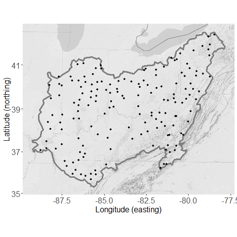

```{r setup, include = FALSE}
knitr::opts_chunk$set(
  collapse = TRUE,
  comment = "#>"
)
```

## Problem 
The global historical climatological network is composed of a series of measurement locations scattered across the United States. These measurements are commonly used to make maps of climate measurements for various regions. These maps play a vital role in understanding the nature and trends of weather in the United States. Two of the primary measurements in this network are minimum and maximum temperature. Indeed, millions of Americans take interest in the forecasts of minimum and maximum temperature when deciding how to dress each day. [@DeGaetano2007] used various interpolation approaches to create minimum and maximum temperature maps of the northeastern United States. Their techniques treated minimum and maximum temperatures as separate observations. In a different framework, minimum and maximum temperatures could be considered as two elements of one and the same observation, which is daily temperature. In other words, these daily temperature measurements create a single *interval-valued* observation rather than two individual observations. This holistic view of temperature motivates the need for methods to analyze the interaction of temperature magnitude and range across space. The <TT>intkrige</TT> package provides a way to analyze and interpolate interval-valued data. A simple demonstration of the workflow underlying these interval-valued temperature predictions is provided in this vignette for the Ohio river basin. The package README also demonstrates this workflow by predicting interval-valued design ground snow loads in Utah. Further details regarding these snow load predictions are provided in [@Bean2019-int] and [@Bean2019-int2].


## Data
The Ohio river basin includes most of the states of Ohio, West Virginia, Kentucky, and Indiana, as well as parts of Pennsylvania, Illinois, and Tennessee. The region is approximately 204,000 square miles and home to nearly 25 million people [@Ohio2019]. The region was selected due its relatively homogeneous elevation profile when compared to the western United States. We wish to map the magnitude and range of temperatures across this region. This is done by creating intervals of the 30 year mean maximum and minimum daily temperatures for available measurement locations. 

Measurement locations were downloaded from National Oceanic and Atmospheric Administration's (NOAA) Global Historical Climatological Network (GHCN) [@ghcn2012]. The 161 remaining observations in the dataset all contained at least 30 years of record with at least 300 daily observation for calendar years 1988 to 2018. Intervals were created using a 5% trimmed 30 year mean for maximum and minimum temperatures respectively. These data are included in the package and can be accessed with the commands

```{r}
library(intkrige)
data(ohtemp)
head(ohtemp)
```

The following figure shows a map of this region with the 161 stations locations overlaid. The code for this map makes use of the <TT>ggmap</TT> package [@ggmap]. The code to generate the map is not provided as the map rendering requires a registered Google API account. 

<center>

</center>

```{r ohioMap, eval = FALSE, echo = FALSE}

library(ggmap)
# # Load the Ohio River Basin Shapefile
# ohMap <- rgdal::readOGR(dsn = "ohMap", layer = "ohMap")
# 
# # Simplify the shapefile 
# ohMap <- rgeos::gSimplify(ohMap, tol = .05, topologyPreserve = TRUE)
data(ohMap)

# key has been removed for security reasons
# register_google(key = "insert key here")
register_google(key = "<my key>")
center = apply(ohMap@bbox, 1, mean)

oh.google <- ggmap::get_googlemap(center = center, zoom = 6, 
                                    maptype = "terrain",
                                    color = "bw",
                                  style = "feature:all|element:labels|visibility:off|
                           &style=feature:road|element:all|visibility:off|
                           &style=feature:landscape.man_made|element:all|visibility:off|")

map <- ggmap(oh.google) +
  xlim(ohMap@bbox[1, 1], ohMap@bbox[1, 2]) + 
  xlab("Longitude (easting)") +
  ylim(ohMap@bbox[2, 1], ohMap@bbox[2, 2]) + 
  ylab("Latitude (northing)") + 
  geom_polygon(data = ohMap, aes(x = long, y = lat), 
               colour = "gray50", fill = NA, lwd = 1.1, lty = 1) +
  geom_point(data = as.data.frame(ohtemp), aes(x = LONGITUDE, y = LATITUDE), 
             pch = 16, alpha = 0.9) + 
  theme(legend.title = element_blank(),
        legend.text = element_text(size = 16),
        axis.text = element_text(size = 16),
        axis.title = element_text(size = 16))

pdf("vignettes/ohmap.png", width = 4, height = 4)
map
dev.off()
```


## Interval exploration
Our goal is to create an interval-valued map of the mean maximum and minimum temperatures across the region. Doing so allows us to simultaneously compare spatial patterns in the magnitude and range of average temperatures experienced in the region. The intkrige package provides a formal workflow for analyzing interval valued data by extending <TT>SpatialPointsDataFrame</TT> and <TT>SpatialPixelsDataFrame</TT> objects from the <TT>sp</TT> package [@Bivand2008]. These objects are created using the <TT>interval()</TT> function as demonstrated below. 

```{r}
# First, create a SpatialPointsDataFrame in the usual way
sp::coordinates(ohtemp) <- c("LONGITUDE", "LATITUDE")
sp::proj4string(ohtemp) <- CRS("+proj=longlat +ellps=WGS84")
interval(ohtemp) <- c("minm", "maxm")

head(ohtemp)
```

This function creates an <TT>intsp</TT> object. Use of the interval function on <TT>SpatialPixelsDataFrame</TT> objects creates <TT>intgrd</TT> objects. Both of these objects contain an interval slot that extend their parent classes. The interval slot is filled by specifying column names within the data frame, or specifying a two-column matrix with the same number of rows as the object data. These two forms of specification allow for convenient transformations of the interval slot values with the appropriate calls. 

```{r}
interval(ohtemp) <- log(interval(ohtemp))
head(ohtemp)
```

Note that intervals must be defined by their endpoints with the lower endpoint appearing in the first column. The <TT>interval()</TT> function will throw an error if it detects any instance of a lower endpoint greater than its corresponding upper endpoint. The function will also throw an error if a proposed transformation of the interval causes a lower endpoint to be greater than an upper endpoint. Intervals can also be characterized by their center and radius. It is easier to describe and characterize intervals by their endpoints, but it is easier to visualize and analyze *spatial* intervals using the center and radius. Thus interval objects must be initialized using their endpoints, but all interval-valued kriging and variogram functions automatically determine and use the center/radius form in analysis.

The interval-valued kriging functions require variograms for the center and radius, while a cross-variogram for the center/radius interaction is optional. The most common way of exploring these spatial relationships is through the use of an empirical variogram, which measures pairwise differences in measurements $z$ with locations $\mathbf{u}_\alpha$ as a function of the difference in location $\mathbf{h}$. This is defined symbolically as 

\begin{equation}
\gamma(\mathbf{h}) = \frac{1}{2N(\mathbf{h})}\sum_{\alpha=1}^{N(\mathbf{h})}\left[z(\mathbf{u}_\alpha) - z(\mathbf{u}_\alpha+h)\right]^2
\label{eqn:vario}
\end{equation}
where $N(\mathbf{h})$ represents the number of station pairs with location difference $\mathbf{h}$ [@Goovaerts1997]. 

We define empirical variograms for the center, radius, and center/radius interaction using (1). The <TT>intvariogram()</TT> function provides wrappers to variogram functionality in the <TT>gstat</TT> package. These wrapper functions exploit the predictable structure of the interval slot in the <TT>intsp</TT> and <TT>intgrd</TT> objects to calculate the three empirical variograms simultaneously. The output of this function is an object of class <TT>intvariogram</TT>. This new S3 class distinguishes this output from traditional lists of empirical variograms.   

```{r, fig.align='center'}
# Revert back to the standard interval
interval(ohtemp) <- exp(interval(ohtemp))
varios <- intvariogram(ohtemp, cutoff = 500)

plot(varios)
```

It seems that the radius and center/radius interaction could be appropriately modeled with spherical variograms while the center could be modeled with a linear variogram. The <TT>fit.intvariogram</TT> function provides a way to fit theoretical variograms to the three empirical variograms generated by the <TT>intvariogram</TT> function. The <TT>fit.intvariogram</TT> function uses the existing functionality of the <TT>fit.variogram</TT> function in the <TT>gstat</TT> package. The <TT>fit.intvariogram</TT> function only accepts objects of class <TT>intvariogram</TT> and is designed to be used in tandem with the <TT>intvariogram</TT> function. The <TT>intvcheck</TT> function allows for a quick evaluation of the model output from <TT>fit.intvariogram</TT>. 

```{r, fig.align='center'}
varioFit <- fit.intvariogram(varios, models = gstat::vgm(c("Lin", "Sph", "Sph")))
varioFit
intvCheck(varios, varioFit)
```

Note that for the observed data, the theoretical variogram models provide a decent fit to the data. However, the "singular model" warning reminds us that well-defined covariances cannot be recovered from linear variograms. The current interval-valued kriging models rely on the covariance equivalence of the variograms (which is calculated using <TT>variogramLine(covariance = TRUE)</TT>). A common practice in this case is to fit a spherical variogram with an arbitrary sill and range. These values are selected to create a spherical variogram that looks similar to the linear variogram within the viewing window. 

```{r, fig.align='center'}
# Replace non-convergent variogram fit with a surrogate that 
# contains a reasonable range and sill. 
varioFit[[1]] <- gstat::vgm(psill = 350, nugget = 4.608542, 
                            range = 600, model = "Sph")

intvCheck(varios, varioFit)
```


We understand and acknowledge the shortcomings of this variogram fitting approach as articulated in [@Loquin2010]. Despite its shortcomings, this common approach to variogram fitting works well for many spatial projects. Our substitution of a spherical variogram for a linear one certainly would demand more attention in a rigorous analysis of temperatures. However, for the purposes of demonstration, this model substitution is sufficient to demonstrate the interval-valued kriging workflow. 

## Interval-valued kriging arguments
We are now ready to make temperature predictions on the grid using interval valued kriging. There are 17 different arguments for the intkrige function, yet all but three of these arguments have default options that allow for a quick implementation. These 17 arguments can be separated into three general categories: data, models and optimization. A brief description of each group of variables is provided below:
<UL>
<LI><B>Data:</B> the <TT>locations</TT> and <TT>newdata</TT> arguments define all of the measurement and prediction locations.
<LI><B>Models:</B> The <TT>models</TT> and <TT>trend</TT> arguments control the type and behavior of the interval valued kriging model. The <TT>trend</TT> argument corresponds to the known mean of the interval-valued centers. When specified, this argument leads the function to use simple instead of ordinary kriging. The <TT>models</TT> argument includes the list of variogram models used to calculate the kriging weights.   
<LI><B>Optimization:</B> Interval-valued kriging amounts the minimizing the function
\begin{eqnarray}
&&E\left[\rho^2_K\left([\hat{Z}(x^*)], [Z(x^*)]\right)\right]\nonumber\\
&=&A_{11}\left[\sum_i\sum_j\lambda_i\lambda_jC^{C,C}(x_i-x_j)-2\sum_i\lambda_iC^{C,C}(x_i-x^*)\right]\nonumber\\
&+&A_{22}\left[\sum_i\sum_j\left|\lambda_i\lambda_j\right|C^{R,R}(x_i-x_j)-2\sum_i\left|\lambda_i\right|C^{R,R}(x_i-x^*)\right]\nonumber\\
&+&2A_{12}\left[\sum_i\sum_j\lambda_i|\lambda_i|C^{C,R}(x_i-x_j)-\sum_i|\lambda_i|C^{C,R}(x^*-x_i)-\sum_i\lambda_iC^{C,R}(x_i-x^*)\right]\label{eqn:pred-var-cov}
\end{eqnarray}
where $C^{C,C}, C^{R,R}, and C^{C,R}$ are the covariances associated with the center, radius, and center/radius interaction. This is can be equivalently defined using the corresponding variograms. However, the current optimization relies on the use of the covariance definitions. As previously mentioned, the function assumes that the covariances exist and calculates them from the variograms using <TT>gstat::variogramLine(covariance = TRUE)</TT>.

The $A_{11}, A_{12}, \text{ and } A_{22}$ parameters are used to weight the importance of different components of the covariance. These three arguments are specified with the <TT>A</TT> parameter in the <TT>intkrige</TT> function. The default option assumes no interaction between center and radius (i.e. <TT>A[3] = 0</TT>). <TT>A[3]</TT> is also *effectively* set to zero when a third variogram model is not specified. 

The <TT>eta, thresh, tolq, maxq, tolp, maxp,</TT> and <TT>r</TT> variables all directly relate to the Penalized Newton-Raphson technique used minimize $E\left[\rho^2_K\left([\hat{Z}(x^*)], [Z(x^*)]\right)\right]$. The details of this optimization technique are provided in a companion paper to this package [@Bean2019-int2] and will not be discussed further in this vignette. These optimization parameters provide the user the necessary flexibility to adjust the optimization technique as needed to produce convergent results. 

These interval-valued kriging models are designed to predict hundreds, if not thousands, of locations in a single function call. Providing a separate initial guess for each prediction location quickly becomes impractical in such a context. As such, the initial guess for the kriging weights at each locations are derived from the traditional simple kriging weights obtained using only the interval centers. It is expected that the final weights will be close to this initial guess. 

Once the user has selected proper optimization parameters, <TT>fast, useR,</TT> and <TT>cores</TT> variables all allow for potential speedups in the computation time. More about these arguments are found in the function documentation. 
</UL>

## Troubleshooting Optimization Concerns 
Each new dataset brings with it a new set of considerations for the optimization algorithm. The R version of the models (invoked when <TT>useR = TRUE</TT>, the default) will print warnings to the screen when the optimization fails. Both the R and c++ versions will flag troublesome predictions by setting <TT>warn = 1</TT> in the list of return arguments. 

Determining the right optimization parameters to ensure a successful optimization for *all* locations can be tricky, especially when faced with a large number of prediction locations. It is recommended that the model first be run on a small set of prediction using the function defaults. Then, adjust the optimization parameters as needed based on the recommended guidelines in the list at the end of the section. Once the optimization is working correctly for a subset of locations, deploy the model on all locations. Movement to the c++ version (via <TT>useR = FALSE</TT>) should only happen after the optimization parameters have been appropriately tuned. Below is a list of common solutions for various optimization issues.   
<UL>
<LI>In ordinary kriging (<TT>trend = NULL</TT>). The warning <q>left feasible region<\q> is best handled by increasing the value of <TT>r</TT> and/or increasing the value of <TT>eta</TT> to be closer to 1. 
<LI>In simple kriging (<TT>trend = !NULL</TT>), the warning <q>convergent, feasible solution not obtained<\q> is likely best handled by invoking the <TT>fast = TRUE</TT> option. The <TT>fast = FALSE</TT> is intended to prevent weights from converging to zero and is only relevant when the number of measurement locations is small (around 50 or less). In situations with more stations, the prevention of zero valued weights can cause a failure to converge. If this warning continues to be obtained. Consider increasing the value of <TT>eta</TT> closer to 1, or increasing the tolerance levels for the convergence criteria. 
<LI>The warning <q>feasible solution obtained from a non-convergent optimization step<\q> is likely best handled by lowering the value of eta, which controls the rate of imposition of the penalty parameter. 
</UL>

## Application
As previously mentioned, we can accept the default arguments for the majority of parameters in the <TT>intkrige</TT> model for our predictions of Ohio temperatures. Because no closed form solution exists for these interval-valued kriging models, the computational time for fine maps can be tremendous. This is one of the reasons for the parallel processing option when the number of prediction locations is large. The parallel version of the model makes use of multiple packages included in the ``Suggests'' field of the package description file. Once these packages are installed, the argument <TT>cores = -1</TT> will use all but one of the available cores to make predictions at the specified locations. Alternatively, the user can explicitly define the number of cores to use in parallel with <TT>n = <int></TT>. We make predictions on a 10 by 10 grid of coordinates defined using the bounding box of the Ohio river valley shape file. The setup and predictions use the following code. 

```{r, fig.align = 'center'}
# Include the Ohio river basin shapefile
data(ohMap)

# New location data preparation
lon <- seq(-89.26637, -77.83937, length.out = 10)
lat <- seq(35.31332, 42.44983, length.out = 10)
newlocations <- expand.grid(lon, lat)
colnames(newlocations) <- c("lon", "lat")
sp::coordinates(newlocations) <- c("lon", "lat")
sp::proj4string(newlocations) <- sp::proj4string(ohtemp)
sp::gridded(newlocations) <- TRUE

# Adjust r and theta to ensure answers remain in feasible region.
preds <- intkrige(ohtemp, newlocations, varioFit, 
                  A = c(1, 1, 0.5), r = 200, eta = 0.9, maxp = 225)

plot(preds, beside = FALSE, circleCol = "gray") + 
  latticeExtra::layer(sp.lines(ohMap, col = "white"))
plot(preds, beside = TRUE)
```

## Analysis
The first plot visualizes the center and radius of the interval-predictions in a single image. The reference circles in the image provide the circle sizes corresponding to the maximum and minimum radius. The numeric values of the maximum and minimum radius (rounded to three decimal places) are also given along the top of the plot. 

The second plot visualizes the components of the interval in a more traditional side by side plotting approach. These side by side plots make use of the <TT>gridArrange()</TT> function in the <TT>gridExtra<\TT> package. Both plotting approaches use the <TT>lattice</TT> package approach to plotting. This means that the user cannot make adjustments to the plotting window using <TT>par()</TT> as they would in base R. Both plotting styles are intended to give users a quick way to visualize the spatial patterns in predictions.

These default plots help us to draw some quick conclusions from the data. First, notice that the highest temperature magnitudes occur in the southern portion of the basin while the largest temperature *ranges* occur in the eastern portion of the basin. The eastern border of the basin runs through the Appalachian mountains and mountainous  regions are notorious for experiencing larger night and day swings in temperature. Conversely, warmer temperatures are more likely to persist throughout the night at lower elevations, farther south. This likely explains why the southern corner of the basin has higher temperature magnitudes and smaller temperature ranges. It is also noteworthy that the smallest predicted interval radii occur along the northern border of the basin, possibly due to the moderating effect of lake Erie on extreme daily temperatures.

More important than the analysis of Ohio river basin temperatures is the establishment of a pattern for exploring interval-valued spatial data. This demonstration has illustrated the use of a series of functions designed simplify and enhance interval-valued spatial analysis. We anticipate that future iterations of this package will result in an continual increase of functionality and applications. 


