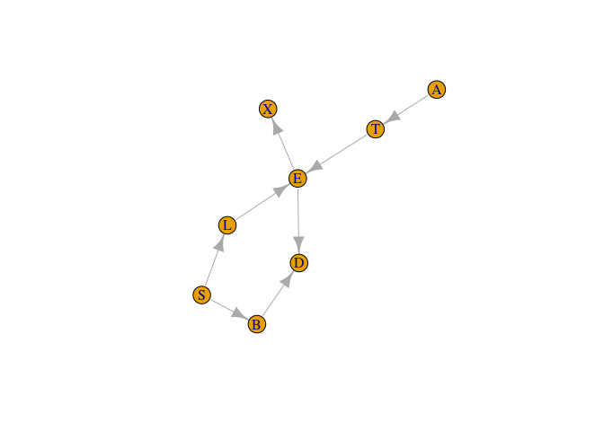
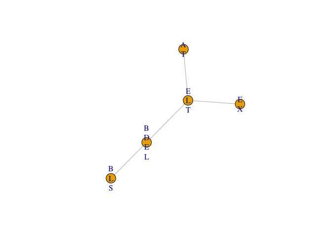
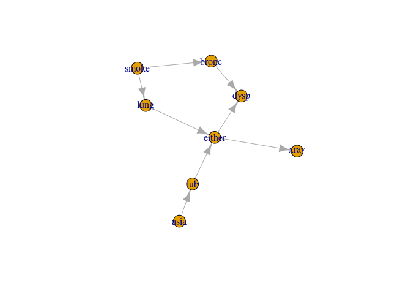

jti: Junction Tree Inference
================

<!-- badges: start -->

[](https://github.com/mlindsk/jti/actions)
[](https://cran.r-project.org/package=jti)
<!-- badges: end -->

## About

The **jti** package (pronounced ‘yeti’) is a memory efficient and fast
implementaion of the junction tree algorithm (JTA) using the
Lauritzen-Spiegelhalter scheme. Why is it memory efficient and fast?
Because we use a sparse representation for the potentials which enable
us to handle large and complex graphs where the variables can have an
arbitrary large number of levels.

## Installation

You can install the current stable release of the package by using the
`devtools` package:

``` r
devtools::install_github("mlindsk/jti", build_vignettes = FALSE)
```

## Libraries

``` r
library(jti)
library(igraph)
```

## Setting up the network

``` r
el <- matrix(c(
  "A", "T",
  "T", "E",
  "S", "L",
  "S", "B",
  "L", "E",
  "E", "X",
  "E", "D",
  "B", "D"),
  nc = 2,
  byrow = TRUE
)

g <- igraph::graph_from_edgelist(el)
plot(g)
```



## Compilation

Checking and conversion

``` r
cl <- cpt_list(asia, g)
cl
#>  List of CPTs 
#>  -------------------------
#>   P( A )
#>   P( T | A )
#>   P( E | T, L )
#>   P( S )
#>   P( L | S )
#>   P( B | S )
#>   P( X | E )
#>   P( D | E, B )
#> 
#>   <cpt_list, list> 
#>  -------------------------
```

Compilation

``` r
cp <- compile(cl, save_graph = TRUE)
cp
#>  Compiled network 
#>  ------------------------- 
#>   Nodes: 8 
#>   Cliques: 6 
#>    - max: 3 
#>    - min: 2 
#>    - avg: 2.67 
#>   <charge, list> 
#>  -------------------------
# plot(dag(cp)) # Should give the same as plot(g)
```

After the network has been compiled, the graph has been triangulated and
moralized. Furthermore, all conditional probability tables (CPTs) has
been designated to one of the cliques (in the triangulated and moralized
graph).

## Example 1: sum-flow without evidence

``` r
jt1 <- jt(cp)
jt1
#>  Junction Tree 
#>  ------------------------- 
#>   Propagated: full 
#>   Flow: sum 
#>   Nodes: 6 
#>   Edges: 5 / 15 
#>   Cliques: 6 
#>    - max: 3 
#>    - min: 2 
#>    - avg: 2.67 
#>   <jt, list> 
#>  -------------------------
plot(jt1)
```


Query probabilities

``` r
query_belief(jt1, c("E", "L", "T"))
#> $E
#> E
#>         n         y 
#> 0.9257808 0.0742192 
#> 
#> $L
#> L
#>     n     y 
#> 0.934 0.066 
#> 
#> $T
#> T
#>      n      y 
#> 0.9912 0.0088
query_belief(jt1, c("B", "D", "E"), type = "joint")
#> , , B = n
#> 
#>    E
#> D            n           y
#>   n 0.41821906 0.007101117
#>   y 0.04637955 0.018500278
#> 
#> , , B = y
#> 
#>    E
#> D            n           y
#>   n 0.09856873 0.007094444
#>   y 0.36261346 0.041523361
```

It should be noticed, that the above could also have been achieved by

``` r
jt1 <- jt(cp, propagate = "no")
jt1 <- propagate(jt1, prop = "full")
```

That is; it is possible to postpone the actual propagation.

## Example 2: sum-flow with evidence

``` r
e2  <- c(A = "y", X = "n")
jt2 <- jt(cp, e2) 
query_belief(jt2, c("B", "D", "E"), type = "joint")
#> , , B = n
#> 
#>    E
#> D            n            y
#>   n 0.45143057 7.711638e-05
#>   y 0.05006263 2.009085e-04
#> 
#> , , B = y
#> 
#>    E
#> D           n            y
#>   n 0.1063963 6.176693e-05
#>   y 0.3914092 3.615182e-04
```

Notice that, the configuration `(D,E,B) = (y,y,n)` has changed
dramatically as a consequence of the evidence. We can get the
probability of the evidence:

``` r
query_evidence(jt2)
#> [1] 0.007152638
```

## Example 3: max-flow without evidence

``` r
jt3 <- jt(cp, flow = "max")
mpe(jt3)
#>   A   T   E   L   S   B   X   D 
#> "n" "n" "n" "n" "n" "n" "n" "n"
```

## Example 4: max-flow with evidence

``` r
e4  <- c(T = "y", X = "y", D = "y")
jt4 <- jt(cp, e4, flow = "max")
mpe(jt4)
#>   A   T   E   L   S   B   X   D 
#> "n" "y" "y" "n" "y" "y" "y" "y"
```

Notice, that `T`, `E`, `S`, `B`, `X` and `D` has changed from `"n"` to
`"y"` as a consequence of the new evidence `e4`.

## Example 5: specifying a root node and only collect to save run time

``` r
cp5 <- compile(cpt_list(asia, g) , "X")
jt5 <- jt(cp5, propagate = "collect")
```

We can only query from the root clique now (clique 1) but we have
ensured that the node of interest, `"X"`, does indeed live in this
clique.

``` r
query_belief(jt5, get_cliques(jt5)$C1, "joint")
#>    E
#> X            n            y
#>   n 0.88559032 0.0004011849
#>   y 0.04019048 0.0738180151
```

## Example 6: Compiling from a list of conditional probabilities

  - We need a list with CPTs which we extract from the asia2 object
      - the list must be named with child nodes
      - The elements need to be array-like objects

<!-- end list -->

``` r
cl  <- cpt_list(asia2)
cp6 <- compile(cl, save_graph = TRUE)
```

Inspection; see if the graph correspond to the cpts

``` r
plot(dag(cp6)) 
```



``` r
jt6 <- jt(cp6)
query_belief(jt6, c("either", "smoke"))
#> $either
#> either
#>      yes       no 
#> 0.064828 0.935172 
#> 
#> $smoke
#> smoke
#> yes  no 
#> 0.5 0.5
```

## Example 7: Fitting a decomposable model and apply JTA

We use the `ess` package (on CRAN), found at
<https://github.com/mlindsk/ess>, to fit an undirected decomposable
graph to data.

``` r
library(ess)

g7  <- ess::fit_graph(asia, trace = FALSE)
ig7 <- igraph::graph_from_adjacency_matrix(ess::adj_mat(g7), "undirected")
cp7 <- compile(cpt_list(asia, ig7))
jt7 <- jt(cp7)

query_belief(jt7, get_cliques(jt7)[[1]], type = "joint")
#> A
#>      n      y 
#> 0.9916 0.0084
```
