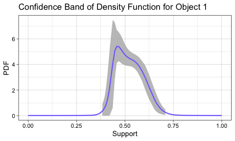

<!-- README.md is generated from README.Rmd. Please edit that file -->

## WRI

<!-- badges: start -->

<!-- badges: end -->

An R package for the paper “Wasserstein F-tests and confidence bands for
the Frechet regression of density response curves”.

## Installation

You can install the released version of WRI from
[CRAN](https://CRAN.R-project.org) with:

``` r
install.packages("WRI")
```

## Example

This is a basic example which shows you how to solve a common problem:

``` r
library(WRI)
data(strokeCTdensity)
predictor = strokeCTdensity$predictors
dSup = strokeCTdensity$densitySupport
densityCurves = strokeCTdensity$densityCurve
xpred = predictor[3, ]

res = wass_regress(rightside_formula = ~., Xfit_df = predictor,
Ytype = 'density', Ymat = densityCurves, Sup = dSup)
# compute the density band for the third observation
confidence_Band1 = confidenceBands(res, Xpred_df = xpred, type = 'density')
```



## Main components

  - `strokeCTdensity`: clinical, radiological scalar variables and
    density curves of the hematoma of 393 stroke patients
  - `wass_regress`: perform Frechet Regression with the Wasserstein
    Distance
  - `wass_R2`: compute Wasserstein coefficient of determination
  - `globalFtest`: perform global F test for Wasserstein regression
  - `partialFtest`: perform partial F test for Wasserstein regression
  - `summary.WRI`: provide summary information of Wasserstein regression
  - `confidenceBands`: compute intrinsic confidence bands and density
    bands
