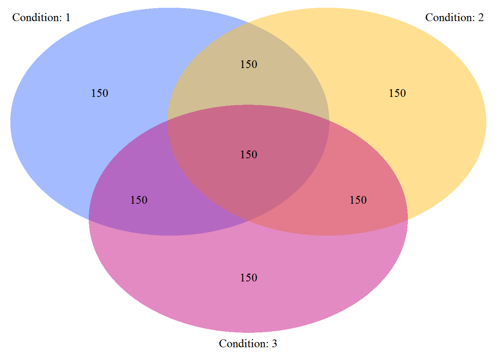

[](https://cran.r-project.org/package=vennLasso)
[](https://travis-ci.org/jaredhuling/vennLasso)

# vennLasso

The `vennLasso` package provides methods for hierarchical variable selection for models with covariate effects stratified by multiple binary factors.


## Installation and Help Files

The `vennLasso` package can be installed from CRAN using:

```r
install.packages("vennLasso")
```

The development version can be installed using the **devtools** package:


```r
devtools::install_github("jaredhuling/vennLasso")
```


or by cloning and building.

Load the **vennLasso** package:

```r
library(vennLasso)
```

Access help file for the main fitting function ``vennLasso()`` by running:


```r
?vennLasso
```

Help file for cross validation function ``cv.vennLasso()`` can be accessed by running:


```r
?cv.vennLasso
```

## A Quick Example

Simulate heterogeneous data:


```r
set.seed(100)
dat.sim <- genHierSparseData(ncats = 3,  # number of stratifying factors
                             nvars = 25, # number of variables
                             nobs = 150, # number of observations per strata
                             nobs.test = 10000,
                             hier.sparsity.param = 0.5,
                             prop.zero.vars = 0.75, # proportion of variables
                                                   # zero for all strata
                             snr = 0.5,  # signal-to-noise ratio
                             family = "gaussian")

# design matrices
x        <- dat.sim$x
x.test   <- dat.sim$x.test

# response vectors
y        <- dat.sim$y
y.test   <- dat.sim$y.test

# binary stratifying factors
grp      <- dat.sim$group.ind
grp.test <- dat.sim$group.ind.test
```

Inspect the populations for each strata:


```r
plotVenn(grp)
```

<!-- -->

Fit vennLasso model with tuning parameter selected with 5-fold cross validation:


```r
fit.adapt <- cv.vennLasso(x, y,
                          grp,
                          adaptive.lasso = TRUE,
                          nlambda        = 50,
                          family         = "gaussian",
                          standardize    = FALSE,
                          intercept      = TRUE,
                          nfolds         = 5)
```


Plot selected variables for each strata (not run): 


```r
library(igraph)
```

```
## 
## Attaching package: 'igraph'
```

```
## The following objects are masked from 'package:stats':
## 
##     decompose, spectrum
```

```
## The following object is masked from 'package:base':
## 
##     union
```

```r
plotSelections(fit.adapt)
```

<!--html_preserve--><div id="htmlwidget-916a5488a66ec817258c" style="width:672px;height:480px;" class="visNetwork html-widget"></div>
<script type="application/json" data-for="htmlwidget-916a5488a66ec817258c">{"x":{"nodes":{"id":[1,2,3,5,4,6,7,8],"label":["0,0,0","0,0,1","0,1,0","1,0,0","0,1,1","1,0,1","1,1,0","1,1,1"],"value":[10,5,6,2,9,7,9,16],"title":["<p>Num vars selected: 10<\/p>","<p>Num vars selected: 5<\/p>","<p>Num vars selected: 6<\/p>","<p>Num vars selected: 2<\/p>","<p>Num vars selected: 9<\/p>","<p>Num vars selected: 7<\/p>","<p>Num vars selected: 9<\/p>","<p>Num vars selected: 16<\/p>"],"x":[-0.444444444444444,-1,-0.333333333333333,0.333333333333333,-0.666666666666667,0.333333333333333,1,0.222222222222222],"y":[-1,1,1,1,0,0,0,-1]},"edges":{"from":[4,6,4,7,8,6,7,8,8],"to":[2,2,3,3,4,5,5,6,7],"value":[5,5,6,6,9,2,2,7,9]},"nodesToDataframe":true,"edgesToDataframe":true,"options":{"width":"100%","height":"100%","nodes":{"shape":"dot","mass":1,"physics":false,"font":{"size":35}},"manipulation":{"enabled":false},"edges":{"smooth":true},"physics":{"stabilization":false},"interaction":{"hover":true,"tooltipDelay":0}},"groups":null,"width":null,"height":null,"idselection":{"enabled":true,"style":"width: 150px; height: 26px","useLabels":true},"byselection":{"enabled":false,"style":"width: 150px; height: 26px","multiple":false,"hideColor":"rgba(200,200,200,0.5)"},"main":null,"submain":null,"footer":null,"igraphlayout":{"type":"full"},"highlight":{"enabled":true,"hoverNearest":true,"degree":1,"algorithm":"all","hideColor":"rgba(200,200,200,0.5)","labelOnly":true},"collapse":{"enabled":false,"fit":false,"resetHighlight":true,"clusterOptions":null},"tooltipStay":300,"tooltipStyle":"position: fixed;visibility:hidden;padding: 5px;white-space: nowrap;font-family: verdana;font-size:14px;font-color:#000000;background-color: #f5f4ed;-moz-border-radius: 3px;-webkit-border-radius: 3px;border-radius: 3px;border: 1px solid #808074;box-shadow: 3px 3px 10px rgba(0, 0, 0, 0.2);"},"evals":[],"jsHooks":[]}</script><!--/html_preserve-->

Predict response for test data:


```r
preds.vl <- predict(fit.adapt, x.test, grp.test, s = "lambda.min",
                    type = 'response')
```

Evaluate mean squared error:


```r
mean((y.test - preds.vl) ^ 2)
```

```
## [1] 0.6852124
```


```r
mean((y.test - mean(y.test)) ^ 2)
```

```
## [1] 1.011026
```


Compare with naive model with all interactions between covariates and stratifying binary factors:

```r
df.x <- data.frame(y = y, x = x, grp = grp)
df.x.test <- data.frame(x = x.test, grp = grp.test)

# create formula for interactions between factors and covariates
form <- paste("y ~ (", paste(paste0("x.", 1:ncol(x)), collapse = "+"), ")*(grp.1*grp.2*grp.3)" )
```

Fit linear model and generate predictions for test set:

```r
lmf <- lm(as.formula(form), data = df.x)

preds.lm <- predict(lmf, df.x.test)
```

Evaluate mean squared error:


```r
mean((y.test - preds.lm) ^ 2)
```

```
## [1] 0.8056107
```

```r
mean((y.test - preds.vl) ^ 2)
```

```
## [1] 0.6852124
```


